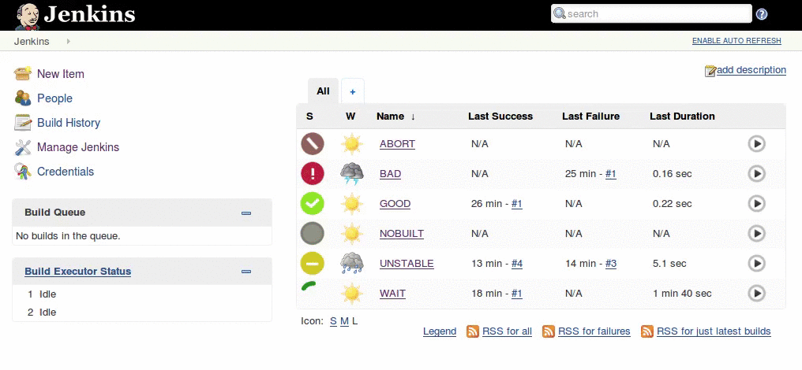

 This plugin provides an alternative set of status and action icons to
provide a fresh look to Jenkins and to be friendly for all users i.e.
iconic not just color indication.

[.confluence-embedded-file-wrapper .confluence-embedded-manual-size]##

[[ModernStatusPlugin-BuildStatusIcons]]
== Build Status Icons

[cols=",,",options="header",]
|===
|Status |Build Finished |Build In Progress
|No Build
|[.confluence-embedded-file-wrapper]#image:https://raw.githubusercontent.com/ovinn/modernstatus-plugin/master/src/main/webapp/24x24/nobuilt.png[image]#
|[.confluence-embedded-file-wrapper]#image:https://raw.githubusercontent.com/ovinn/modernstatus-plugin/master/src/main/webapp/24x24/nobuilt_anime.gif[image]#

|Build Disabled
|[.confluence-embedded-file-wrapper]#image:https://raw.githubusercontent.com/ovinn/modernstatus-plugin/master/src/main/webapp/24x24/disabled.png[image]#
|[.confluence-embedded-file-wrapper]#image:https://raw.githubusercontent.com/ovinn/modernstatus-plugin/master/src/main/webapp/24x24/disabled_anime.gif[image]#

|Successful Build
|[.confluence-embedded-file-wrapper]#image:https://raw.githubusercontent.com/ovinn/modernstatus-plugin/master/src/main/webapp/24x24/blue.png[image]#
|[.confluence-embedded-file-wrapper]#image:https://raw.githubusercontent.com/ovinn/modernstatus-plugin/master/src/main/webapp/24x24/blue_anime.gif[image]#

|Unstable Build
|[.confluence-embedded-file-wrapper]#image:https://raw.githubusercontent.com/ovinn/modernstatus-plugin/master/src/main/webapp/24x24/yellow.png[image]#
|[.confluence-embedded-file-wrapper]#image:https://raw.githubusercontent.com/ovinn/modernstatus-plugin/master/src/main/webapp/24x24/yellow_anime.gif[image]#

|Failed Build
|[.confluence-embedded-file-wrapper]#image:https://raw.githubusercontent.com/ovinn/modernstatus-plugin/master/src/main/webapp/24x24/red.png[image]#
|[.confluence-embedded-file-wrapper]#image:https://raw.githubusercontent.com/ovinn/modernstatus-plugin/master/src/main/webapp/24x24/red_anime.gif[image]#

|Aborted Build
|[.confluence-embedded-file-wrapper]#image:https://raw.githubusercontent.com/ovinn/modernstatus-plugin/master/src/main/webapp/24x24/aborted.png[image]#
|[.confluence-embedded-file-wrapper]#image:https://raw.githubusercontent.com/ovinn/modernstatus-plugin/master/src/main/webapp/24x24/aborted_anime.gif[image]#
|===

[[ModernStatusPlugin-ProjectIcons]]
== Project Icons

[cols=",",options="header",]
|===
|Action |Icon
|Build Now
|[.confluence-embedded-file-wrapper]#image:https://raw.githubusercontent.com/ovinn/modernstatus-plugin/master/src/main/webapp/24x24/clock.png[image]#

|Delete Project
|[.confluence-embedded-file-wrapper]#image:https://raw.githubusercontent.com/ovinn/modernstatus-plugin/master/src/main/webapp/24x24/edit-delete.png[image]#

|Workspace
|[.confluence-embedded-file-wrapper]#image:https://raw.githubusercontent.com/ovinn/modernstatus-plugin/master/src/main/webapp/24x24/folder.png[image]#
|===
