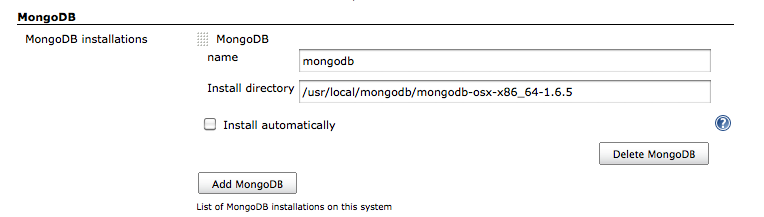
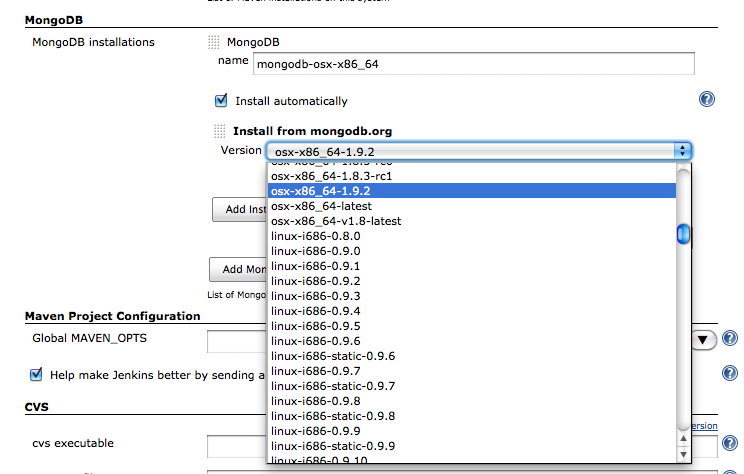
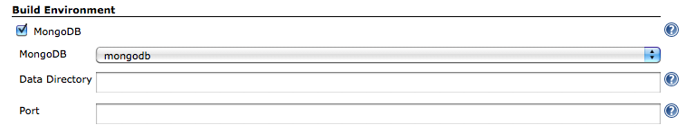

[.conf-macro .output-inline]#This plugin provides
http://www.mongodb.org/[MongoDB] integration capabilities.#

Start mongod before job running, and stop after job finished.

[[MongoDBPlugin-SettingMongoDBInstallation]]
== Setting MongoDB Installation

Using installed MongoDB. +
[.confluence-embedded-file-wrapper]##

Or install automatically. +
[.confluence-embedded-file-wrapper]##

[[MongoDBPlugin-JobSettings]]
== Job Settings

[.confluence-embedded-file-wrapper]##

* Data Directory
** Directory to store files. (--dbpath option)
** Default is $\{WORKSPACE}/data/db
** Before job starting, this directory will clean.
* Port
** Running mongod with specify a different port. (--port option)

[[MongoDBPlugin-VersionHistory]]
== Version History

[[MongoDBPlugin-Version1.3(Feb20,2013)]]
=== Version 1.3 (Feb 20, 2013)

* Added support for passing additional startup options and start
timeout.
* Fixed java.io.NotSerializableException

[[MongoDBPlugin-Version1.2(Jan10,2013)]]
=== Version 1.2 (Jan 10, 2013)

* Fixed for
https://issues.jenkins-ci.org/browse/JENKINS-16279[JENKINS-16279]

[[MongoDBPlugin-Version1.1(Aug13,2011)]]
=== Version 1.1 (Aug 13, 2011)

* Fixed running on Windows.

[[MongoDBPlugin-Version1.0(Jun12,2011)]]
=== Version 1.0 (Jun 12, 2011)

* Initial release
