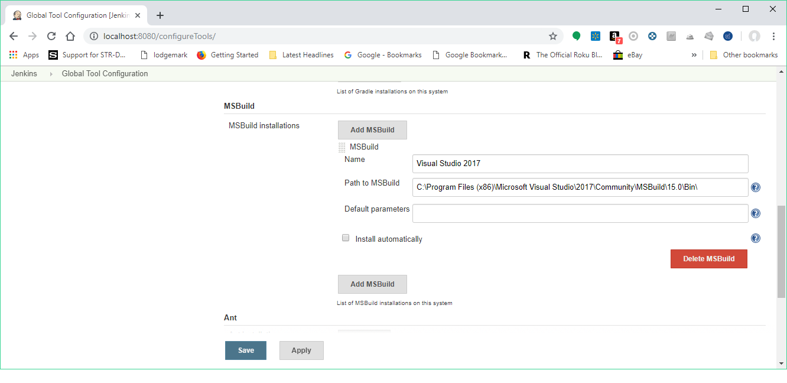
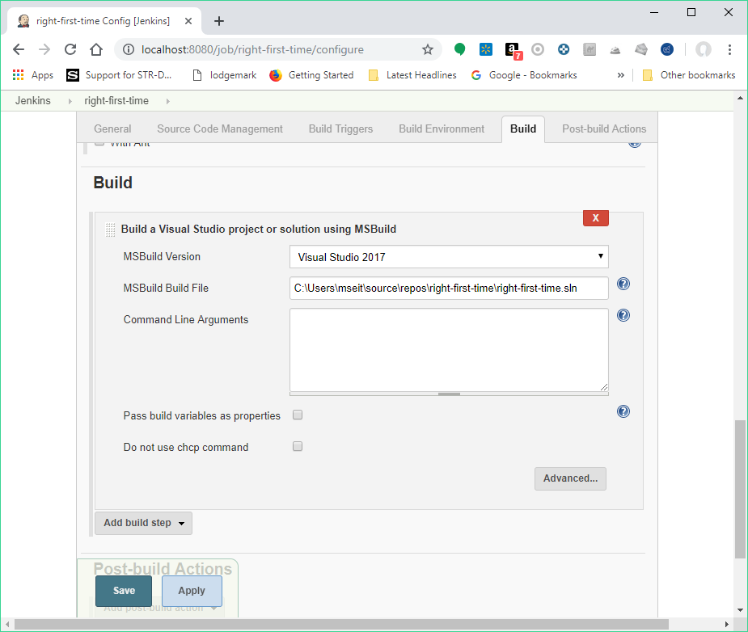

This plugin allows you to use MSBuild to build .NET and Visual Studio
projects.

[[MSBuildPlugin-Usage]]
== Usage

To use this plugin, specify the location directory of MSBuild.exe on
Jenkin's configuration page. The MSBuild executable is usually
situated in a subfolder of C:\WINDOWS\Microsoft.NET\Framework. The
Visual Studio 2017 Community version of "msbuild.exe" is located in
"C:\Program Files (x86)\Microsoft Visual
Studio\2017\Community\MSBuild\15.0\Bin\" If you have multiple MSBuild
versions installed, you can configure multiple executables. 

 +

[.confluence-embedded-file-wrapper .confluence-embedded-manual-size]##

Then, on your project configuration page, specify the name of the build
file (.proj or .sln) and any
https://docs.microsoft.com/en-us/visualstudio/msbuild/msbuild-command-line-reference?view=vs-2017[command
line arguments] you want to pass in. The files are compiled to the
directory where Visual Studio would put them as well.

 +

[.confluence-embedded-file-wrapper .confluence-embedded-manual-size]##

[[MSBuildPlugin-Troubleshooting]]
=== Troubleshooting

* When using Command Line Arguments, bear in mind that special
characters are treated like in Unix, so they will need to be escaped
using the backslash.

[[MSBuildPlugin-Changelog]]
== Changelog

[[MSBuildPlugin-Release1.29]]
=== Release 1.29

*
Fix https://issues.jenkins-ci.org/browse/JENKINS-48194[JENKINS-48194] -
Binary compatibility broken since 1.28

[[MSBuildPlugin-Release1.28]]
=== Release 1.28

*
Fix https://issues.jenkins-ci.org/browse/JENKINS-42284[JENKINS-42284] -
chcp command errors are ignored and no longer fail the build. Moreover,
a checkbox is now available on the build step configuration to prevent
the plugin from executing chcp before running msbuild.

[[MSBuildPlugin-Release1.27]]
=== Release 1.27

*
Add https://issues.jenkins-ci.org/browse/JENKINS-24132[JENKINS-24132] -
Support for multiple MSBuild Output encoding so that the console log of
Jenkins is displayed correctly  +
*
Add https://issues.jenkins-ci.org/browse/JENKINS-37392[JENKINS-37392] -
Add @Symbol("msbuild") to MSBuild's ToolDescriptor +
* Fix https://github.com/jenkinsci/msbuild-plugin/pull/28[PR#28] - Minor
bugs and build warnings 

[[MSBuildPlugin-Release1.26]]
=== Release 1.26

*
Fix https://issues.jenkins-ci.org/browse/JENKINS-28679[JENKINS-28679] -
Warning when setting MSBuild installation path to the directory
containing msbuild.exe instead of the path to the executable itself  +
* Add https://issues.jenkins-ci.org/browse/JENKINS-3367[JENKINS-3367] -
Add ouput coloring for warning and error messages

[[MSBuildPlugin-Release1.25]]
=== Release 1.25

* Fix https://issues.jenkins-ci.org/browse/JENKINS-9104[JENKINS-9104] -
Veto killing mspdbsrv.exe"

[[MSBuildPlugin-Release1.24]]
=== Release 1.24

* Fix https://issues.jenkins-ci.org/browse/JENKINS-19706[JENKINS-19706]
- Masked Password Clearly visible as plain text in console output. +
* Fix https://issues.jenkins-ci.org/browse/JENKINS-19830[JENKINS-19830]
- Masked Password visible as plain text in Msbuild Plugin +
* Fix https://issues.jenkins-ci.org/browse/JENKINS-21585[JENKINS-21585]
- Pass build variables as properties incorrectly format command line +
* Fix https://issues.jenkins-ci.org/browse/JENKINS-18652[JENKINS-18652]
- Handling of Configuration and Platform parameters +
* Fix https://issues.jenkins-ci.org/browse/JENKINS-22344[JENKINS-22344]
- Command Line Arguments: /p:PublishFolder does not work with UNC format
to publish to remote server +
* Fix https://issues.jenkins-ci.org/browse/JENKINS-22451[JENKINS-22451]
- Backslash is stripped from MSBuild command line argument +
* Fix https://issues.jenkins-ci.org/browse/JENKINS-22461[JENKINS-22461]
- New MSBuild release has a space in the installation path; causes
msbuild plugin to fail

[[MSBuildPlugin-Release1.23]]
=== Release 1.23

* Fix textbox for argument is too short +
* Add french translation

[[MSBuildPlugin-Release1.22]]
=== Release 1.22

* Fixed more documentation links.

[[MSBuildPlugin-Release1.21]]
=== Release 1.21

* Fix https://issues.jenkins-ci.org/browse/JENKINS-19830[JENKINS-19830]
- Masked Password visible as plain text in Msbuild Plugin

[[MSBuildPlugin-Release1.20]]
=== Release 1.20

* Fix https://issues.jenkins-ci.org/browse/JENKINS-19432[JENKINS-19432]
- Add option: "If warnings during msbuild, set the build to unstable"

[[MSBuildPlugin-Release1.19]]
=== Release 1.19

* Fix https://issues.jenkins-ci.org/browse/JENKINS-18543[JENKINS-18543]
- Update to newest MSBuild plugin breaks passing of release
configurations with spaces in them

[[MSBuildPlugin-Release1.18]]
=== Release 1.18

* Fix https://issues.jenkins-ci.org/browse/JENKINS-17876[JENKINS-17876]
- MSBuild Command Line Arguments quotes being stripped...not 5552

[[MSBuildPlugin-Release1.17]]
=== Release 1.17

* Fix https://issues.jenkins-ci.org/browse/JENKINS-5552[JENKINS-5552] -
MSBuild plugin creates malformed command line

[[MSBuildPlugin-Release1.16]]
=== Release 1.16

* Fix https://issues.jenkins-ci.org/browse/JENKINS-14898[JENKINS-14898]
- MsBuild windows style environment variables no longer work +
* Fix https://issues.jenkins-ci.org/browse/JENKINS-15029[JENKINS-15029]
- Update of MSBuild plugin to 1.15 causes Parameterized trigger plugin
to fail.

[[MSBuildPlugin-Release1.15]]
=== Release 1.15

* Fix issue on backward compatibility

[[MSBuildPlugin-Release1.14]]
=== Release 1.14

* Fix https://issues.jenkins-ci.org/browse/JENKINS-13863[JENKINS-13863]
- MSBuild is unable to build projects in a different directory

[[MSBuildPlugin-Release1.13]]
=== Release 1.13

* Merge pull request - Add a checkbox to exclude a failure on msbuild
step

[[MSBuildPlugin-Release1.12]]
=== Release 1.12

* Add UI checkbox to control build variables passing

[[MSBuildPlugin-Release1.11]]
=== Release 1.11

* Integrate pull request - Use lowercase "/p" for xbuild compatibility

[[MSBuildPlugin-Release1.10]]
=== Release 1.10

* Integrate pull request - Change Internal object: Descriptor by
BuildStepDescriptor

[[MSBuildPlugin-Release1.9]]
=== Release 1.9

* Fix command generation with multiple build parameters

[[MSBuildPlugin-Release1.8.2(December25,2011)]]
=== Release 1.8.2 (December 25, 2011)

* Fix https://issues.jenkins-ci.org/browse/JENKINS-12222[JENKINS-12222]
- java.lang.NullPointerException in the msbuild plugin when a job is
executed by the parameterized build trigger plugin

[[MSBuildPlugin-Release1.8.1(December03,2011)]]
=== Release 1.8.1 (December 03, 2011)

* Fix double quoted default args

[[MSBuildPlugin-Release1.8(December01,2011)]]
=== Release 1.8 (December 01, 2011)

* Add default args (global configuration) - Merged pull request

[[MSBuildPlugin-Release1.7(May13,2011)]]
=== Release 1.7 (May 13, 2011)

* Fix https://issues.jenkins-ci.org/browse/JENKINS-3823[JENKINS-3823] -
configure msbuild path as a tool +
and https://issues.jenkins-ci.org/browse/JENKINS-4120[JENKINS-4120] -
Implement concept of tool installation into MSBuild plugin

[[MSBuildPlugin-Release1.6(May10,2011)]]
=== Release 1.6 (May 10, 2011)

* Fixed https://issues.jenkins-ci.org/browse/JENKINS-9645[JENKINS-9645]
and https://issues.jenkins-ci.org/browse/JENKINS-9643[JENKINS-9643] -
Regression introduced in 1.5 - The MsBuild file was not taken into
account

[[MSBuildPlugin-Release1.5(May05,2011)]]
=== Release 1.5 (May 05, 2011)

* Add variables (from build and environment) resolution.

[[MSBuildPlugin-Release1.4(April02,2011)]]
=== Release 1.4 (April 02, 2011)

* Fix https://issues.jenkins-ci.org/browse/JENKINS-4121[JENKINS-4121] -
Existence check for MsBuild.exe does not account for non-master nodes

[[MSBuildPlugin-Release1.3(Dec29,2009)]]
=== Release 1.3 (Dec 29, 2009)

* Add build parameters as properties
(https://issues.jenkins-ci.org/browse/JENKINS-2349[JENKINS-2349])
* Console output should show the command
(https://issues.jenkins-ci.org/browse/JENKINS-3610[JENKINS-3610])
* Update uses of deprecated APIs

[[MSBuildPlugin-Release1.2(Apr21,2009)]]
=== Release 1.2 (Apr 21, 2009)

* Add a the possibility to manage multiple Msbuild version
(https://issues.jenkins-ci.org/browse/JENKINS-3179[JENKINS-3179])

[[MSBuildPlugin-Release1.1(Jun03,2008)]]
=== Release 1.1 (Jun 03, 2008)

* Initial release
