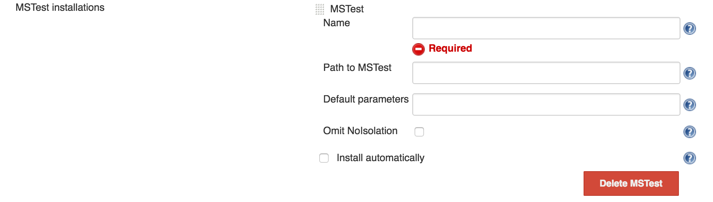
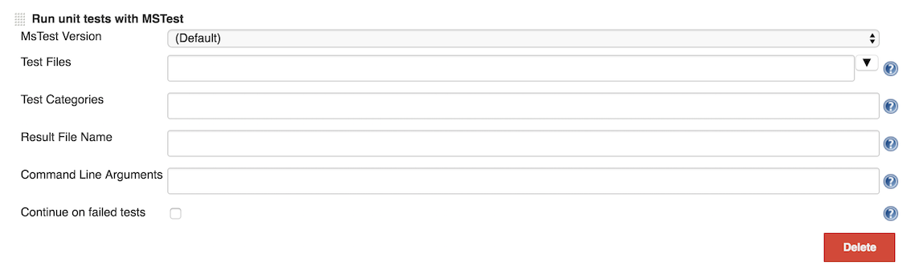

This plugin allow you to execute test using MSTest command line tool.

[[MSTestRunnerPlugin-Description]]
== Description

This plugin allow you to execute test using MSTest command line tool.

MSTest are test classes for .NET framework which are integrated into
Visual Studio. You should use a plugin to process the result files, I
recommend using
https://wiki.jenkins-ci.org/display/JENKINS/MSTest+Plugin[MSTest Jenkins
Plugin]. You can read my post about
http://dotdotnet.blogspot.co.il/2011/11/building-net-application-with-jenkins.html[how
to setup Jenkins with MSTest] in my blog.

[[MSTestRunnerPlugin-Configuration]]
== Configuration

To configure a MSTest installation, go to _Manage Jenkins -> Configure
System_ (or _Manage Jenkins -> Global Tool Configuration_ in Jenkins
2.8, possibly earlier) and add a MSTest installation. *Name* is
mandatory. If *Path to MSTest* is left blank, the default is
_MSTest.exe_.

[.confluence-embedded-file-wrapper .confluence-embedded-manual-size]##

MSTestRunner can be used as a build step. The screenshot below shows the
configuration parameters available where the *Test Files* and the
*Result File Name* are mandatory. The MSTest Version is not mandatory.
If the default is used, the plugin will look for _MSTest.exe_, so
ideally it should be in the path.

[.confluence-embedded-file-wrapper .confluence-embedded-manual-size]##

For further configuration tips, see each field's inline help.

[[MSTestRunnerPlugin-VersionHistory]]
== Version History

[[MSTestRunnerPlugin-Version1.3.0(25/05/2016)]]
=== Version 1.3.0 (25/05/2016)

* https://issues.jenkins-ci.org/browse/JENKINS-34392[JENKINS-34392]
Upgrade to new plugin parent POM
* https://issues.jenkins-ci.org/browse/JENKINS-30457[JENKINS-30457]
Relative paths to test files with dots failing.
* https://issues.jenkins-ci.org/browse/JENKINS-34378[JENKINS-34378]
Validation for the test result filename field.

[[MSTestRunnerPlugin-Version1.2.0(09/12/2015)]]
=== Version 1.2.0 (09/12/2015)

* https://issues.jenkins-ci.org/browse/JENKINS-28869[JENKINS-28869]
- Fixes problem with newline tokennization (thanks to Thomas Blitz)
* https://issues.jenkins-ci.org/browse/JENKINS-29389[JENKINS-29389]
- Quotation marks for /testcategories argument, must beused only when
multiple category was specifed (thanks to Nikolas Falco)
* https://issues.jenkins-ci.org/browse/JENKINS-29391[JENKINS-29391]
- add support to full path in testFiles (thanks to Nikolas Falco)
* https://issues.jenkins-ci.org/browse/JENKINS-30292[JENKINS-30292] -
Not visible in Conditional BuildStep Plugin (thanks to Ido Ran)

[[MSTestRunnerPlugin-Version1.1.0(06/04/2014)]]
=== Version 1.1.0 (06/04/2014)

* Add Continue On Failed Test checkbox which allows to report success
even when test have failed
(https://issues.jenkins-ci.org/browse/JENKINS-20367[JENKINS-20367])

[[MSTestRunnerPlugin-Version1.0.1(06/06/2013)]]
=== Version 1.0.1 (06/06/2013)

* Use workspace path instead of module path to support multi-module
build
(https://github.com/jenkinsci/mstestrunner-plugin/pull/2[#2] by https://github.com/blazee[blazee])

[[MSTestRunnerPlugin-Version1.0.0(31/05/2013)]]
=== Version 1.0.0 (31/05/2013)

* Path to test containers (DLLs) are allowed to have space in them.
* Test containers can now only be separated with new lines because they
are allowed to have space in them.
* The license of this plugin is now MIT.

[[MSTestRunnerPlugin-Version0.2.1(09/14/2012)]]
=== Version 0.2.1 (09/14/2012)

* Fix the bug in which the flag /noisolation was not added by default.
* Add new option in MSTest config (Manage Jenkins -> Configure System ->
MSTest) name Omit Noisolation. Checking this option will omit the
/noisolation flag from the call to MSTest.

[[MSTestRunnerPlugin-Version0.2(09/02/2012)]]
=== Version 0.2 (09/02/2012)

* Add parameter for running MSTest with or without isolation (thanks
to https://github.com/roicp[roicp] https://github.com/jenkinsci/mstestrunner-plugin/pull/1[#1])

Notice +
Due to update in version 0.2 the plugin do not add /noisolation flag by
default which break MSTest on some systems.

To work around this problem until then either downgrade to 0.1 or add
/noisolation flag in Manage Jenkins -> Configure System -> MSTest ->
Default Paramters.

You can upgrade to version 0.2.1 which fix the problem.

[[MSTestRunnerPlugin-Version0.1(01/15/2012)]]
=== Version 0.1 (01/15/2012)

* Initial release 
