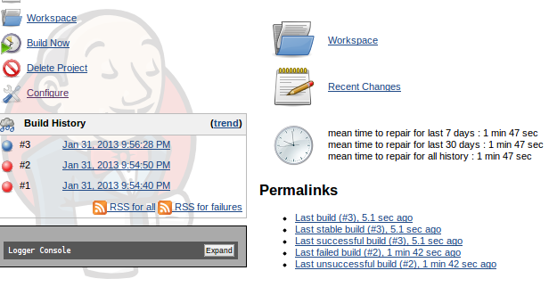
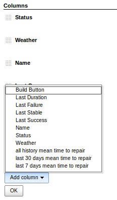

This plugin statistics job builds mean time to repair.

[[MTTRPlugin-Example:]]
== Example:

[[MTTRPlugin-]]
== [.confluence-embedded-file-wrapper]##

[.confluence-embedded-file-wrapper]##

[.confluence-embedded-file-wrapper]##

[[MTTRPlugin-Downloads]]
=== http://repo.jenkins-ci.org/releases/org/jenkins-ci/plugins/mttr[Downloads]

[[MTTRPlugin-ChangeLog]]
== Change Log

[[MTTRPlugin-Version1.1(January31,2013)]]
=== Version 1.1(January 31, 2013)

* Initial Release
