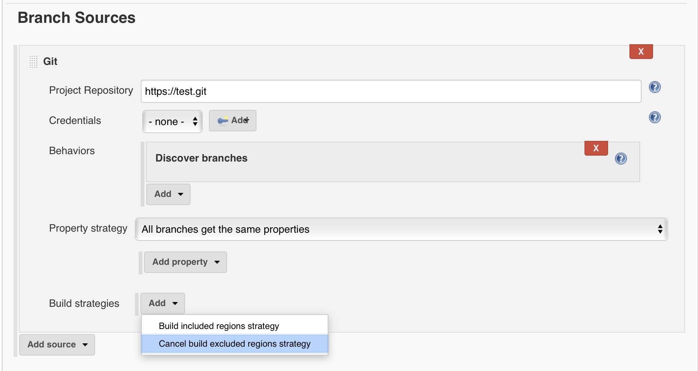
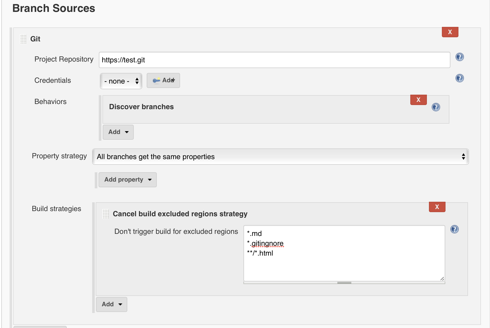

*https://plugins.jenkins.io/multibranch-build-strategy-extension[Plugin
site]*

 +

 +

*Purpose*

This [.s1]#plugin# provides addition configuration to prevent
[.s1]#multi# branch projects from triggering new builds

based on a include or exclude regions in source repository.

 +

 +

 +

*Setup*

Let's say you don't want your [.s1]#ci# to run on README or
.[.s1]#gitignore# or any .[.s1]#html# file change

 +

 +

[.confluence-embedded-file-wrapper .confluence-embedded-manual-size]##

On [.s1]#multibranch# job go to Build Strategy section , click add
button and select

Cancel build excluded regions strategy

 +

 +

[.confluence-embedded-file-wrapper .confluence-embedded-manual-size]##

 +

fill the [.s1]#textarea# with ant style exclusions:

http://readme.md/[    README.md]

    .[.s1]#gitignore#

     **/*.[.s1]#html#

 +

 +

 +
