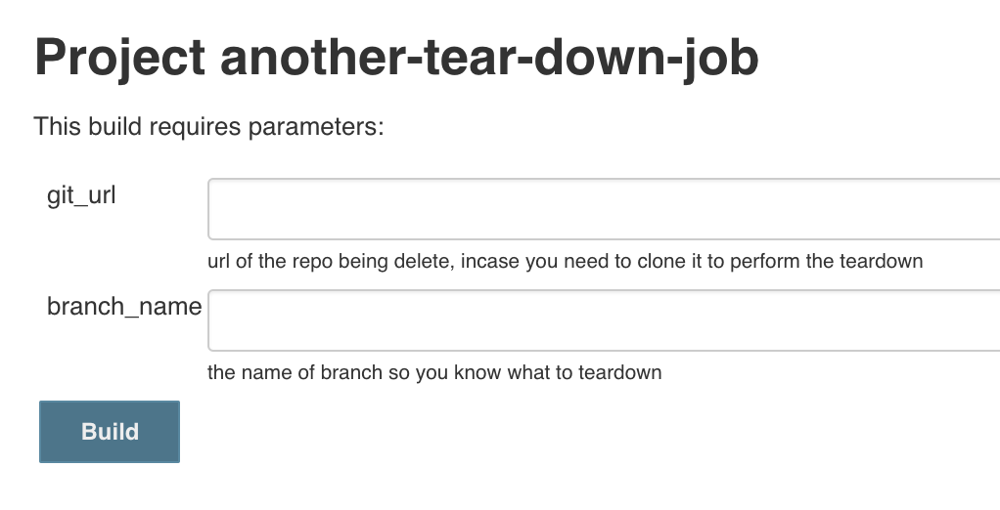
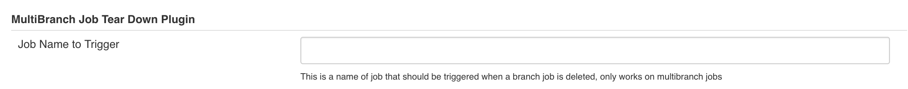

 +

This plugin triggers/schedules a job to run when a multibranch workflow
job is disabled or deleted. Essential use case is you have a multibranch
job that spins up some infrastructure like a server, when the job is
deleted this plugin enables you to tear down said infrastructure and
clean up after yourself.

[[MultibranchJobTearDownPlugin-BasicSetup]]
== Basic Setup

There are three ways to use this plugin but they require that you create
a job that accepts a String parameter of `git_url` and
`branch_name`.[.confluence-embedded-file-wrapper .confluence-embedded-manual-size]##

[[MultibranchJobTearDownPlugin-ExpressSetup]]
=== Express Setup

Simply create a job named `job-tear-down-executor` the plugin
automatically detects if this job is present and will send all branch
deletions to this job.

[[MultibranchJobTearDownPlugin-ConfiguretheJob]]
=== Configure the Job

In the global setting section of Jenkins you can configure the job name
that should be executed if you don't want to call your job
`job-tear-down-executor`

[.confluence-embedded-file-wrapper .confluence-embedded-manual-size]##

[[MultibranchJobTearDownPlugin-Customizeforyourpipeline]]
=== Customize for your pipeline

If you need more fine tune control of which job to execute you can
include the following in your pipeline. 

*Pipeline Example*

[source,syntaxhighlighter-pre]
----
//Scripted Pipelines
properties([branchTearDownExecutor('my-special-job')])

//Declarative Pipelines
options {
  branchTearDownExecutor 'my-special-job'
}
----

 +

[[MultibranchJobTearDownPlugin-ChangeLog]]
== Change Log

12 Dec 2018 - 1.1

* Filter out global shared pipeline library scm's from the teardown
git_url variable

26 Oct 2018 - 1.0

* Initial Version

 +
