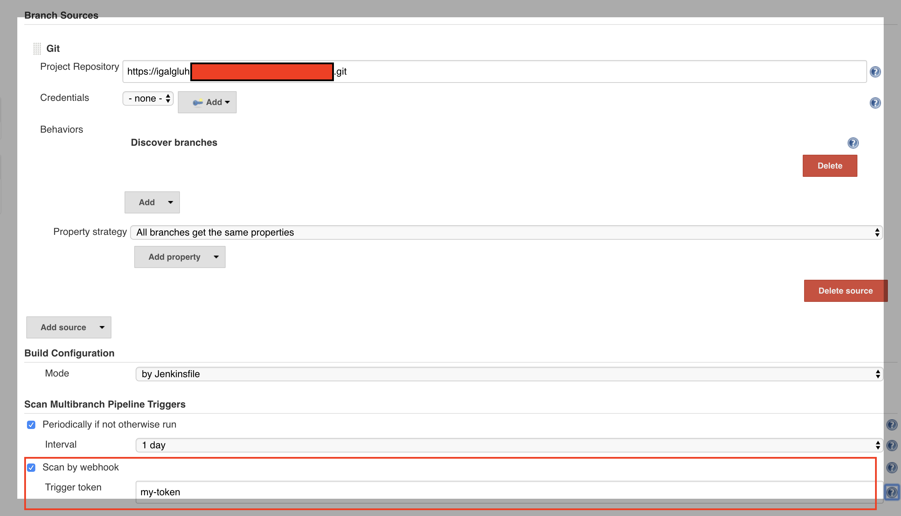

[cols="",options="header",]
|===
|Plugin Information
|View Multibranch Scan Webhook Trigger
Plugin https://plugins.jenkins.io/multibranch-scan-webhook-trigger[on
the plugin site] for more information.
|===

 +

 +

All multibranch projects comes with build in periodically scan trigger
that polls scm and check wich branches has changed and than build those
branches.

This is a Jenkins plugin that add functionality to do this scan on
webhook:

. Receive any HTTP request,
`+JENKINS_URL/multibranch-webhook-trigger/invoke?token=TOKENHERE+`
. Trigger a multibranch jobs scan that matches the token

[[MultibranchScanWebhookTriggerPlugin-ConfiguretheTokenparameter]]
== Configure the Token parameter

 +

 +

 +

There is a special `+token+` parameter. When supplied, the invocation
will only trigger jobs with that exact token. The token also allows
invocations without any other authentication credentials.

[.confluence-embedded-file-wrapper .confluence-embedded-manual-size]##

 +

 +

The token can be supplied as a:

* Request parameter:
`+curl -POST http://localhost:8080/jenkins/multibranch-webhook-trigger/invoke?token=my-token+`
* Token header:
`+curl -POST -H "token: my-token" http://localhost:8080/jenkins/multibranch-webhook-trigger/invoke+`

 +

 +

 +

 +

 +

 +

 +

 +

 +
