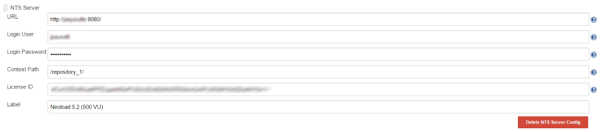
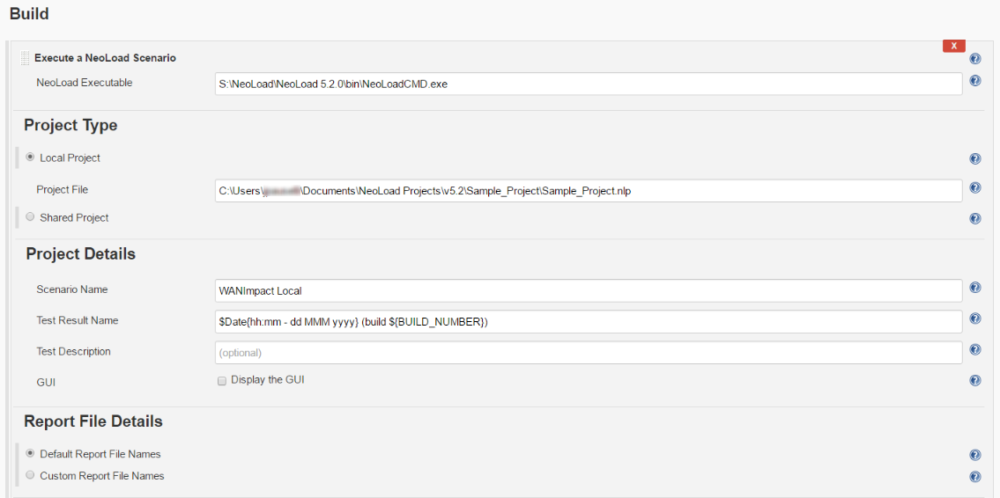
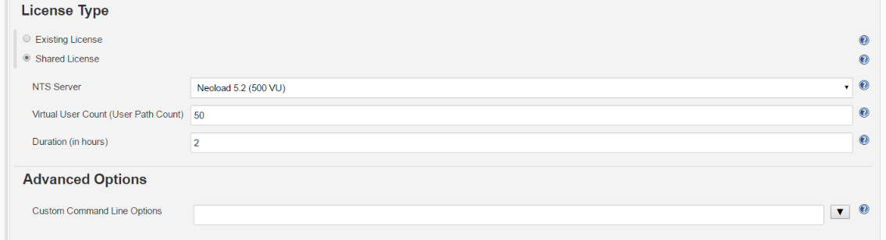
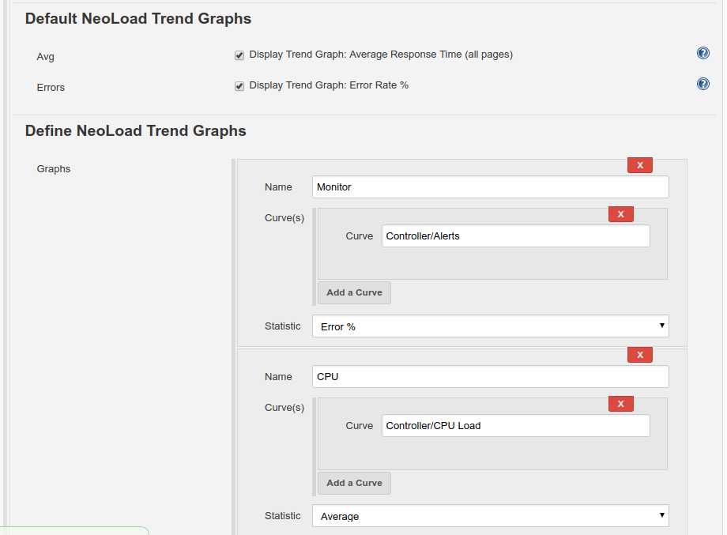
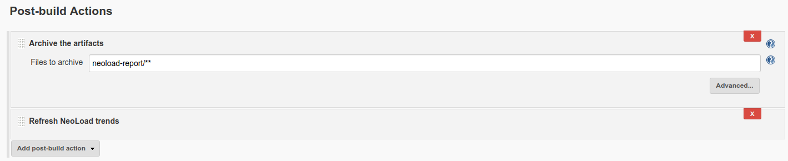
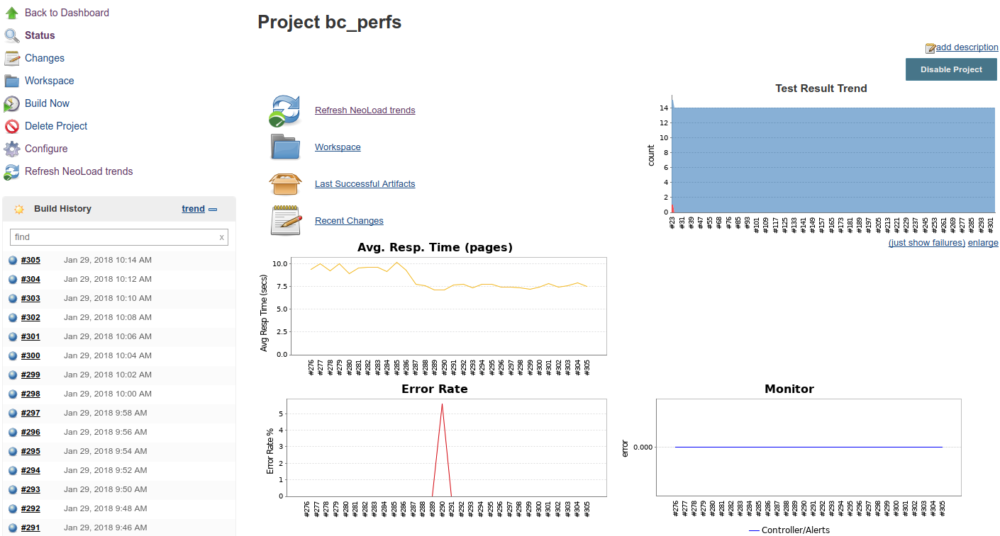

[.conf-macro .output-inline]##This plugin allows you to monitor load
tests performed by
http://www.neotys.com/product/overview-neoload.html[NeoLoad] from
Jenkins. NeoLoad test results are combined with the other integration
jobs in the Jenkins dashboard. Performance regression issues are raised
quickly to make Jenkins integration projects more relevant. For regular
jobs or pipeline jobs.##[.conf-macro .output-inline]####

[cols="",options="header",]
|===
|Plugin Information
|View NeoLoad https://plugins.jenkins.io/neoload-jenkins-plugin[on the
plugin site] for more information.
|===

[.aui-icon .aui-icon-small .aui-iconfont-info .confluence-information-macro-icon]##

Older versions of this plugin may not be safe to use. Please review the
following warnings before using an older version:

* https://jenkins.io/security/advisory/2019-10-16/#SECURITY-1427[Credentials
stored in plain text]

After every build of a job configured with the NeoLoad plugin, Jenkins
can display:

* the HTML summary of the NeoLoad test result per build available with
the *Performance Result* command
* the JUnit details of every passed or failed test available with the
*Test Result* command---also used in the test result trend graph

See https://www.neotys.com/documents/doc/neoload/latest/en/html/#5769.htm for
detailed documentation.

[[NeoLoadPlugin-Prerequisites]]
== Prerequisites

The NeoLoad plugin, from version 2.1.0 requires:

* Jenkins 1.609.1 or later, 
* Java 7 or later.

[[NeoLoadPlugin-CollaborationConfiguration]]
== Collaboration Configuration

The plugin allows to configure a collaboration server like Neotys Team
Server (NTS) with the *Manage Jenkins > Configure System* command.
[.confluence-embedded-file-wrapper]##

[[NeoLoadPlugin-BuildStep]]
== Build Step

The plugin adds a new build step: *Execute a NeoLoad Scenario*.

The following steps are required:

* Type the path of the *NeoLoad* executable.
* Select *Local Project* or *Shared Project* and configure it.
* Type the name of the NeoLoad scenario in the *Scenario Name* field.
* Select *Default Report File Names* or *Custom Report File Names* and
configure it.

[.confluence-embedded-file-wrapper]##

* Select *Existing License* or *Shared License* and configure it.

[.confluence-embedded-file-wrapper]##

* Select *Display Trend Graph: Average Response Time (all pages)* to
include the *Avg. Resp. Time* trend graph in Jenkins.
* Select *Display Trend Graph: Error Rate %* to include the *Error
Rate* trend graph in Jenkins.
* _(Recommended)_ Add as many user-defined graphs as wanted with several
curves on each graph. +
[.confluence-embedded-file-wrapper]##

[[NeoLoadPlugin-Post-BuildAction]]
== Post-Build Action

The plugin needs the *Archive the artifacts* post-build action. The
regeneration of trends could be triggered. Please archive the artifact
before Refresh trends.

[.confluence-embedded-file-wrapper .confluence-embedded-manual-size]##

*Example Trend Graphs*

*[.confluence-embedded-file-wrapper]##*

[[NeoLoadPlugin-PipelinesSteps]]
== Pipelines Steps

The "neoloadRun" step in the Jenkins Snippet Generator makes it possible
to run a NeoLoad scenario from Jenkins. It also archives the reports and
refreshes the graphs.

* [.labelwarning]#Warning#: To use the Snippet Generator, the Jenkins
project including the job to configure must be compliant with Pipeline
as code. For more information,
see https://jenkins.io/doc/book/pipeline-as-code/#introduction[Pipeline
as code].

Once the Jenkins project is selected, the *Snippet Generator* is
accessible with a click on the *Pipeline Syntax* link.

[.confluence-embedded-file-wrapper .confluence-embedded-manual-size]#image:http://thot/authorit_publishing/Web%20Help/NeoLoad_6.6/English%20(United%20States)/nl-pipelinesyntax.png[NL-pipelinesyntax,width=336,height=295]#

This plugin provides two steps: 

* neoloadRun: to run NeoLoad scenario, archive report and refresh the
trends.
* neoloadRefreshTrends: to refresh or change the trends only.

[.confluence-embedded-file-wrapper]#image:http://thot/authorit_publishing/Web%20Help/NeoLoad_6.6/English%20(United%20States)/nl-snippetgenerator.png[NL-Snippetgenerator]#

[[NeoLoadPlugin-ExecuteNeoLoad]]
=== Execute NeoLoad

[source,syntaxhighlighter-pre]
----
neoloadRun executable: '/opt/neoload/bin/NeoLoadCmd', project: 'test.nlp', scenario: 'Test for CD', trendGraphs: ['AvgResponseTime', 'ErrorRate']
neoloadRun executable: '/opt/neoload/bin/NeoloadCmd', project: [server: 'NTS', name: 'MyProject', publishTestResult: false], scenario: 'Test for CD', trendGraphs: ['AvgResponseTime', 'ErrorRate']
neoloadRun executable: '/opt/neoload/bin/NeoloadCmd', project: 'test.nlp', scenario: 'Test for CD', sharedLicense: [server: 'NTS', duration: 2, vuCount: 50], trendGraphs: ['AvgResponseTime', 'ErrorRate']
----

[[NeoLoadPlugin-Refreshgraph]]
===  +
Refresh graph

[source,syntaxhighlighter-pre]
----
neoloadRefreshTrends(trendGraphs: ['AvgResponseTime', 'ErrorRate'])
neoloadRefreshTrends(trendGraphs: [[name: 'Cpu vs User Load', curve: ['Controller/User Load', 'LG localhost:7100/CPU Load'], statistic: 'error'], 'AvgResponseTime', 'ErrorRate'])
----

 +

[[NeoLoadPlugin-FAQ]]
== FAQ

Why don't I see any trend graphs?

In order to see trend graphs, please verify:

* The *Archive the artifacts* post-build action has been added.
* Either *Default Report File Names* or *Custom Report File
Names* is selected and an xml report is defined.
* At least two executions were run.
* Date and time is synchronized between the Jenkins machine and the
build machine.

[[NeoLoadPlugin-KnownIssues]]
== Known Issues

1. The NeoLoad report file (via artifacts and the Performance Result
link) displays a blank page. This affects versions released before
NeoLoad 5.2.

[[NeoLoadPlugin-Workaround]]
=== Workaround

Use the Jenkins Script Console to disable the sandboxing security by
executing the following script. The Script Console is under Jenkins ->
Manage Jenkins -> Script Console.

....
System.setProperty("hudson.model.DirectoryBrowserSupport.CSP", "")
....

Clear the cache afterwards (hold shift and reload the page).

See
https://wiki.jenkins-ci.org/display/JENKINS/Configuring+Content+Security+Policy
for more information.

2. The NeoLoad Graphs aren't displayed in the main page of my job.

[[NeoLoadPlugin-Workaround.1]]
=== Workaround

Make sure you used a "Freestyle project" for your job. If you use (for
example) the Maven Plugin for your job, create a "Freestyle project"
then add Maven configuration build step.

[[NeoLoadPlugin-Changelog]]
== Changelog

[[NeoLoadPlugin-Version2.2.6(releasedOctober03,2019)]]
=== Version 2.2.6 (released October 03, 2019)

FIXED: Passwords storage has been changed for security reasons.

[[NeoLoadPlugin-Version2.2.5(releasedMay20,2019)]]
=== Version 2.2.5 (released May 20, 2019)

* IMPROVED: Allow usage of YAML or JSON local project.

[[NeoLoadPlugin-Version2.2.4(releasedJuly26,2018)]]
=== Version 2.2.4 (released July 26, 2018)

* FIXED: Graph with ' character in name was not available.

[[NeoLoadPlugin-Version2.2.3(releasedJuly25,2018)]]
=== Version 2.2.3 (released July 25, 2018)

* IMPROVED: The log on NeoLoad error.

[[NeoLoadPlugin-Version2.2.2(releasedJuly12,2018)]]
=== Version 2.2.2 (released July 12, 2018)

* FIXED: Confusion of launching method when Master and Slave are running
in different operating system.

[[NeoLoadPlugin-Version2.2.1(releasedJuly10,2018)]]
=== Version 2.2.1 (released July 10, 2018)

* FIXED: Process is interrupted on Windows Slave.

[[NeoLoadPlugin-Version2.2.0(releasedJune26,2018)]]
=== Version 2.2.0 (released June 26, 2018)

* ADD:  Pipeline as code support
* ADD: SAP license capability

[[NeoLoadPlugin-Version2.1.1(releasedMay23,2018)]]
=== Version 2.1.1 (released May 23, 2018)

* FIXED: Runtime Exception "Issue executing password scrambler" was
thrown when NeoLoad path executable could not be found. (#11841)

[[NeoLoadPlugin-Version2.1.0(releasedFebruary1,2018)]]
=== Version 2.1.0 (released February 1, 2018)

* IMPROVED: The trends are now generated at end of Neoload Job with new
post-build Action 

[[NeoLoadPlugin-Version2.0.2(releasedMarch17,2017)]]
=== Version 2.0.2 (released March 17, 2017)

* FIXED: Randomly, the password scrambler could not be executed, so
usage of shared project of shared license could fail. (#10743)
* FIXED: Avoid scanning result files if project does not have NeoLoad
configuration.

[[NeoLoadPlugin-Version2.0.1(releasedSeptember1,2016)]]
=== Version 2.0.1 (released September 1, 2016)

* FIXED: Job could not be executed if Jenkins master and slave were on
different OS. (#10588)
* FIXED: Job configuration warned about missing executable and nlp file
on master even though it could be executed on slave. (#10635)
* FIXED: Graphs trend did not work when job was executed on Windows.
(#10629)
* IMPROVED: To install the plugin, Java version 8 was required. Now Java
version 7 and higher are supported. (#10610)

[[NeoLoadPlugin-Version2.0.0(releasedJune20,2016)]]
=== Version 2.0.0 (released June 20, 2016)

* FIXED: When creating a new Neoload job there is no choice selected by
default for Report File Details. (#10272)
* FIXED: PDF report option is not kept in Project details after a save
or apply. (#10253)
* FIXED: Exception: Fail to convert sharedProject. (#10278)
* FIXED: When using NTS server, job failed due to NTS password
"PASSWORD" . Input length must be multiple of 16 when decrypting.
(#10248)
* FIXED: Label have to be reviewed for Neoload servers. (#10246)
* FIXED: Project details field ordering need to be review for better
understanding. (#10244)
* FIXED: Help mention VU ( User path) when field label mention User Path
(VU). (#10243)
* FIXED: Even Customize Report ... settings are not set they are filled
in executed command. (#10236)
* FIXED: Jenkins 2.0: Deleting a server from the main config page makes
the job fail. (#10260)
* FIXED: Job can't be run if there is no Test description: Invalid
argument '', Expected value of type 'STRING'. (#10235)
* FIXED: Use new NL logo for link to Performance result. (#10249)

[[NeoLoadPlugin-Version1.0.2(releasedFebruary9,2016)]]
=== Version 1.0.2 (released February 9, 2016)

* FIXED: HTML report files sometimes didn't display. (#9257)

[[NeoLoadPlugin-Version1.0.1(releasedFebruary6,2014)]]
=== Version 1.0.1 (released February 6, 2014)

* FIXED: Performance results links were lost when a job was renamed.
(#5308)
* FIXED: Performance results linked to a report artifact that was not
related to the current build after renaming a job. (#5309)
* FIXED: Displayed graph values did not match displayed html report
values. (#5813)

[[NeoLoadPlugin-Version1.0(releasedNovember5,2013)]]
=== Version 1.0 (released November 5, 2013)

* Initial release.
