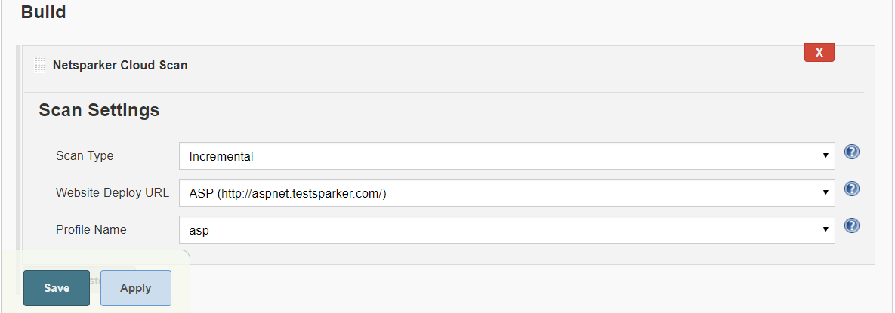
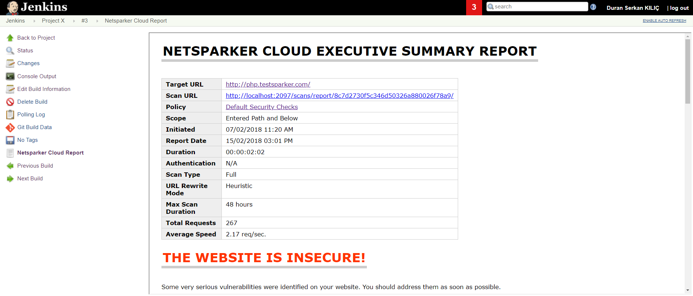

Jenkins plugin for Netsparker Cloud

[[NetsparkerCloudScanPlugin-Description]]
== Description

Allows users to start security scans via Netsparker Cloud and see their
reports in Jenkins 

[[NetsparkerCloudScanPlugin-Features]]
== Features

[[NetsparkerCloudScanPlugin-GlobalSettings]]
=== Global Settings

 Netsparker Cloud plugin needs the admin user to define the API settings
only once.

[.confluence-embedded-file-wrapper .confluence-embedded-manual-size]#image:docs/images/2018-06-25_14_04_36-Configure_System_[Jenkins].png[image,width=809]#

 +

[[NetsparkerCloudScanPlugin-GlobalSettingsOverride]]
=== Global Settings Override

As from version 1.1.5,  global settings can be overridden in pipeline
scripts by giving ncApiToken and/or ncServerURL parameters.

[[NetsparkerCloudScanPlugin-ExampleScript]]
==== Example Script

node\{ +
step([$class: 'NCScanBuilder', +
ncApiToken: 'LH5pBO+aVYFp5PVTLKHmlyNbrsT+axzHd/wSqDXajYY=', +
ncServerURL: "http://localhost:2097/", +
ncScanType: "FullWithPrimaryProfile", ncWebsiteId:
"7d7eeb95-5a63-4973-0395-a96c04c157b8"]) +
}

[[NetsparkerCloudScanPlugin-ScanTask]]
=== Scan Task

 Once you define global API settings, the plugin retrieves available
scan settings such as scannable website list and scan profile names. You
can easily select relevant settings.

[.confluence-embedded-file-wrapper .confluence-embedded-manual-size]##

Scan Report

 Once your initiated scan is completed, you can easily see your
executive scan report on the build result window.

 [.confluence-embedded-file-wrapper .confluence-embedded-manual-size]####

[[NetsparkerCloudScanPlugin-Requirements]]
== Requirements

In order to use the Netsparker Cloud scan plugin, following requirements
needs to be satisfied:

* The user must have API token which has permission to start security
scan.
* The token belongs to the Netsparker Cloud account must have at least
one registered website. 

[[NetsparkerCloudScanPlugin-UserGuide]]
== User Guide

Netsparker Cloud Jenkins Plugin documentation is always available at:

https://www.netsparker.com/blog/docs-and-faqs/how-to-install-configure-netsparker-cloud-scan-jenkins-plugin/

Netsparker Cloud SDLC documentation is always available at:

https://www.netsparker.com/blog/docs-and-faqs/integrating-netsparker-software-development-lifecycle-sdlc/

[[NetsparkerCloudScanPlugin-Checksum]]
== Checksum

[[NetsparkerCloudScanPlugin-Version]]
=== Version

[[NetsparkerCloudScanPlugin-1.1.7]]
==== 1.1.7

[width="100%",cols="14%,86%",options="header",]
|===
|Method |Checksum
|SHA-256
|04079140e6fabcd4fe3e80685d074e80ba72cb222abc8f2ebf6f2dfefc868199 

|SHA-1 |0e850a9808cac98d2b2c9b766242494df5dd4cf3 

|MD5 |d311ba8d33d32b2846ac82e23bfa93b2 
|===

[[NetsparkerCloudScanPlugin-1.1.6]]
==== 1.1.6

[width="100%",cols="14%,86%",options="header",]
|===
|Method |Checksum
|SHA-256
|2c756936ac6774e385e8a24d73da7edd755fb6bfa463590d54f2d911ac23d83d

|SHA-1 |31e570af87f8d97bb528f97e641e3de2228493bc

|MD5 |0e0b47b68a2338d16f42ec3a478adabb
|===

[[NetsparkerCloudScanPlugin-1.1.5]]
==== 1.1.5

[width="100%",cols="14%,86%",options="header",]
|===
|Method |Checksum
|SHA-256
|47fdccb5e600de9c884b770696cd120d42725e9695bde8ac872c980104aa3afc +

|SHA-1 |db3b4d406ec549de409a3491a4a27575f06b1708 +

|MD5 |7e0aebfab565b5662f1799c084b6e90c +
|===

[[NetsparkerCloudScanPlugin-1.1.4]]
==== 1.1.4

[[NetsparkerCloudScanPlugin-N/A]]
==== N/A

[[NetsparkerCloudScanPlugin-1.1.3]]
==== 1.1.3

[width="100%",cols="14%,86%",options="header",]
|===
|Method |Checksum
|SHA-256
|f9134f00113bf8b0c818ae88fbf2a04175c3fefe6b439d2c3bd75da6fb7df88b

|SHA-1 |1cf1521962ee78c20732f291488e64005e6f9144

|MD5 |423ea363a2ddc217395efa3df5714122
|===

[[NetsparkerCloudScanPlugin-1.1.2]]
==== 1.1.2

[width="100%",cols="14%,86%",options="header",]
|===
|Method |Checksum
|SHA-256
|4f0ec9f7fd8a88244a174d1c09de369db947497cc0f988095de2de1ba52eb0d8

|SHA-1 |110d7c9b9151abe4cc71bd5ff0a828dfeeec64f2

|MD5 |7f0f9b540e3b98abf03fb7d1d6da054a
|===
