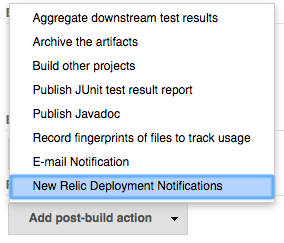
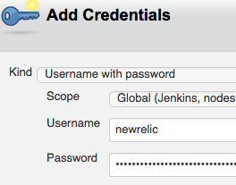
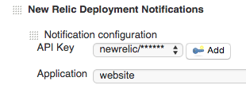
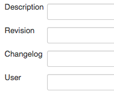
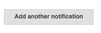
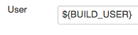

[.conf-macro .output-inline]#Jenkins plugin to notify New Relic about
https://docs.newrelic.com/docs/apm/applications-menu/events/deployments-dashboard[deployments].#

[[NewRelicDeploymentNotifierPlugin-Requirements]]
== Requirements

* An account at http://newrelic.com/[New Relic]
* API access enabled by creating an
https://docs.newrelic.com/docs/apm/apis/requirements/api-key[API key]
* Jenkins 1.580.1 or newer

[[NewRelicDeploymentNotifierPlugin-Usage]]
== Usage

Use the New Relic Deployment Notifier by adding it as a _Post Step_ in
you Jenkins build job configuration.

. In your Jenkins job configuration go to the *Post-build Actions*
section, click on *Add post-build action* and select *New Relic
Deployment Notifications* +
[.confluence-embedded-file-wrapper]##
. Create an username/password credential for the API key. Enter the key
as the password. +
[.confluence-embedded-file-wrapper]##
. Select an application in the dropdown list. +
[.confluence-embedded-file-wrapper]##
. Add any of the optional values: _description_, _revision_, _changelog_
or _user_ +
[.confluence-embedded-file-wrapper]##

If you have configured everything correctly, Jenkins will notify you New
Relic account of subsequent deployments.

It is possible to configure several applications to be notified. +
[.confluence-embedded-file-wrapper]##

[[NewRelicDeploymentNotifierPlugin-Gettinguserasanenvironmentvariable]]
=== Getting user as an environment variable

Install the
https://wiki.jenkins-ci.org/display/JENKINS/Build+User+Vars+Plugin[Build
User Vars Plugin] and use any of the supported environment variables. +
[.confluence-embedded-file-wrapper]##

[[NewRelicDeploymentNotifierPlugin-Changelog]]
== https://github.com/jenkinsci/newrelic-deployment-notifier-plugin/blob/master/CHANGELOG.md[Changelog]
