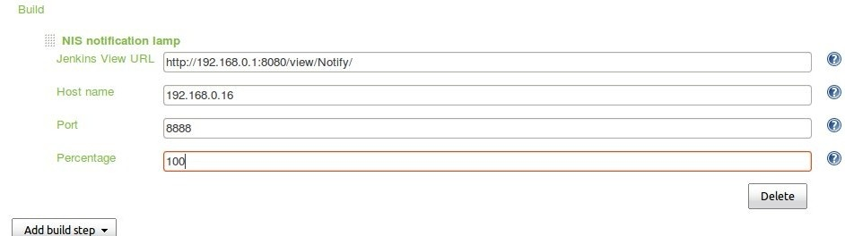
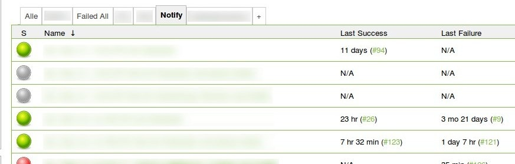

[[NIS-notification-lamp-NISnotificationlamp]]
== NIS notification lamp

 +

This plugin analyzes tasks (displayed on tabpanel) and sends string
"SUCCESS" or "FAILURE" to target server via UDP.

[[NIS-notification-lamp-ExampleofUsing]]
=== Example of Using

[[NIS-notification-lamp-]]
=== [.confluence-embedded-file-wrapper]##

[.confluence-embedded-file-wrapper]##
