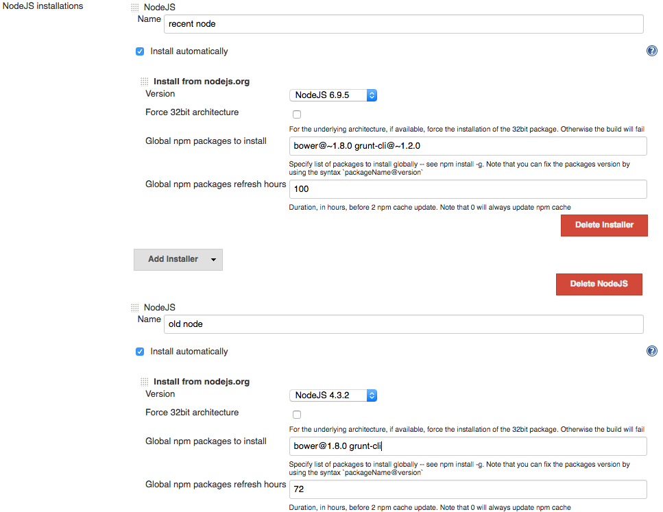
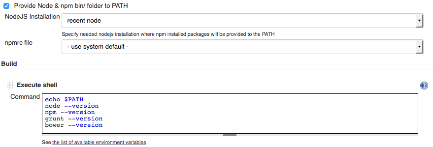
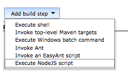
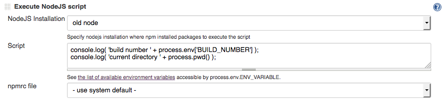
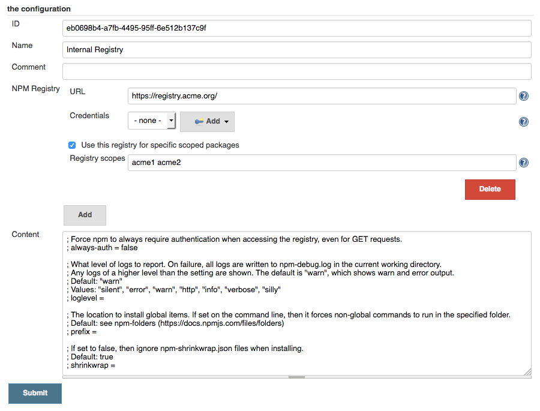
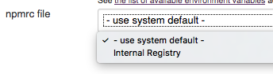

Provides Jenkins integration for NodeJS & npm packages.

[[NodeJSPlugin-Download&Installation]]
== Download & Installation

You can download the
http://updates.jenkins-ci.org/latest/nodejs.hpi[latest .hpi] and install
it from the Manage Plugins menu, or install this plugin directly from
the Plugins Update Center.

[[NodeJSPlugin-Mainfeatures]]
== Main features

* Provides NodeJS auto-installer, allowing to create as many NodeJS
installations "profiles" as you want. +
The auto-installer will automatically install a given version of NodeJS,
on every jenkins slave where it will be needed
* Allows to install globally some npm packages inside each
installations, these npm packages will be made available to the PATH
* Allows to execute some NodeJS script, under a given NodeJS
installation
* Allows use custom NPM user configuration file defined with
config-file-provider plugin to setup custom NPM settings
* Add a lightweight support to DSL pipeline
* Force 32bit architecture
* Relocate npm cache folder using pre defined streategies

[[NodeJSPlugin-Usage]]
== Usage

. After installing the plugin, go to the global jenkins configuration
panel (JENKINS_URL/configure or JENKINS_URL/configureTools if using
jenkins 2), +
and add new NodeJS installations.
. For every Nodejs installation, you can choose to install some global
npm packages. +
Since 1.2.6 you could force the installation of the 32bit package for
the underlying architecture if supported. If the package is not
available the build will fail.
+
_Note that you might provide npm package's version (with syntax
"package@0.1.2" for instance, or maybe better, "package@~0.1.0") in
order to enforce_ +
_reproductibility of your npm execution environnment (the ~ syntax
allows to benefits from bugfixes without taking the risk of a major
version upgrade)_ +
See below: +
[.confluence-embedded-file-wrapper]##
. Now, go to a job configuration screen, you will have 2 new items :
* On the "Build environnment" section, you will be able to pick one of
the NodeJS installations to provide its bin/ folder to the PATH. +
This way, during shell build scripts, you will have some npm executables
available to the command line (like bower or grunt) +
See below: +
[.confluence-embedded-file-wrapper]##
* On the "Build" section, you will be able to add a "Execute NodeJS
script" build step +
[.confluence-embedded-file-wrapper]## +
This way, you will be able to fill a textarea with the script content
you want to execute. +
Note that you will have to select a NodeJS runtime you previously
installed, to specify the NodeJS version you want to use +
during your NodeJS script execution. +
[.confluence-embedded-file-wrapper]##
. You can customise any
https://docs.npmjs.com/misc/config#config-settings[NPM settings] you
need creating a NPM config file where you can also setup multiple npm
registry (scoped or public) +
and select for each one stored credential (only user/password supported
type) as follow: +
[.confluence-embedded-file-wrapper]## +
and than select the config file to use for each configured build step +
[.confluence-embedded-file-wrapper]##
. You would relocate the npm cache folder to swipe out it when a job is
removed or workspace folder is deleted. There are three default
strategy:
* per node, that is the default NPM behavour. All download package are
placed in the ~/.npm on Unix system or %APP_DATA%\npm-cache on Windows
system;
* per executor, where each executor has an own NPM cache folder placed
in ~/npm-cache/$executorNumber;
* per job, placed in the workspace folder under $WORKSPACE/npm-cache.
This cache will be swipe out together the workspace and will be removed
when the job is deleted.

[[NodeJSPlugin-Pipeline]]
== Pipeline

The current supported DSL steps are:

* nodejs (as buildwrapper)
* tools

In a Declarative pipeline you can add any configured NodeJS tool to your
job, and it will enhance +
the PATH variable with the selected NodeJS installation folder, instead
in scripted pipeline you have to do it manually.

*_Example of use tools in Jenkinsfile (Scripted Pipeline)_*

[source,syntaxhighlighter-pre]
----
node {
    env.NODEJS_HOME = "${tool 'Node 6.x'}"
    // on linux / mac
    env.PATH="${env.NODEJS_HOME}/bin:${env.PATH}"
    // on windows
    env.PATH="${env.NODEJS_HOME};${env.PATH}"
    sh 'npm --version'
}
----

This example show the use of *buildwrapper*, where enhanced PATH will be
available only inside the brace block

*_Example of the use of buildwrapper Jenkinsfile (Declarative
Pipeline)_*

[source,syntaxhighlighter-pre]
----
pipeline {
    agent any

    stages {
        stage('Build') {
            steps {
                nodejs(nodeJSInstallationName: 'Node 6.x', configId: '<config-file-provider-id>') {
                    sh 'npm config ls'
                }
            }
        }
    }
}
----

[[NodeJSPlugin-Knownlimitations/issues]]
== Known limitations / issues

[.aui-icon .aui-icon-small .aui-iconfont-warning .confluence-information-macro-icon]#
#

NodeJS version 1.0 has adapted its code to the most recent Jenkins API
(1.6xx). If also EnvInject is installed you will fall in
https://issues.jenkins-ci.org/browse/JENKINS-26583[JENKINS-26583] +
that corrupts setup of the nodejs installation bin folder into PATH
environment. In this case consider if update or not or use an own build
from +
https://github.com/jenkinsci/nodejs-plugin/tree/workaround-26583[this
branch] untill the JENKINS-26583 will not be fixed.

* If you update from NodeJS 0.2.2 or earlier to newer version
materializes a data migration. This data migration is transparent to the
users but +
you can not back to 0.2.2 without lost global configuration tools and
job build step configuration.
* NodeJS versions prior to 0.9.0 won't be available at the moment
(directory structure was not the same as today on distribution site). +
This might be handled in the future (this is exposed as
https://github.com/jenkinsci/nodejs-plugin/blob/master/src/main/java/jenkins/plugins/nodejs/tools/pathresolvers/LatestInstallerPathResolver.java[PathResolver
implementation]) : +
don't hesitate to provide new implementations for previous versions and
submit a PR on github.
* Supported architecture are:
** Windows 32/64 bit
** Linux 32/64 bit
** OSX (intel) 64 bit
** Arm 6l/7l/64
** SunOS

[[NodeJSPlugin-ReleasesNotes]]
== Releases Notes

*Moved to https://github.com/jenkinsci/nodejs-plugin/releases[github
repository page]*
