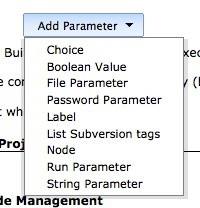
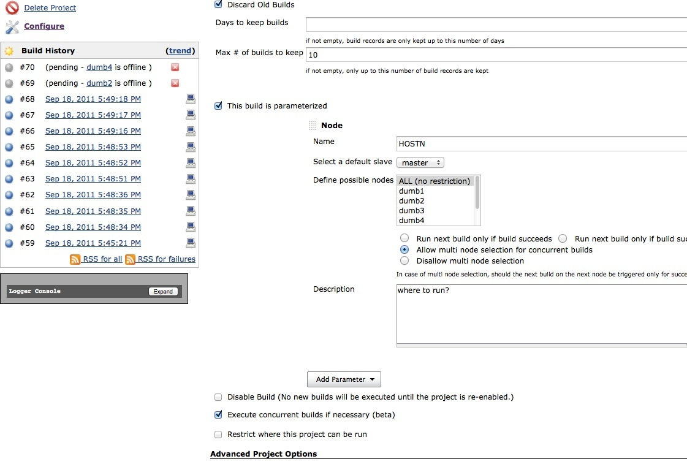
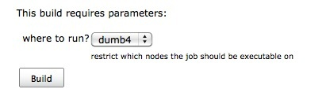
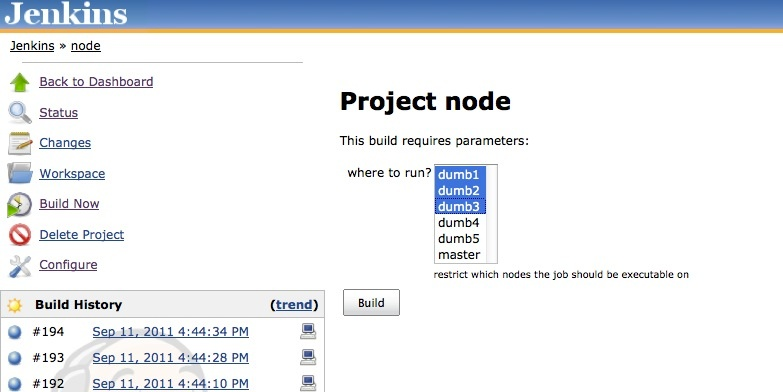
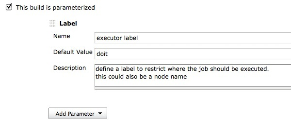
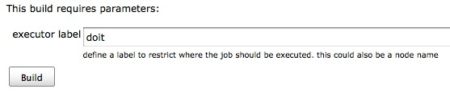
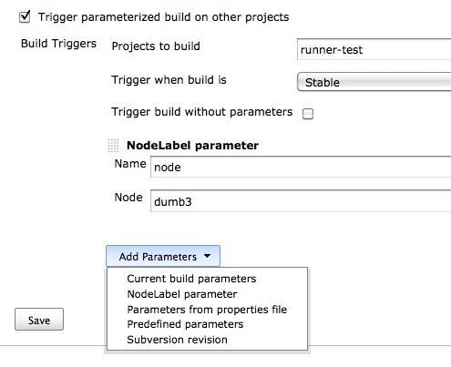
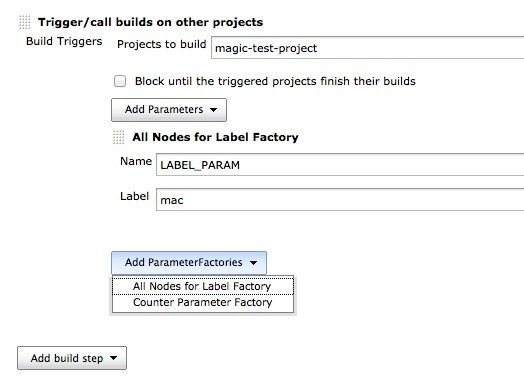

This plugin adds two new parameter types to job configuration - node and
label, this allows to dynamically select the node where a job/project
should be executed.

[[NodeLabelParameterPlugin-Description]]
== Description

The plugin allows to configure additional parameters for a job. These
new parameter types are 'Node' and 'Label'. This is specially useful if
you want to execute the job on different nodes without changing the
configuration over and over again. It also allows you to use Jenkins in
a scenario where you would like to setup different nodes with the same
script/jobs configured - e.g. SW provisioning. +
Another usage scenario would be to configure a node maintenance job
which you could trigger on request on each node.

[.confluence-embedded-file-wrapper]##

Restrict where this project can be run

[.aui-icon .aui-icon-small .aui-iconfont-warning .confluence-information-macro-icon]#
#

If your using a node or label parameter to run your job on a particular
node, you should not use the option "Restrict where this project can be
run" in the job configuration - it will not have any effect to the
selection of your node anymore!

* {blank}
+
[[NodeLabelParameterPlugin-Node]]
===== Node
+
Define a list of nodes on which the job should be allowed to be executed
on. A default node used for scheduled jobs can be defined. +
You are able to configure the job to run one after the other or even
concurrent.

[.confluence-embedded-file-wrapper]## +
In case multi node selection was disabled, you get a dropdown to select
one node to execute the job on.

[.confluence-embedded-file-wrapper]##

If multi node selection was enabled, you get the chance to select
multiple nodes to run the job on. The job will then be executed on each
of the nodes, one after the other or concurrent - depending on the
configuration.

[.confluence-embedded-file-wrapper]##

* {blank}
+
[[NodeLabelParameterPlugin-Label]]
===== Label
+
Define a label of 'Restrict where this project can be run' on the fly.

[.confluence-embedded-file-wrapper]##

[.confluence-embedded-file-wrapper]##

[[NodeLabelParameterPlugin-Triggerviascript]]
=== Trigger via script

One can also trigger a job via remote call (e.g. script)

Trigger job on multiple nodes:

[source,syntaxhighlighter-pre]
----
curl --silent -u USER:PASSWORD --show-error --data 'json={"parameter":[{"name":"PARAMNAME","value":["node1","node2"]}]}&Submit=Build' http://localhost:8080/job/remote/build?token=SECTOKEN
----

Although the first format also supports passing just one node name as
parameter in the list, the plugin also supports to pas a simple
key/value parameter to trigger the job on  single node only:

[source,syntaxhighlighter-pre]
----
curl --silent -u USER:PASSWORD --show-error --data 'json={"parameter":[{"name":"PARAMNAME","value":"master"}]}&Submit=Build' http://localhost:8080/job/remote/build?token=SECTOKEN
----

If you have a 'label' parameter (instead of a 'node' parameter), then
the request should look like this:

[source,syntaxhighlighter-pre]
----
curl --silent -u USER:PASSWORD --show-error --data 'json={"parameter":[{"name":"PARAMNAME","label":"mylabel"}]}&Submit=Build' http://localhost:8080/job/remote/build?token=SECTOKEN
----

It is also possible to pass the parameter via GET (example: NODENAME is
a 'Node' parameter defined on the job):

[source,syntaxhighlighter-pre]
----
 http://localhost:8080/jenkins/job/MyJob/buildWithParameters?NODENAME=node1
----

[[NodeLabelParameterPlugin-ParameterizedTriggerplugin]]
== Parameterized Trigger plugin

[[NodeLabelParameterPlugin-PostBuildAction]]
=== Post Build Action

If
the https://wiki.jenkins-ci.org/display/JENKINS/Parameterized+Trigger+Plugin[Parameterized
Trigger Plugin] is installed, an additional parameter is available to
pass to the target job. The parameterized trigger plugin handles Node
and Label parameters as every other parameter if you use the option
'Current build parameters'. +
But it is not possible to use the 'Predefined parameters' to overwrite
such a parameter, therefore the NodeLabel Parameter plugin adds a new
parameter to the trigger plugin.

This parameter type defines where the target job should be executed, the
value must match either a label or a node name - otherwise the job will
just stay in the queue. The NodeLabel parameter passed to the target
job, does not have to exist on the target job (but if the target has one
defined, it should match the name). This way it is possible to trigger
jobs on different nodes then they are actually configured. +
[.confluence-embedded-file-wrapper]##

[[NodeLabelParameterPlugin-BuildParameterFactory]]
=== BuildParameterFactory

The nodelabel parameter plugin also adds a `+BuildParameterFactory+` to
the parameterized trigger plugin, this factory enables you to trigger a
build of a specific project on all nodes having the same label.

. Add the a "Trigger/call builds on other projects" build step
. define the project you want to run on each node
. select the "All Nodes for Label Factory" from the "Add
ParameterFactory" dropdown
. define the label identifying all the nodes you want to run the project
on

[.confluence-embedded-file-wrapper]##

Similarly, you can also add "Build on every online node" as a parameter
factory. This will cause the specified projects to run on all nodes
(master and all slaves) that are online and have non-zero executor
configured to it.

[[NodeLabelParameterPlugin-VersionHistory]]
== Version History

[[NodeLabelParameterPlugin-1.7(7.Dec.2015)]]
=== 1.7 (7. Dec. 2015)

* fix https://issues.jenkins-ci.org/browse/JENKINS-22185[JENKINS-22185]
Trigger a build in all nodes matching a label (thanks to Antonio)

[[NodeLabelParameterPlugin-1.6(23.Nov.2015)]]
=== 1.6 (23. Nov. 2015)

* add MIT license
https://github.com/jenkinsci/nodelabelparameter-plugin/pull/8[PR #8]
(thanks vaneyckt)
* fix https://issues.jenkins-ci.org/browse/JENKINS-28374[JENKINS-28374]
enable triggering via rebuild plugin (thanks lrobertson39)
* fix https://issues.jenkins-ci.org/browse/JENKINS-27880[JENKINS-27880]
expose value in API (thanks Charles Stephens)
* fix typo
https://github.com/jenkinsci/nodelabelparameter-plugin/pull/4[PR #4]
(thanks guysoft)

[[NodeLabelParameterPlugin-1.5.1(2.March2014)]]
=== 1.5.1 (2. March 2014)

* fix https://issues.jenkins-ci.org/browse/JENKINS-21828[JENKINS-21828]
encoding issues with german "umlaute"
* integrate
https://github.com/jenkinsci/nodelabelparameter-plugin/pull/3[PR #3] 
LabelParameterDefinition extends SimpleParameterDefinition to support
better integration with other plugins

[[NodeLabelParameterPlugin-1.5.0(10.Feb2014)]]
=== 1.5.0 (10. Feb 2014)

* implement https://issues.jenkins-ci.org/browse/JENKINS-17660[JENKINS-17660]
for convenience, allow usage of 'value' for calls of label parameters
via script
* implement https://issues.jenkins-ci.org/browse/JENKINS-21194[JENKINS-21194]
add notion of NodeEligibility to differentiate between different offline
modes of nodes
* new feature: "_build on all nodes matching label_" for Label parameter
* fix https://issues.jenkins-ci.org/browse/JENKINS-20885[JENKINS-20885]
default node not selected in dropdown
* fix https://issues.jenkins-ci.org/browse/JENKINS-20823[JENKINS-20823]
Stack Trace when Configuring a task with "Label Factory"
* lift dependency to core 1.509.4

[[NodeLabelParameterPlugin-1.4(28.March2013)]]
=== 1.4 (28. March 2013)

* implement
https://issues.jenkins-ci.org/browse/JENKINS-17305[JENKINS-17305] don't
wait for offline nodes (new option added for node parameter and
parameter factory)
* implement
https://issues.jenkins-ci.org/browse/JENKINS-14407[JENKINS-14407] allow
multi-value default for scheduled builds

[[NodeLabelParameterPlugin-1.3(9.Dec2012)]]
=== 1.3 (9. Dec 2012)

* Add new build parameter factory for
https://wiki.jenkins-ci.org/display/JENKINS/Parameterized+Trigger+Plugin[Parameterized
Trigger Plugin] : List of nodes - factory takes a list of nodes to
trigger the job on
* fix https://issues.jenkins-ci.org/browse/JENKINS-15339[JENKINS-15339]
breaks Windows batch file build steps if Name field not filled in
* fix https://issues.jenkins-ci.org/browse/JENKINS-15370[JENKINS-15370]
Value of Node param variable does not contain all values when selecting
multiple nodes

[[NodeLabelParameterPlugin-1.2.1(2.July2012)]]
=== 1.2.1 (2. July 2012)

* fixed
https://issues.jenkins-ci.org/browse/JENKINS-14230[JENKINS-14230] Node
parameter value can't be passed by HTTP GET

[[NodeLabelParameterPlugin-1.2(25.June2012)]]
=== 1.2 (25. June 2012)

* fix https://issues.jenkins-ci.org/browse/JENKINS-14120[JENKINS-14120]
confusing output
* fix https://issues.jenkins-ci.org/browse/JENKINS-13902[JENKINS-13902]
move 'master' up in selection list
* fix https://issues.jenkins-ci.org/browse/JENKINS-14109[JENKINS-14109]
Passing $\{NODE_NAME} as Node Parameter to downstream job not possible
on master

[[NodeLabelParameterPlugin-1.1.4(21.May2012)]]
=== 1.1.4 (21. May 2012)

* supported a build parameter factory that lets you run a specified job
on all the slaves.

[[NodeLabelParameterPlugin-1.1.3(11.May2012)]]
=== 1.1.3 (11. May 2012)

* fix https://issues.jenkins-ci.org/browse/JENKINS-13704[JENKINS-13704]
Unable to start a concurrent build when there are nodeParameterValues

[[NodeLabelParameterPlugin-1.1.2(25.Feb.2011)]]
=== 1.1.2 (25. Feb. 2011)

* fix https://issues.jenkins-ci.org/browse/JENKINS-12226[JENKINS-12226]
Triggering a build with "Current build parameters" fails when the
current build parameters includes a node name
* fix issue if a a job has many parameters

[[NodeLabelParameterPlugin-1.1.1(27.Nov.2011)]]
=== 1.1.1 (27. Nov. 2011)

* Fix issue if a label was using expressions

[[NodeLabelParameterPlugin-1.1.0(15.Nov.2011)]]
=== 1.1.0 (15. Nov. 2011)

* Added a BuildParameterFactory to get all Nodes for a Label when
triggered via buildstep from "parameterized-trigger-plugin"
(https://github.com/jenkinsci/nodelabelparameter-plugin/pull/1[pull #1],
thanks to wolfs)

[[NodeLabelParameterPlugin-1.0.0(18.Sep.2011)]]
=== 1.0.0 (18. Sep. 2011)

* fix https://issues.jenkins-ci.org/browse/JENKINS-10982[JENKINS-10982]
trim labels / nodes
* fix https://issues.jenkins-ci.org/browse/JENKINS-11006[JENKINS-11006]
fix remote triggering (e.g. via script)
* enhance node parameter to support concurrent job execution
* ...in case you have an issue after updating to this version, try to
just open the job configuration and save it again.

[[NodeLabelParameterPlugin-0.2.0]]
=== 0.2.0

* add badge icon to show on which node/label the build was done
* add support to execute the job on multiple nodes automatically  (one
after the other)

[[NodeLabelParameterPlugin-0.1.2]]
=== 0.1.2

* add additional parameter to parameterized-trigger plugin
(https://issues.jenkins-ci.org/browse/JENKINS-10088[JENKINS-10088])

[[NodeLabelParameterPlugin-0.1.0]]
=== 0.1.0

* Inital

[[NodeLabelParameterPlugin-HelpandSupport]]
== Help and Support

type

key

summary

[.icon-in-pdf]# # Data cannot be retrieved due to an unexpected error.

http://issues.jenkins-ci.org/secure/IssueNavigator.jspa?reset=true&jqlQuery=project%20=%20JENKINS%20AND%20status%20in%20%28Open,%20%22In%20Progress%22,%20Reopened%29%20AND%20component%20=%20%27nodelabelparameter-plugin%27&src=confmacro[View
these issues in Jira]

For Help and support please use the
http://jenkins-ci.org/content/mailing-lists[Jenkins Users] mailing
list. +
The comment list below is not monitored.
