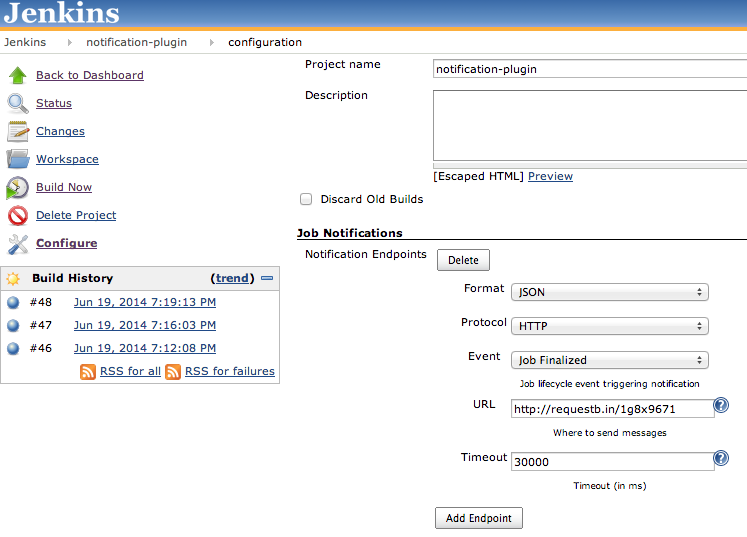
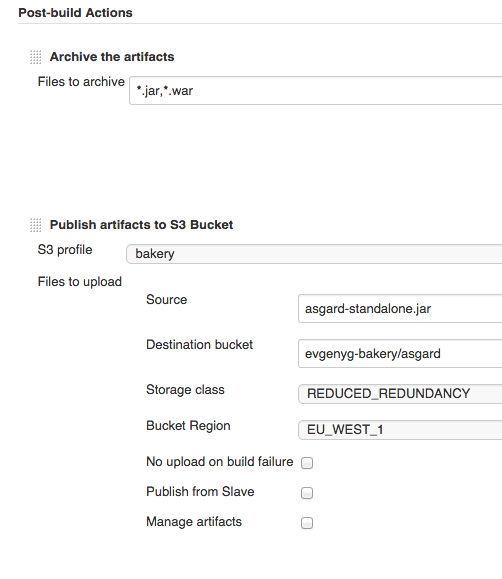

This plugin from http://www.tikalk.com/[Tikal Knowledge] allows sending
Job Status notifications in JSON and XML formats. +

Job Notifications are defined in job's configuration, in their own
separate section *"Job Notifications"*:

[.confluence-embedded-file-wrapper]##

Several notification endpoints can be defined. Each endpoint can be
configured with:

* *"Format"* : notification payload format, JSON or XML.
* *"Protocol"*: protocol to use for sending notification messages, HTTP,
TCP or UDP.
* *"Event"*: job events that trigger notifications: Job Started, Job
Completed, Job Finalized or All Events (the default option). The
difference between job being "completed" and "finalized" is as follows:
when job is finalized all post-build activities, such as archiving
artifacts, were executed as well. This is not the case with job being
merely "completed" which usually involves only creation of job's
artifacts without post-processing them. If you're unsure of which event
to use, you can start with "Job Finalized".
* *"URL"*: URL to send notifications to. It takes the form of
**"**`+http://host+`*"* for HTTP protocol, and **"**`+host:port+`*"* for
TCP and UDP protocols.
* *"Timeout"*: Timeout in milliseconds for sending notification request,
30 seconds by default.

Example of notification message (you can use
http://requestb.in/[*requestb.in*] and
http://jsonlint.com/[*jsonlint.com*] services to aggregate HTTP requests
and validate JSON payload):

[source,syntaxhighlighter-pre]
----
{
    "name": "asgard",
    "url": "job/asgard/",
    "build": {
        "full_url": "http://localhost:8080/job/asgard/18/",
        "number": 18,
        "phase": "COMPLETED",
        "status": "SUCCESS",
        "url": "job/asgard/18/",
        "scm": {
            "url": "https://github.com/evgeny-goldin/asgard.git",
            "branch": "origin/master",
            "commit": "c6d86dc654b12425e706bcf951adfe5a8627a517"
        },
        "artifacts": {
            "asgard.war": {
                "archive": "http://localhost:8080/job/asgard/18/artifact/asgard.war"
            },
            "asgard-standalone.jar": {
                "archive": "http://localhost:8080/job/asgard/18/artifact/asgard-standalone.jar",
                "s3": "https://s3-eu-west-1.amazonaws.com/evgenyg-bakery/asgard/asgard-standalone.jar"
            }
        }
    }
}
----

The payload submitted includes the following information:

* Job's name and URL.
* Build's number, full URL, phase, and status.
* SCM URL, branch and commit (only for Git repositories).
* Artifacts generated. They need to be archived by *"Archive the
artifacts"* or published to S3 by *"Publish artifacts to S3 Bucket"*
post-build actions. In addition, Jenkins needs to have its URL
configured in "Manage Jenkins" => "Configure System" => "Jenkins
Location" => "Jenkins URL".

[.confluence-embedded-file-wrapper]##

[[NotificationPlugin-AWSS3Support]]
== AWS S3 Support

If Jenkins https://wiki.jenkins-ci.org/display/JENKINS/S3+Plugin[*S3
Plugin*] is installed and artifacts are uploaded to
http://aws.amazon.com/s3/[AWS S3] by *"Publish artifacts to S3 Bucket"*
post-build action - the plugin will send their downloadable locations as
well.

Note that you need to
http://docs.aws.amazon.com/AmazonS3/latest/UG/EditingBucketPermissions.html[edit
S3 bucket's policy] (see
http://docs.aws.amazon.com/AmazonS3/latest/dev/example-bucket-policies.html#example-bucket-policies-use-case-2[example])
to make its artifacts directly "downloadable" by anonymous users. Here's
one possible policy:

[source,syntaxhighlighter-pre]
----
{
    "Version": "2008-10-17",
    "Statement": [
        {
            "Effect": "Allow",
            "Principal": {
                "AWS": "*"
            },
            "Action": "s3:GetObject",
            "Resource": "arn:aws:s3:::notification-plugin/*"
        }
    ]
}
----
