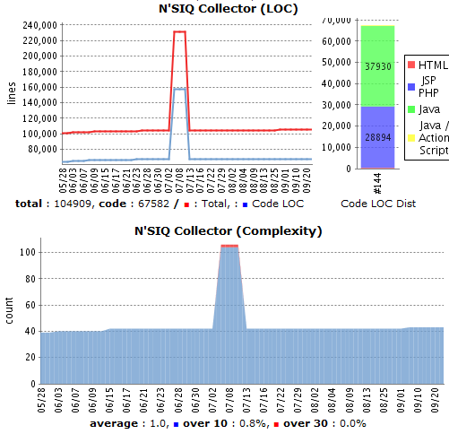
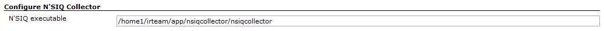
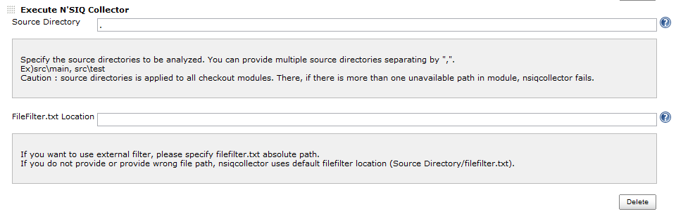
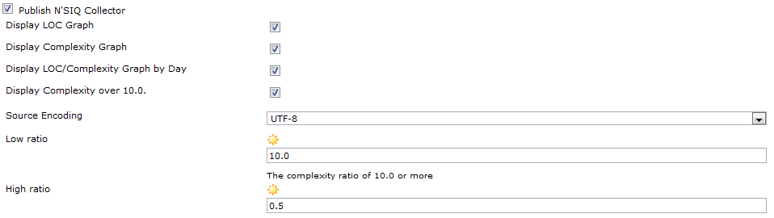

[.conf-macro .output-inline]#This plugin shows the lines of code and
cyclomatic complexity from from external metric tools named
http://dev.naver.com/projects/nsiqcollector[N'SIQ Collector].#

[[NSIQCollectorPlugin-Introduction]]
== Introduction

[.confluence-embedded-file-wrapper]##

* N'SIQ Collector Plugin shows lines of code and cyclomatic complexity
from extenal metric tools named N'SIQ
Collector(http://dev.naver.com/projects/nsiqcollector)
** N'SIQ Collector collects LOC and complexity from the designated
folder without any complex options. If you run N'SIQ Collector on the
some folder like following, It will scan files in the folder and
generate two files(loc_result.html, complexity_result.html) on the
folder.
+
____
nsiqcollector folder_to_be_analyzed
____
** You can easily filter files in the folder by configuring
"filefilter.txt" file on the folder. You can see how to set up it in
following URL.
http://dev.naver.com/projects/nsiqcollector/wiki/%EB%B9%A8%EB%A6%AC%EC%8B%9C%EC%9E%91%ED%95%98%EA%B8%B0
*** filefilter.txt file is automatically generated in the target folder
when you run nsiqcollector on the folder.

[[NSIQCollectorPlugin-Howtosetup]]
== How to set up

* Install N'SIQ Collector on the Hudson
server.(http://dev.naver.com/projects/nsiqcollector/download)
* Install N'SIQ Collector Hudson Plugin through the official Hudson
updatecenter.
* Restart Hudson

* Go to Hudson Configure ==> Assign N'SIQ Collector executable. +
[.confluence-embedded-file-wrapper]##

* Go to Hudson Project Configure ==> Add "Execute N'SIQ Collector"
BuildStep and assign folders to be analyzed. +
[.confluence-embedded-file-wrapper]##
** If you want to use external filefilter.txt which is not in the
assigned folders, assign it the FileFilter.txt location field.

* Go to "Post Build Actions" and Click the "Publish the N'SIQ Collector"
checkbox. +
[.confluence-embedded-file-wrapper]##
** Check the options you want.

* Build it!

[[NSIQCollectorPlugin-Developers]]
== Developers

* Young-eun Oh, Currently working for NHN corp
(http://nhncorp.com/[http://nhncorp.com])
* JunHo Yoon. Currently working for NHN corp
(http://nhncorp.com/[http://nhncorp.com])

[[NSIQCollectorPlugin-Changelog]]
== Changelog

[[NSIQCollectorPlugin-1.3.3(Aug6,2011)]]
=== 1.3.3 (Aug 6, 2011)

* Add log output on error
* Update uses of deprecated APIs

[[NSIQCollectorPlugin-1.3.2(Oct21,2010)]]
=== 1.3.2 (Oct 21, 2010)

[[NSIQCollectorPlugin-1.3.0]]
=== 1.3.0

* Official Release
