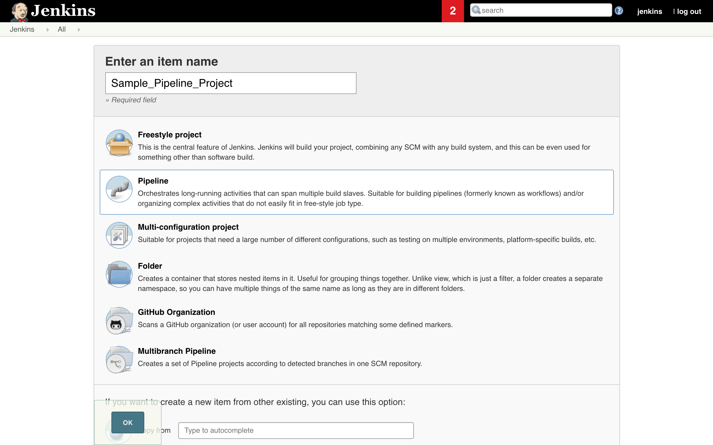

Nutanix Calm Jenkins plugin allows you to launch Nutanix Calm blueprint,
provision infrastructure, and services in a multi cloud environment and
subsequently run actions/tasks on those applications.

[[NutanixCalmPlugin-Changelog]]
== Changelog 

[[NutanixCalmPlugin-Version1.2(January032019)]]
=== *Version 1.2 (January 03 2019)*

* Ability to reference the Jenkins Environment variables in the run time
variables section of blueprint launch and application action run in the
Jenkins Calm Plugin. 
* Calm Service IP application variable is exposed as a Jenkins
environment variable.
* This release also includes two minor bug fixes.

[[NutanixCalmPlugin-KnownIssues]]
==== Known Issues

* Slight performance lag observed in the plugin when used in Windows OS
chrome browser

[[NutanixCalmPlugin-Version1.1(November032018)]]
=== Version 1.1 (November 03 2018)

* In this release Plugin can be used with Jenkins Freestyle projects and
Pipeline. +
Launch Calm Blueprints and run application actions from the Jenkins
build steps. +
* The Prism Central credentials are handled by the credentials plugin as
prescribed by Jenkins.
* By default, the PC IP/URL expects an SSL certificate. There is an
exclusive option to override the same.

[[NutanixCalmPlugin-License:]]
== License:

* All source code is licensed under the MIT license.

[[NutanixCalmPlugin-SupportedVersions:]]
== Supported Versions:

* Jenkins versions: 2.107.2 and later
* Nutanix Calm versions: 5.7.1 and later
* Google Chrome version:  69.0.3497.100 (Official Build) (64-bit) 

[[NutanixCalmPlugin-PluginInstallation:]]
== Plugin Installation:

* Navigate to Manage Jenkins→ Manage Plugin → Available.  Search for
Nutanix Calm +
[.confluence-embedded-file-wrapper .confluence-embedded-manual-size]##
* To verify that the Nutanix Calm plug-in is successfully installed,
click Manage Jenkins→ Manage Plugins→ Installed, search for Nutanix Calm
plugin.  +
[.confluence-embedded-file-wrapper .confluence-embedded-manual-size]## +

[[NutanixCalmPlugin-PluginConfiguration:]]
==  +
Plugin Configuration:

* To configure the plugin first Navigate to Manage Jenkins -> Configure
System -> Nutanix Calm Plugin Configuration. Provide the Prism Central
IP/DNS Name, Username and Password. +
[.confluence-embedded-file-wrapper .confluence-embedded-manual-size]#image:docs/images/Plugin_configuration.png[image,height=400]#

[[NutanixCalmPlugin-JenkinsFreestylejobSetup:]]
==  +
Jenkins Freestyle job Setup:

* Click on New Item. Select Freestyle project. Enter an item name. Click
OK. +
[.confluence-embedded-file-wrapper .confluence-embedded-manual-size]## +
[.confluence-embedded-file-wrapper .confluence-embedded-manual-size]## +
 +
* Click on Add Build step. Select *Nutanix Calm Blueprint Launch*.  +
[.confluence-embedded-file-wrapper .confluence-embedded-manual-size]## +
 +
* In the section
** Select the Calm project.
** Select the Blueprint to launch. Blueprint description is fetched and
displayed. 
** Select the Application profile.
** Modify the values for runtime variables available for that
application profile. 
** Provide an application name. BUILD_ID is appended by default to the
application name to uniquely identify it in Calm. 
** Select the option if you want Jenkins job to wait for blueprint
launch to complete before proceeding to the next step. +
[.confluence-embedded-file-wrapper .confluence-embedded-manual-size]## +
 +
* To invoke actions defined in the Calm blueprint/ application, click on
Add Build Step. Select *Nutanix Calm Application Action Run*.  +
[.confluence-embedded-file-wrapper .confluence-embedded-manual-size]## +
 +
* In the section 
** Select the application name. 
** Select the application actions available. 
** If necessary, modify the values for the runtime variables
available. +
[.confluence-embedded-file-wrapper .confluence-embedded-manual-size]## +
 +
** Click on Apply and then Save.
** Click on Build Now to run these build steps.  +
[.confluence-embedded-file-wrapper .confluence-embedded-manual-size]##

[[NutanixCalmPlugin-JenkinsPipeline:]]
== Jenkins Pipeline:

* Click on New Item. Select Pipeline. Enter an item name. Click OK. +
[.confluence-embedded-file-wrapper .confluence-embedded-manual-size]## +
 +
[.confluence-embedded-file-wrapper .confluence-embedded-manual-size]## +
 +
* Select pipeline script in Pipeline Definition section and to generate
the pipeline syntax click on the Pipeline Syntax at the bottom.  +
[.confluence-embedded-file-wrapper .confluence-embedded-manual-size]## +
 +
* In the Pipeline Syntax window, select the General build Step in the
Sample step dropdown. 
* Select Nutanix Calm Blueprint Launch in Build Step
* In the section
** Select the Calm project.
** Select the Blueprint to launch. Blueprint description is fetched and
displayed. 
** Select the Application profile.
** Modify the values for runtime variables available for that
application profile. 
** Provide an application name. BUILD_ID is appended by default to the
application name to uniquely identify it in Calm. 
** Select the option if you want Jenkins job to wait for blueprint
launch to complete before proceeding to the next step.
* Click on Generate Pipeline Script. +
[.confluence-embedded-file-wrapper .confluence-embedded-manual-size]##  +
 +
* Copy and paste the text in the box below into the pipeline script box
in \{} under node.  +
[.confluence-embedded-file-wrapper .confluence-embedded-manual-size]## +
 +
* Follow same steps to generate the pipeline syntax for *Nutanix Calm
Application Action Run.* +
*[.confluence-embedded-file-wrapper .confluence-embedded-manual-size]## +
 +
*
* Copy and paste the text in the box below into the pipeline script box
in \{} under node. ** +
[.confluence-embedded-file-wrapper .confluence-embedded-manual-size]#image:docs/images/Copy_App_Action_Script.png[image,height=400]# +
**
* Click on Apply and then Save.
* CNow we can click on Build Now to run these build steps.  +
*[.confluence-embedded-file-wrapper .confluence-embedded-manual-size]#image:docs/images/Build_Now_Pipeline.png[image,height=400]# +
*
+
* +
*
* Pipeline scripts can also be invoked from SCM in Pipeline Definition
section 
+
[.confluence-embedded-file-wrapper .confluence-embedded-manual-size]## +

 +

 +

 +

[.aui-icon .aui-icon-small .aui-iconfont-info .confluence-information-macro-icon]#
#

$\{CalmServicesIP} is the exposed Jenkins environment variable which
gives the output like InstanceName_ProviderType=IP For example
\{mssqlvm-0-190103-040010_VMWARE_VM=10.46.140.18,
iis1-0-190103-040009_VMWARE_VM=10.46.141.34,
iis2-0-190103-040009_VMWARE_VM=10.46.140.91}

 +

 +
 +
 +
 +
 +
