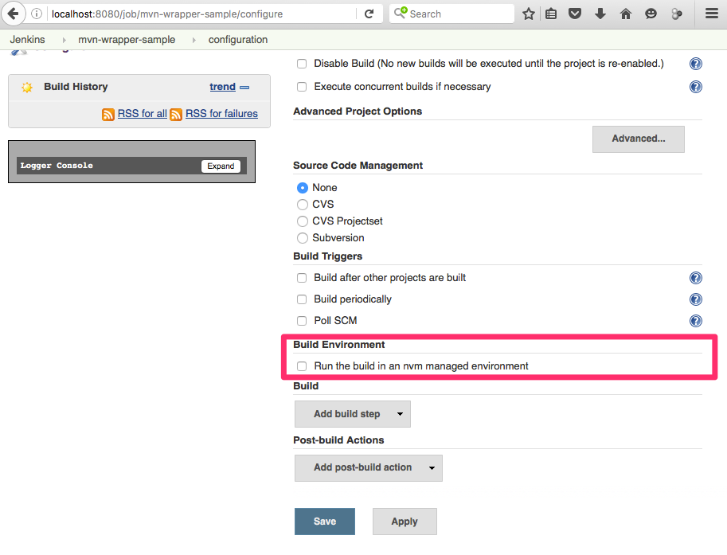
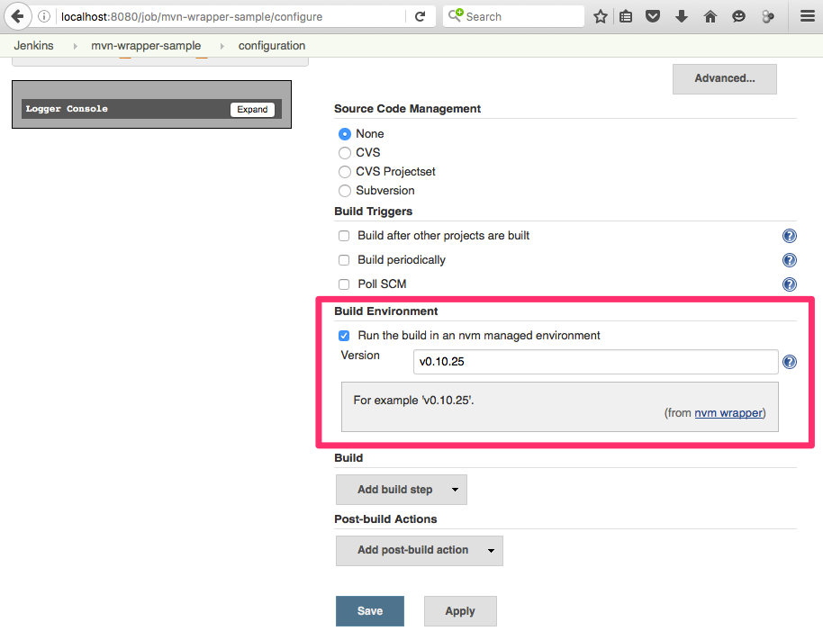
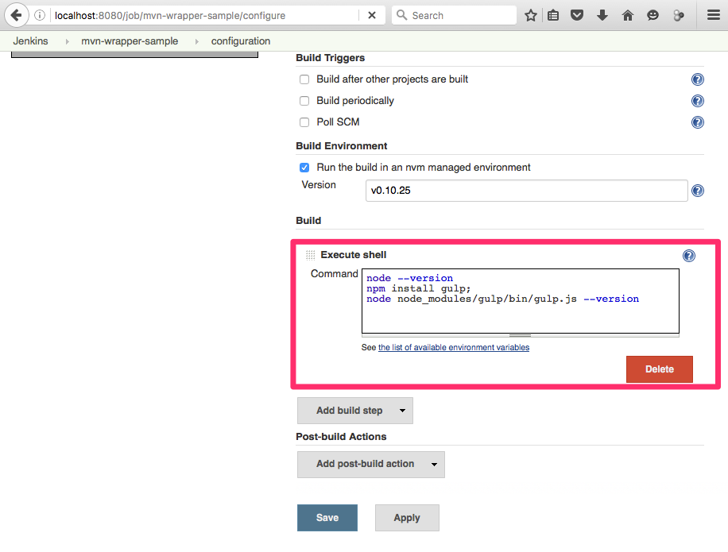
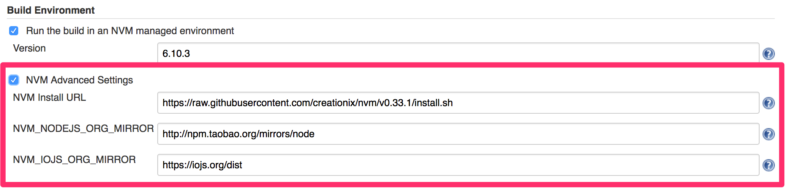

Allows you to easily install, manage, and work with multiple Node.js
environments

[.confluence-embedded-file-wrapper]#image:https://jenkins.ci.cloudbees.com/buildStatus/icon?job=plugins/nvm-wrapper-plugin[image]#

[[NvmWrapperPlugin-Features]]
== Features

* Installs nvm.sh
* Installs node version configured for a job.
* Amends build environment to use configured node version.

[[NvmWrapperPlugin-Potentialupcomingfeatures]]
=== Potential upcoming features

* Use the .nvmrc-file
* Make code compatible with Java 7

    

[[NvmWrapperPlugin-Requirements]]
== Requirements

*  nvm-wrapper doesn't support windows
https://github.com/coreybutler/nvm-windows[nvm-windows] 
*  https://github.com/creationix/nvm/blob/master/README.markdown[nvm
readme]
*  Java 8

[[NvmWrapperPlugin-Setup]]
== Setup

[[NvmWrapperPlugin-Installplugin]]
=== Install plugin

Install this plugin via the Jenkins plugin manager.

[[NvmWrapperPlugin-Per-jobconfig]]
=== Per-job config

. Enable build to run in nvm environment +
[.confluence-embedded-file-wrapper]##
. Configure the node version  +
[.confluence-embedded-file-wrapper]##
. Add a shell command. There is not need to install modules globally 
[.confluence-embedded-file-wrapper]## +
 

[[NvmWrapperPlugin-Versionhistory]]
== Version history

[[NvmWrapperPlugin-Version0.1.7(Abril2019)]]
=== Version 0.1.7 (Abril 2019)

* Fix [.jira-issue .conf-macro .output-block]#
https://issues.jenkins-ci.org/browse/JENKINS-49720[[.aui-icon .aui-icon-wait .issue-placeholder]##
##JENKINS-49720] - [.summary]#Getting issue details...#
[.aui-lozenge .aui-lozenge-subtle .aui-lozenge-default .issue-placeholder]#STATUS#
#

[[NvmWrapperPlugin-Version0.1.6(Aug2018)]]
=== Version 0.1.6 (Aug 2018)

* Provide a way to customize NVM installation settings.

* Fix  [.jira-issue .conf-macro .output-block]#
https://issues.jenkins-ci.org/browse/JENKINS-49720[[.aui-icon .aui-icon-wait .issue-placeholder]##
##JENKINS-49720] - [.summary]#Getting issue details...#
[.aui-lozenge .aui-lozenge-subtle .aui-lozenge-default .issue-placeholder]#STATUS#
#
* Fix  [.jira-issue .conf-macro .output-block]#
https://issues.jenkins-ci.org/browse/JENKINS-46585[[.aui-icon .aui-icon-wait .issue-placeholder]##
##JENKINS-46585] - [.summary]#Getting issue details...#
[.aui-lozenge .aui-lozenge-subtle .aui-lozenge-default .issue-placeholder]#STATUS#
#
* Fix  [.jira-issue .conf-macro .output-block]#
https://issues.jenkins-ci.org/browse/JENKINS-49445[[.aui-icon .aui-icon-wait .issue-placeholder]##
##JENKINS-49445] - [.summary]#Getting issue details...#
[.aui-lozenge .aui-lozenge-subtle .aui-lozenge-default .issue-placeholder]#STATUS#
#

[[NvmWrapperPlugin-Version0.1.5(Feb2018)]]
=== Version 0.1.5 (Feb 2018)

* Fix  [.jira-issue .conf-macro .output-block]#
https://issues.jenkins-ci.org/browse/JENKINS-45742[[.aui-icon .aui-icon-wait .issue-placeholder]##
##JENKINS-45742] - [.summary]#Getting issue details...#
[.aui-lozenge .aui-lozenge-subtle .aui-lozenge-default .issue-placeholder]#STATUS#
#
* https://github.com/jenkinsci/nvm-wrapper-plugin/pull/11[Make arguments
other than version optional]

[[NvmWrapperPlugin-Version0.1.4(Jul2017)]]
=== Version 0.1.4 (Jul 2017)

* Fix  [.jira-issue .conf-macro .output-block]#
https://issues.jenkins-ci.org/browse/JENKINS-45784[[.aui-icon .aui-icon-wait .issue-placeholder]##
##JENKINS-45784] - [.summary]#Getting issue details...#
[.aui-lozenge .aui-lozenge-subtle .aui-lozenge-default .issue-placeholder]#STATUS#
#

[[NvmWrapperPlugin-Version0.1.3(Jun,2017)]]
=== Version 0.1.3 (Jun, 2017)

* Add pipeline support +
[.confluence-embedded-file-wrapper .confluence-embedded-manual-size]#image:https://cloud.githubusercontent.com/assets/140008/25879088/16e70756-34f5-11e7-8220-1d9f5f6cc7ae.png[image,height=250]#

 +

[.confluence-embedded-file-wrapper .confluence-embedded-manual-size]#image:https://user-images.githubusercontent.com/140008/27511402-a251668a-58e8-11e7-9044-80f8ee0aa936.png[image,height=250]#

* Fix  [.jira-issue .conf-macro .output-block]#
https://issues.jenkins-ci.org/browse/JENKINS-45079[[.aui-icon .aui-icon-wait .issue-placeholder]##
##JENKINS-45079] - [.summary]#Getting issue details...#
[.aui-lozenge .aui-lozenge-subtle .aui-lozenge-default .issue-placeholder]#STATUS#
#

 +

[[NvmWrapperPlugin-Version0.1.2(May,2017)]]
=== Version 0.1.2 (May, 2017)

* Add support to advanced options +
[.confluence-embedded-file-wrapper .confluence-embedded-manual-size]##
* Fix https://github.com/jenkinsci/nvm-wrapper-plugin/pull/3

 +

[[NvmWrapperPlugin-Version0.1.0(Aug,2016)]]
=== Version 0.1.0 (Aug, 2016)

* Initial release

[[NvmWrapperPlugin-GithubRepo]]
=== https://github.com/jenkinsci/nvm-wrapper-plugin[Github Repo]
