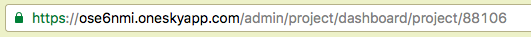
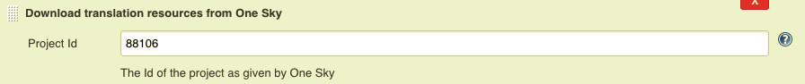
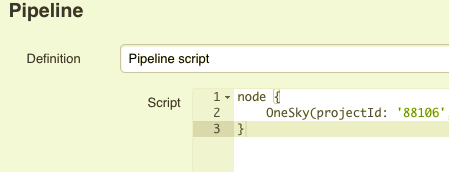
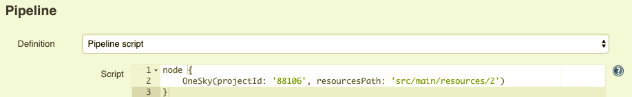
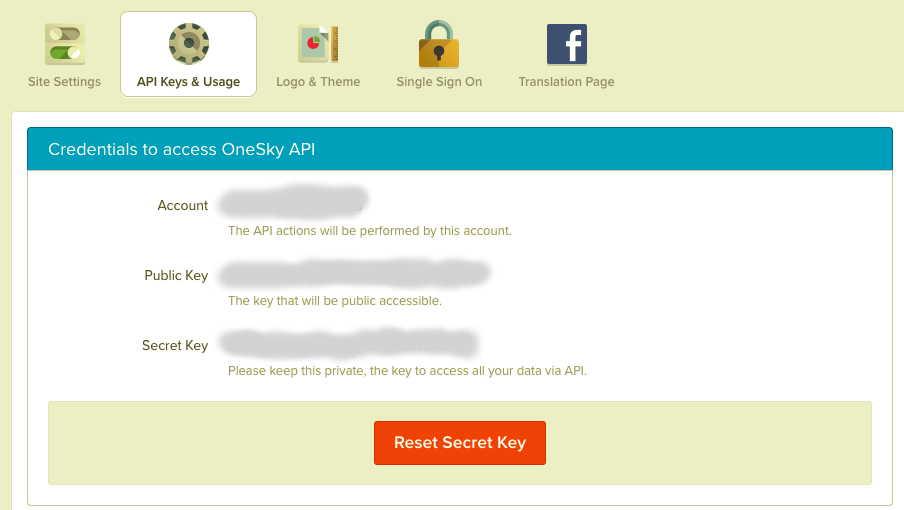
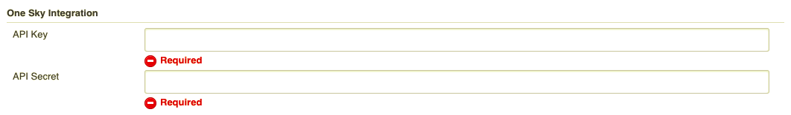

Maintain the localization process in sync with OneSky

[[OneskyPlugin-Features]]
== Features

* Downloading of 'ready to be published' translation files from one sky
* Creation of the downloaded files over in your workspace
* Pipeline support

[[OneskyPlugin-Usage]]
== Usage

To use this plugin 4 things need to be configured: +
 

. The target translation project Id as found on the url of the onesky
app
. Secret key - This is where equivalent to a password for accessing the
api
. Public Key - This is the equivalent to a username for accessing the
api
. Resources Path - This is the relative path, inside your workspace,
where your translation files will be output to 

[[OneskyPlugin-Configuration]]
== Configuration

To retrieve the *project Id* head over to the project definitions in
your onesky app and copy and pate the ending of your URL:

[.confluence-embedded-file-wrapper]## +
(88106 this example)

To the settings in your job: 

[.confluence-embedded-file-wrapper]##

Or your pipeline:

[.confluence-embedded-file-wrapper]##

The *Resources Path* will be configured in the same place:

on your job: +
[.confluence-embedded-file-wrapper]##

and on your pipeline:

[.confluence-embedded-file-wrapper]##

Finally, both the *API Secret* and *API key* should be taken from the
onesky app settings page:

[.confluence-embedded-file-wrapper]##

and saved in the global jenkins configuration:

[.confluence-embedded-file-wrapper]##
