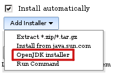
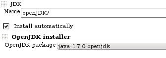

This plugin adds auto installer for OpenJDK from native RPM packages and
provides switching between OpenJDK vesrions using Linux alternatives

[[OpenJDKnativeinstallerplugin-Configuration]]
== Configuration

Add Java installation, select "Install automatically" and choose OpenJDK
installer

 +
[.confluence-embedded-file-wrapper]##

Select RPM package, which you want to install

 +
[.confluence-embedded-file-wrapper]## +
  +
Alternatives and yum are run via sudo, therefore appropriate sudoers
setup is requited (including switching off tty requirement which is
turned on by default or run pseudo-tty e.g. by including -t param in ssh
command). +
Example setup: +

*/etc/sudoers.d/jenkins*

[source,syntaxhighlighter-pre]
----
#Defaults    requiretty
User_Alias JENKINS = test_user
Cmnd_Alias OPENJDK_INSTALL = /usr/sbin/alternatives, /usr/bin/yum
JENKINS ALL = NOPASSWD: OPENJDK_INSTALL
----

[[OpenJDKnativeinstallerplugin-Changelog]]
== Changelog

[[OpenJDKnativeinstallerplugin-Upcomingchanges]]
=== Upcoming changes +

[[OpenJDKnativeinstallerplugin-Release1.1(2015-01-16)]]
=== Release 1.1 (2015-01-16)

* Added OpenJDK8
(https://issues.jenkins-ci.org/browse/JENKINS-26434[JENKINS-26434])

[[OpenJDKnativeinstallerplugin-Release1.0(2012-03-01)]]
=== Release 1.0 (2012-03-01)

* Initial release
