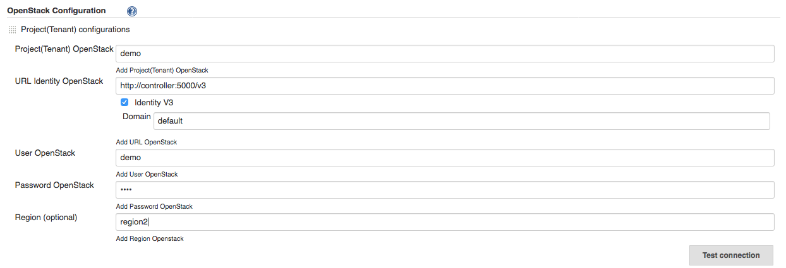
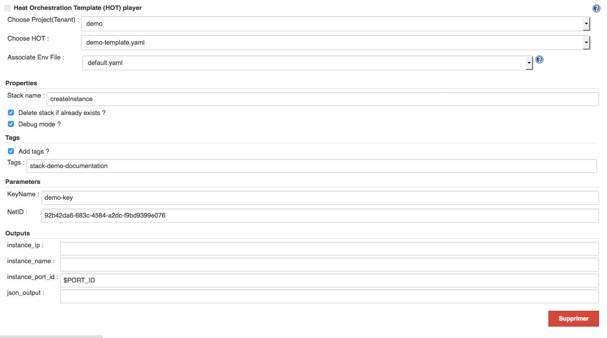
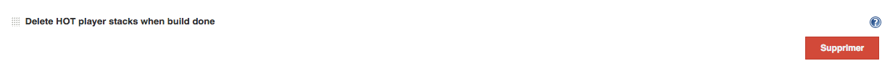
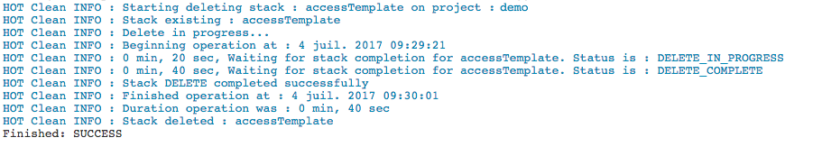

Openstack Heat Plugin allows to interact with OpenStack by using the
Heat API in Jenkins.

[[OpenstackHeatPlugin-Summary]]
== Summary

Openstack Heat is a Jenkins plugin that allows to interact with
OpenStack by using the Heat API. +
When you configure a project, you can add a step build HOT player. At
this time, you can choose a tenant/yaml file/env file from differents
lists. +
When a selection is done, the plugin generates automatically the
interface from the differents parameters (yaml file, env file...) and
you can configure the heat interactions. You can create differents HOT
player steps and exchange data between them. +
When the job is launched, the plugin calls OpenStack via the Heat API
with the configuration and the Jenkins console shows the outputs from
the interaction.

[[OpenstackHeatPlugin-Installation]]
== Installation

The plugin can be install with the differents methods described in the
Jenkins documentation
: https://wiki.jenkins-ci.org/display/JENKINS/Plugins#Plugins-Howtoinstallplugins[Jenkins
Plugins - How to install plugins]

[[OpenstackHeatPlugin-Usage]]
== Usage

[[OpenstackHeatPlugin-Globalconfiguration]]
=== Global configuration

'''''

[[OpenstackHeatPlugin-OpenStackConfiguration]]
==== OpenStack Configuration

This section permits to add one or more OpenStack platform(s) by the
button *Add a new Project(Tenant) configuration*.

You need to fill the fields :

* _Project(Tenant) OpenStack_ : Project (Tenant) associated with the
identification.
* _URL Identity OpenStack_ : Url to access the identity service.
* _Identity V3_ : If the identity uses v3, the check box permits to
configure the domain.
* _Domain_ : Domain used for the identification when the identity V3 is
checked.
* _User OpenStack_ : User to identify on the project(tenant).
* _Password OpenStack_ : Password associated.
* Region (optional) : If you want used a specific region on your
openstack, it's optional +
[.confluence-embedded-file-wrapper .confluence-embedded-manual-size]## +
[.confluence-embedded-file-wrapper .confluence-embedded-manual-size]##

_Test connection_ : This button permits to test the parameters by
creating a connection. +
_Delete_ : This button permits to delete this configuration panel. +
_Add a new Project(Tenant) configuration_ : This button permits to add
multiple projects(tenants) to deploy on different OpenStack.

[[OpenstackHeatPlugin-OpenStackTimeConfiguration]]
==== OpenStack Time Configuration

This section permits to configure the differents timeout associated with
OpenStack Heat API.

* _Polling Status OpenStack (s)_ : This input allows to put the interval
in seconds in order that the plugin checks the status of a stack in
Openstack. By default, the time is 20 seconds.
* _Timeout Operation OpenStack (s)_ : This input allows to put the
interval in seconds in order that the operation via Heat falls in
timeout. By default, the time is 15 minutes (900 s).

[.confluence-embedded-file-wrapper .confluence-embedded-manual-size]#image:https://raw.githubusercontent.com/jenkinsci/openstack-heat-plugin/master/doc/images/openstack_time_configuration.png[image,width=1024,height=97]#

[[OpenstackHeatPlugin-HeatOrchestrationTemplate(HOT)LoaderSettings]]
==== Heat Orchestration Template (HOT) Loader Settings

This section allows to choose a loader to consume the HOT data.

A loader is divided in two distincts parts:

. The configuration to load the files yaml to manage stack, this is
mandatory.
. The configuration to load optional files env to facilitate sending
parameters via the client OpenStack to manage the stacks.

Currently, it exits two defaults loaders:

[[OpenstackHeatPlugin-LoaderFromDir]]
===== _LoaderFromDir_

* _Path to the directory Heat Template_ : The absolute path (in the same
physical machine that hosting Jenkins server) to the repository
containing the yaml files.
* _Extension for the Heat Template File_ : The extension associated with
the yaml files.
* _Test Path Hot_ : This button permits to test the yaml files
configuration.
* _Use optional path to the directory Env File_ : When you check this
box, you can configure the optional files env.
* _Path to the directory Env_ : The absolute path (in the same physical
machine that hosting Jenkins server) to the repository containing the
env files.
* _Extension for the Env File_ : The extension associated with the env
files.
* _Default full Env filename_ : You can indicate a file by default. The
plugin tries to find an env file with the same name of the hot file else
it uses the default or nothing if this field is empty.
* _Test Path Env_ : This button permits to test the env files
configuration.

[.confluence-embedded-file-wrapper .confluence-embedded-manual-size]#image:https://raw.githubusercontent.com/jenkinsci/openstack-heat-plugin/master/doc/images/openstack_loaderfromdir_configuration.png[image,width=1024,height=360]#

[[OpenstackHeatPlugin-LoaderHttpREST]]
===== _LoaderHttpREST_

We suppose to use an Api REST. So the root url via a Get retrieve the
list of the yaml file and the root url + path to a file via a Get
download this specific file.

* _Url to access to the Hot API Rest_: The url to access at the list of
the yaml file, it is the root url. The format is an array json. You can
find an example (listHots) in the package
/openstack.heat/src/test/resources/com/arkea/jenkins/openstack/heat/yaml.
* _Test Url Hot_ : This button permits to test the url Hot API Rest
configuration.
* _Use optional url to Envs File_ : When you check this box, you can
configure the optional files env.
* _Url to access to the Env API Rest_ : The url to access at the list of
the yaml file, it is the root url. The format is an array json. You can
find an example (listEnvs) in the package
/openstack.heat/src/test/resources/com/arkea/jenkins/openstack/heat/yaml.
* _Test Url Env_ : This button permits to test the url env files
configuration.
* _Default full Env filename_ : You can indicate a file by default. The
plugin tries to find an env file with the same name of the hot file else
it uses the default or nothing if this field is empty.

[.confluence-embedded-file-wrapper .confluence-embedded-manual-size]#image:https://raw.githubusercontent.com/jenkinsci/openstack-heat-plugin/master/doc/images/openstack_loaderhttprest_configuration.png[image,width=1024,height=293]#

[[OpenstackHeatPlugin-Stepconfiguration]]
=== Step configuration

'''''

If the global configuration is done and all is correct, then in a
free-style project you can see the item *Heat Orchestration Template
(HOT) player* in the list build step.

[.confluence-embedded-file-wrapper .confluence-embedded-manual-size]#image:https://raw.githubusercontent.com/jenkinsci/openstack-heat-plugin/master/doc/images/step_menu_configuration.png[image,width=343,height=203]#

If you have configured many projects, a selectbox appears to choose
which project you want to use. Otherwise, if you have only one project,
it's selected by default without selectbox.

[.confluence-embedded-file-wrapper .confluence-embedded-manual-size]#image:https://raw.githubusercontent.com/jenkinsci/openstack-heat-plugin/master/doc/images/openstack_project_configuration.png[image,width=1024,height=79]#

The Heat Orchestration Template (HOT) player allows to play HOT file to
OpenStack. +
The HOT player load the HOT file choose in the selectbox and generate
dynamically the inputs. +
If the Associate Env File is configured than the selectbox permits to
choose one file env file. +
By default when you choose a HOT file, the selectbox Associate Env File
tries to select the same env file name if it exits or the default env
file if it is configured. In this case, the differents inputs are fills
with the data from env file. +
The inputs are divided in 4 categories :

. Properties:
* _Stack name_ : Corresponding to the the name used in OpenStack.
* _Delete stack if already exists ?_ : If you want reuse the same name
for a stack, the plugin destroys the stack if already exits.
* _Debug mode ?_ : If it's checked than the console print all the
differents values parameters.
. Tags
* If you checked "Add tags ?", this category permits to add tags to the
stacks. Input should be a string, multiple tags can be added separated
by ","
. Parameters:
* This category is generated dynamically from the differents parameters
present in the HOT.
. Outputs:
* This category is generated dynamically from the differents outputs
present in the HOT.

Variable environment

[.aui-icon .aui-icon-small .aui-iconfont-approve .confluence-information-macro-icon]#
#

You can use variable environment in each input. The variable must be
start with "$" without "-".

[.confluence-embedded-file-wrapper .confluence-embedded-manual-size]##

Content file

[.aui-icon .aui-icon-small .aui-iconfont-approve .confluence-information-macro-icon]#
#

If you fly over the help's icon from the _Associate Env File_ when an
entry is selected, you can watch the content of the file. +
[.confluence-embedded-file-wrapper .confluence-embedded-manual-size]#image:https://raw.githubusercontent.com/jenkinsci/openstack-heat-plugin/master/doc/images/step_env_help.png[image,width=1024,height=156]#

[[OpenstackHeatPlugin-Postbuildaction]]
=== Post build action

'''''

In the post build action list, you can see the item *Delete HOT player
stacks when build done*.

This task permits to clean the environment by deleting all the stacks
created during the different previous build step in the
job[.confluence-embedded-file-wrapper]####

[[OpenstackHeatPlugin-Execution]]
=== Execution

'''''

When the job is launched, you can follow the interactions between
Jenkins and Openstack in the console. If you have checked the debug
mode, the outputs are more verbose. +
If the job have a problem, the console shows the stacktrace.

[.confluence-embedded-file-wrapper .confluence-embedded-manual-size]#image:https://raw.githubusercontent.com/jenkinsci/openstack-heat-plugin/master/doc/images/execution_hot.png[image,width=1024,height=680]#

When you choose the post build action, the console looks like this :

[.confluence-embedded-file-wrapper .confluence-embedded-manual-size]##

[[OpenstackHeatPlugin-Development]]
== Development

You need *Java 7* and *Maven 3* (3.3.1 minimum) to develop on your
computer. +
The first step consists to extract the source via the command *git
clone*. +
If you need to clean the project, you can do that via the command *mvn
clean* and by deleting the work directory.

[[OpenstackHeatPlugin-Eclipse]]
=== Eclipse

If you want import the project under Eclipse, you need to launch *mvn
eclipse:eclipse* under a terminal in the project's directory. +
After, you just import the project via the menu _File/Import.../Existing
Projects into Workspace_ under Eclipse.

[[OpenstackHeatPlugin-Launch]]
=== Launch

On a terminal, you can launch a jenkins to test the plugin via the
command : *mvn hpi:run -Djetty.port=8080*. You can choose the port.

If you want to debug the plugin, you need to add these options to
*MAVEN_OPTS* env variable : *-Xdebug
-Xrunjdwp:transport=dt_socket,server=y,address=8000,suspend=n* and to
create a debug configuration under Eclipse via the menu _Run/Debug
configurations.../Remote Java Application/New_. Select the
_openstack.heat_ project. +
After jenkins runs, under Eclipse, launch the previous configuration. If
you put a breakpoint, you can debug the code under Eclipse.

[[OpenstackHeatPlugin-Test]]
=== Test

The source have some tests. If you want to pass them, it's via the
command : *mvn test*. +
If you want to launch a specific test, execute the command : *mvn
-Dtest=ClassNameTest test* where _ClassNameTest_ equals the single class
test.

If you want to debug the test, you need to create a debug configuration
under Eclipse via the menu _Run/Debug configurations.../Remote Java
Application/New_. Select the _openstack.heat_ project and change the
port to 5005. +
You need to launch the application via the command : *mvn
-Dmaven.surefire.debug test*. +
During the launching, the starter wait a connection to the debug port,
so under Eclipse, launch the previous configuration. If you put a
breakpoint, you can debug the code under Eclipse.

It is possible to combine the twice, for example : *mvn
-Dtest=ClassNameTest -Dmaven.surefire.debug test*

[[OpenstackHeatPlugin-License]]
== License

License

[.aui-icon .aui-icon-small .aui-iconfont-info .confluence-information-macro-icon]#
#

 +
Copyright 2015 Credit Mutuel Arkea

Licensed under the Apache License, Version 2.0 (the "License"); +
you may not use this file except in compliance with the License. +
You may obtain a copy of the License at

http://www.apache.org/licenses/LICENSE-2.0

Unless required by applicable law or agreed to in writing, software
distributed under +
the License is distributed on an "AS IS" BASIS, WITHOUT WARRANTIES OR
CONDITIONS OF ANY KIND, +
either express or implied. +
See the License for the specific language governing permissions and
limitations under the License.

[[OpenstackHeatPlugin-Feedbackwanted]]
== Feedback wanted

Let me know via the maintainer email at the top of the page!

[[OpenstackHeatPlugin-Versionhistory]]
== Version history

[[OpenstackHeatPlugin-Version1.5(November16,2017)]]
=== Version 1.5 (November 16, 2017)

* Roll back to dependency OpenStack4j 3.0.4

[[OpenstackHeatPlugin-Version1.4(November14,2017)]]
=== Version 1.4 (November 14, 2017)

* Bugs fixed : Integer ,default list, size constraints
* Update dependency OpenStack4j to 3.1.0
* Add configuration for `+http://ci.jenkins.io+`

[[OpenstackHeatPlugin-Version1.3(June28,2017)]]
=== Version 1.3 (June 28, 2017)

* Add optional Region to the project configuration
* Add optional support tag on stack
* Add optional post build task to clean (delete) all the stacks created
* Bugs fixed : missing env file, multi project
* Update test, documentation

[[OpenstackHeatPlugin-Version1.2(April5,2017)]]
=== Version 1.2 (April 5, 2017)

* Update dependency and constructor OpenStack to avoid
java.lang.NoSuchMethodError:
org.openstack4j.api.heat.StackService.delete
* Update test, documentation

[[OpenstackHeatPlugin-Version1.1(November9,2016)]]
=== Version 1.1 (November 9, 2016)

* Upgrade constraints (Implementation + test)
* Add I18n and constants
* Loader HttpRest Ihm simplified

[[OpenstackHeatPlugin-Version1.0(September15,2016)]]
=== Version 1.0 (September 15, 2016)

* Initial release
