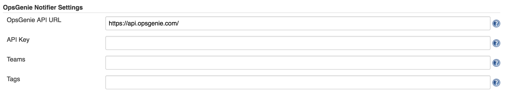
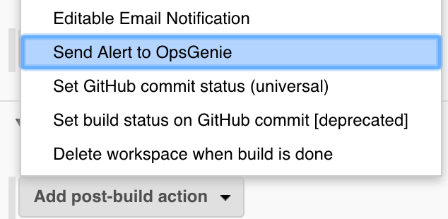
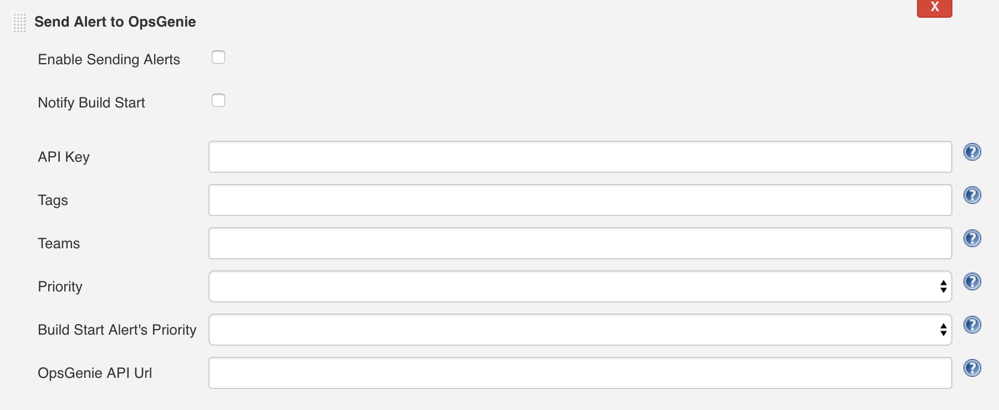

[.aui-icon .aui-icon-small .aui-iconfont-info .confluence-information-macro-icon]#
#

This plugin allows posting build related alerts to
https://www.opsgenie.com/[OpsGenie] that notify who is on call.

[[OpsGeniePlugin-Documentation]]
== Documentation

 

[.aui-icon .aui-icon-small .aui-iconfont-error .confluence-information-macro-icon]#
#

This documentation only contains some part of the documentation, if you
want to get more information you can check our
https://github.com/opsgenie/opsgenie-jenkins-plugin[OpsGenie Jenkins
Plugin GitHub] and
https://docs.opsgenie.com/docs/integrations/jenkins-integration[OpsGenie
Jenkins Integration Documentation].

 +

 

The OpsGenie Plugin allows sending build messages to OpsGenie which
filters them and creates alerts.

 

[[OpsGeniePlugin-GlobalConfiguration]]
=== Global Configuration

 

. Configure the Global Jenkins settings for OpsGenie plugin by following
"Manage Jenkins" -> "Configure System" -> "OpsGenie Notifier Settings".
. Enter the API Url and API Key that's given from OpsGenie Jenkins
Integration. API Url set to a default value but also can be configured. 
. Enter the Teams that you want to notify and alert Tags.
. These fields can be used as default settings, also can be overridden
for specific jobs.

[.confluence-embedded-file-wrapper .image-center-wrapper .confluence-embedded-manual-size]##

[[OpsGeniePlugin-Post-BuildAction]]
=== Post-Build Action

. Activate OpsGenie Plugin for the Jenkins Job by following <Job> ->
"Configure".
. Scroll to the "Post-Build Actions" section of the project
configuration.
. Click on the "Add post-build action" button.
. Select the "Send Alert to OpsGenie" entry from the list displayed.
 The "Send Alert to OpsGenie" section will appear in the window.
. Click on the "Save" button to retain these changes.

[.confluence-embedded-file-wrapper .image-center-wrapper .confluence-embedded-manual-size]##

[[OpsGeniePlugin-JobConfiguration]]
=== Job Configuration

. Configure the Jenkins Job settings for OpsGenie plugin by following
<Job> -> "Configure" -> "Send Alert to OpsGenie".
. Check "Enable Sending Alerts" to send an alert to OpsGenie.
. Check "Notify Build Start" to send an alert to OpsGenie that notifies
on build start.
. Enter the API URL and API Key that's given from OpsGenie Jenkins
Integration. If you fill these fields global settings will be
overridden. 
. Enter the Teams that you want to notify and alert Tags. If you fill
these fields global settings will be overridden.
. Select the priority of the build status alert from "Priority" field.
. Select the priority of the build start status alert from "Build Start
Alert's Priority" field.

[[OpsGeniePlugin-]]
=== [.confluence-embedded-file-wrapper .image-center-wrapper .confluence-embedded-manual-size]##

[[OpsGeniePlugin-Versionhistory]]
== Version history

[[OpsGeniePlugin-Version1.2(Aug9,2017)]]
=== Version 1.2 (Aug 9, 2017)

* image:docs/images/information.svg[(info)]   Initial
release

 +
