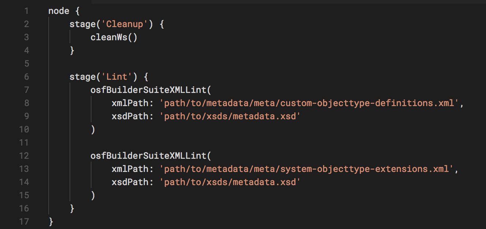
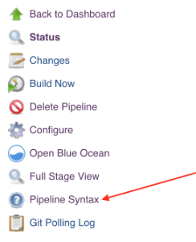

*OSF Builder Suite :: XML Linter* is a very easy-to-use Jenkins plugin
that is used to lint your XML file against a XSD file.

If you have a bug to report or maybe a feature that you wish to request,
please do
so https://github.com/jenkinsci/osf-builder-suite-xml-linter-plugin/issues[on
GitHub, on the project's issues page].

 

[[OSFBuilderSuiteXMLLinterPlugin-Installation]]
== Installation

Just go to "`+Manage Jenkins > Manage Plugins > Available+`", search for
"`+OSF Builder Suite+`",
select `+"OSF Builder Suite :: XML Linter"+` and click
"`+Download now and install after restart+`" button.

 

 

[[OSFBuilderSuiteXMLLinterPlugin-Configuration]]
== Configuration

[.confluence-embedded-file-wrapper .confluence-embedded-manual-size]##

Path (relative to the workspace) to the XML file you want to lint.  +
 +
Example: path/to/file.xml

 

[.confluence-embedded-file-wrapper .confluence-embedded-manual-size]##

Path (relative to the workspace) to the XSD file you wish to lint your
XML file against.  +
 +
Example: path/to/file.xsd

 

[[OSFBuilderSuiteXMLLinterPlugin-JenkinsPipelineConfiguration]]
== Jenkins Pipeline Configuration

Here's a sample pipeline configuration to get you started:

[.confluence-embedded-file-wrapper .confluence-embedded-manual-size]##

 

You can also always consult the pipelines documentation available
at https://jenkins.io/doc/book/pipeline/ or check the pipeline syntax
link right inside Jenkins on the left navigation menu.

[.confluence-embedded-file-wrapper .confluence-embedded-manual-size]##

 

[[OSFBuilderSuiteXMLLinterPlugin-Versionhistory]]
== Version history

https://github.com/jenkinsci/osf-builder-suite-xml-linter-plugin/releases
