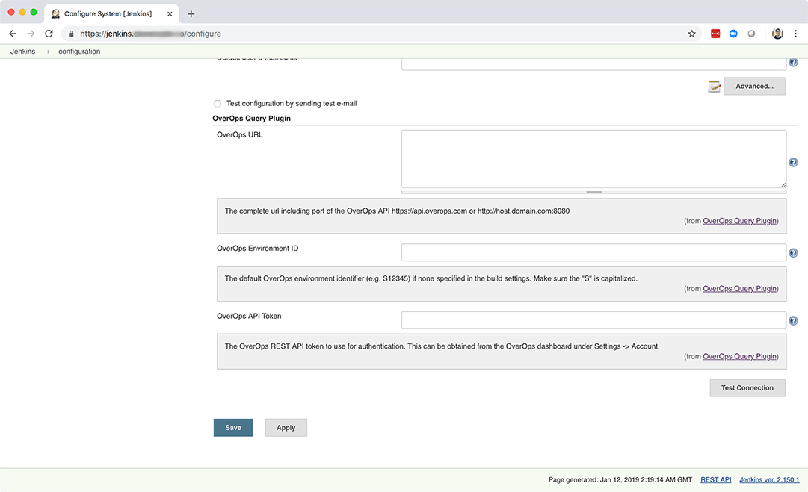

https://www.overops.com/[[.confluence-embedded-file-wrapper .confluence-embedded-manual-size]##] 
    

This plugin provides a mechanism for applying OverOps severity
assignment and regression analysis to new builds to allow application
owners, DevOps engineers, and SREs to determine the quality of their
code before promoting it into production.

Run this plugin as a post build step after all other testing is complete
to generate a Reliability Report that will determine the stability of
the build. From the Reliability Report you can drill down into each
specific error using the
OverOps https://doc.overops.com/docs/automated-root-cause-arc[Automated
Root Cause] analysis screen to solve the issue.

For more information about the
plugin, https://doc.overops.com/docs/jenkins#section-quality-gates[quality
gates], and
for https://doc.overops.com/docs/jenkins#section-examples-for-regression-testing[regression
testing examples], see the https://doc.overops.com/docs/jenkins[Jenkins
Plugin Guide].

Find this project on
GitHub: https://github.com/jenkinsci/overops-query-plugin

[.confluence-embedded-file-wrapper .confluence-embedded-manual-size]#image:https://files.readme.io/865d290-Pasted_image_at_2019-02-11__6_21_PM.png[OverOps
Reliability Report,height=400]#

[[OverOpsQueryPlugin-Installation]]
== https://github.com/jenkinsci/overops-query-plugin#installation[Installation]

Prerequisites

* Jenkins 2.43 running on Java 1.8 or later
* OverOps installed on the designated environment

Install the OverOps Query Plugin through the Plugin Manager. From the
Jenkins Dashboard, select Manage Jenkins → Manage Plugins → Available →
scroll down to *OverOps Query Plugin*.

[[OverOpsQueryPlugin-GlobalConfiguration]]
== https://github.com/jenkinsci/overops-query-plugin#global-configuration[Global Configuration]

After installing the plugin, configure it to connect to OverOps.

From the Jenkins Dashboard, select Manage Jenkins → Configure System →
scroll down to OverOps Query Plugin.

[.confluence-embedded-file-wrapper .confluence-embedded-manual-size]##

[[OverOpsQueryPlugin-OverOpsURL]]
=== OverOps URL

The complete URL of the OverOps API, including
port. https://api.overops.com/[https://api.overops.com] for SaaS
or http://host.domain.com:8080/[http://host.domain.com:8080] for on
prem.

[[OverOpsQueryPlugin-OverOpsEnvironmentID]]
=== OverOps Environment ID

The default OverOps environment identifier (e.g. S12345) if none is
specified in the build settings. Make sure the "S" is capitalized.

[[OverOpsQueryPlugin-OverOpsAPIToken]]
=== OverOps API Token

The OverOps REST API token to use for authentication. This can be
obtained from the OverOps dashboard under Settings → Account.

[[OverOpsQueryPlugin-Testing]]
==== Testing

Click _Test Connection_ to show a count of available metrics. If the
count shows 0 measurements, credentials are correct but database may be
wrong. If credentials are incorrect you will receive an authentication
error.

 +

[[OverOpsQueryPlugin-JobPostBuildConfiguration]]
== https://github.com/jenkinsci/overops-query-plugin#job-post-build-configuration[Job Post Build Configuration]

Choose a project, then select Configure → Post-build Actions → scroll
down to *Query OverOps*

[.confluence-embedded-file-wrapper .confluence-embedded-manual-size]#image:https://files.readme.io/be5ad3f-image-7.png[image,height=400]#

[[OverOpsQueryPlugin-ApplicationName]]
=== Application Name

_(Optional)_ https://doc.overops.com/docs/naming-your-application-server-deployment[Application
Name] as specified in OverOps

* If populated, the plugin will filter the data for the specific
application in OverOps.
* If blank, no application filter will be applied in query.

Example: +
$\{JOB_NAME }

[[OverOpsQueryPlugin-DeploymentName]]
=== Deployment Name

_(Optional)_ https://doc.overops.com/docs/naming-your-application-server-deployment[Deployment
Name] as specified in OverOps or use Jenkins environment variables.

Example: +
$\{BUILD_NUMBER} or $\{JOB_NAME }-$\{BUILD_NUMBER}

* If populated, the plugin will filter the data for the specific
deployment name in OverOps
* If blank, no deployment filter will be applied in the query.

[[OverOpsQueryPlugin-EnvironmentID]]
=== Environment ID

The OverOps environment identifier (e.g S4567) to inspect data for this
build. If no value is provided here, the value provided in the global
Jenkins plug settings will be used.

[[OverOpsQueryPlugin-RegexFilter]]
=== Regex Filter

A way to filter out specific event types from affecting the outcome of
the OverOps Reliability report.

* Sample list of event types, Uncaught Exception, Caught
Exception,|Swallowed Exception, Logged Error, Logged Warning, Timer
* This filter enables the removal of one or more of these event types
from the final results.
* Example filter expression with pipe separated
list- `+"type":\"s*(Logged Error|Logged Warning|Timer)+`

[[OverOpsQueryPlugin-MarkBuildUnstable]]
=== Mark Build Unstable

If checked the build will be marked unstable if any of the above gates
are met.

[[OverOpsQueryPlugin-ShowTopIssues]]
=== Show Top Issues

Prints the top X events (as provided by this parameter) with the highest
volume of errors detected within the active time window, This is useful
when used in conjunction with Max Error Volume to identify the errors
which caused a build to fail.

[[OverOpsQueryPlugin-QualityGates]]
== Quality Gates

[[OverOpsQueryPlugin-NewErrorGate]]
=== New Error Gate

If any new errors is detected, the build will be marked as unstable.

[[OverOpsQueryPlugin-ResurfacedErrorGate]]
=== Resurfaced Error Gate

If any resurfaced errors is detected, the build will be marked as
unstable.

[[OverOpsQueryPlugin-TotalErrorVolumeGate]]
=== Total Error Volume Gate

Set the max total error volume allowed. If exceeded the build will be
marked as unstable.

[[OverOpsQueryPlugin-UniqueErrorVolumeGate]]
=== Unique Error Volume Gate

Set the max total error volume allowed. If exceeded the build will be
marked as unstable.

[[OverOpsQueryPlugin-CriticalExceptionTypesGate]]
=== Critical Exception Types Gate

A comma delimited list of exception types that are deemed as severe
regardless of their volume. If any events of any exceptions listed have
a count greater than zero, the build will be marked as unstable. Blank
to skip this test.

Example: +
NullPointerException,IndexOutOfBoundsException

[[OverOpsQueryPlugin-IncreasingErrorsGate]]
=== Increasing Errors Gate

Combines the following parameters:

* Event Volume Threshold
* Event Rate Threshold
* Regression Delta
* Critical Regression Threshold
* Apply Seasonality

[[OverOpsQueryPlugin-ActiveTimeWindow(d-day,h-hour,m-minute)]]
==== Active Time Window (d - day, h - hour, m - minute)

The time window inspected to search for new issues and regressions. Set
to zero to use the Deployment Name (which would be the current build).

* Example: 1d would be one day active time window.

[[OverOpsQueryPlugin-BaselineTimeWindow(d-day,h-hour,m-minute)]]
==== Baseline Time Window (d - day, h - hour, m - minute)

The time window against which events in the active window are compared
to test for regressions. If this gate is used, baseline time window is
required.

* Example: 14d would be a two week baseline time window.

[[OverOpsQueryPlugin-EventVolumeThreshold]]
==== Event Volume Threshold

The minimal number of times an event of a non-critical type (e.g.
uncaught) must take place to be considered severe.

* If a New event has a count greater than the set value, it will be
evaluated as severe and could break the build if its event rate is above
the Event Rate Threshold.
* If an Existing event has a count greater than the set value, it will
be evaluated as severe and could break the build if its event rate is
above the Event Rate Threshold and the Critical Regression Threshold.
* If any event has a count less than the set value, it will not be
evaluated as severe and will not break the build.

[[OverOpsQueryPlugin-EventRateThreshold(0-1)]]
==== Event Rate Threshold (0-1)

The minimum rate at which event of a non-critical type (e.g. uncaught)
must take place to be considered severe. A rate of 0.1 means the events
is allowed to take place <= 10% of the time.

* If a New event has a rate greater than the set value, it will be
evaluated as severe and could break the build if its event volume is
above the Event Volume Threshold.
* If an Existing event has a rate greater than the set value, it will be
evaluated as severe and could break the build if its event volume is
above the Event Volume Threshold and the Critical Regression Threshold.
* If an event has a rate less than the set value, it will not be
evaluated as severe and will not break the build.

[[OverOpsQueryPlugin-RegressionDelta(0-1)]]
==== Regression Delta (0-1)

The change in percentage between an event's rate in the active time span
compared to the baseline to be considered a regression. The active time
span is the Active Time Window or the Deployment Name (whichever is
populated). A rate of 0.1 means the events is allowed to take place <=
10% of the time.

* If an Existing event has an error rate delta (active window compared
to baseline) greater than the set value, it will be marked as a
regression, but will not break the build.

[[OverOpsQueryPlugin-CriticalRegressionThreshold(0-1)]]
==== Critical Regression Threshold (0-1)

The change in percentage between an event's rate in the active time span
compared to the baseline to be considered a critical regression. The
active time span is the Active Time Window or the Deployment Name
(whichever is populated). A rate of 0.1 means the events is allowed to
take place <= 10% of the time.

* If an Existing event has an error rate delta (active window compared
to baseline) greater than the set value, it will be marked as a severe
regression and will break the build.

[[OverOpsQueryPlugin-ApplySeasonality]]
==== Apply Seasonality

If peaks have been seen in baseline window, then this would be
considered normal and not a regression. Should the plugin identify an
equal or matching peak in the baseline time window, or two peaks of
greater than 50% of the volume seen in the active window, the event will
not be marked as a regression.

[[OverOpsQueryPlugin-DebugMode]]
=== Debug Mode

If checked, all queries and results will be displayed in the OverOps
reliability report. For advanced debugging purposes only.

 +

'''''

Visit https://overops.com/[overops.com] to learn more about OverOps.
