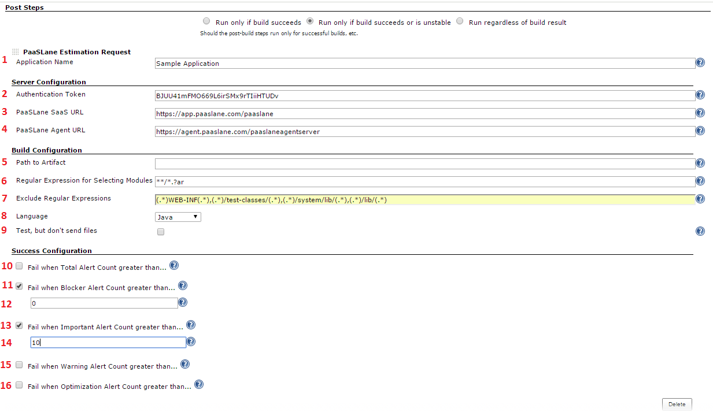

Provides a post build action for submitting artifacts to PaaSLane for
scanning.

[[PaaSLaneEstimatePlugin-Goal]]
== Goal

The PaaSLane Estimate plugin for Jenkins provides a secure submission
capability for users of PaaSLane. a static code analysis platform, and
Jenkins. PaaSLane is a static code analyzer for modernizing and
optimizing applications. When modernizing existing code, PaaSLane can
help to make your application be more performant, more secure, and
easier to maintain. When developing new cloud applications,
http://www.paaslane.com/[PaaSLane] helps ensure optimal performance and
scalability in the most popular public and private cloud platforms.
PaaSLane automatically spots hundreds of potential issues and
optimizations in your source code, giving you detailed examples and
suggesting remediations to enhance developer productivity. For a free
trial http://www.paaslane.com/products/paaslane-optimize/[click here] .

The PaaSLane Estimate plugin is implemented as a _Post Build Action_ and
is intended to sweep a directory structure looking for files that match
the specified patterns and securely upload them to PaaSLane for
verification. Once the files are uploaded, they are profiled and then an
estimation report is generated. This report will include overall
conformance with the rules defined, a list of instances of the
violations with their recommended remediation, as well as an estimate
for the remediation.

[[PaaSLaneEstimatePlugin-Gettingstarted]]
== Getting started

Install the plugin using the Plugin Manager via the Available tab, and
restart Jenkins

[[PaaSLaneEstimatePlugin-JobSetup]]
== Job Setup

The PaaSLane Estimate plugin is implemented as a Post Build Action
Plugin as shown below

[.confluence-embedded-file-wrapper]##

[[PaaSLaneEstimatePlugin-Options:]]
== Options:

. Name - The name field is used to specify the PaaSLane application that
the artifacts mapped later will be associated with. For example, if the
name of this field is "My Application" and you match 3 artifacts, there
will be an application "My Application" with 3 modules that get
profiled.
. Authentication Token - The "Authentication Token" field contains the
PaaSLane token associated with a specific user in a specific tenant.
This token can be gotten by logging into PaaSLane, clicking the username
dropdown and selecting to "Get Token". Once you have this option you
should be presented with the time sensitive token.
. PaaSLane SaaS URL - The "PaaSLane Agent URL" field specifies the root
url, including the host, port and context that define the location of
the PaaSLane profiling environment to use. For most SaaS customers, this
will be [.nolink]#https://app.paaslane.com/paaslane#.
. PaaSLane Agent URL - The "PaaSLane Agent URL" field specifies the root
url, including the host, port and context that define the location of
the PaaSLane profiling environment to use. For most SaaS customers, this
will be [.nolink]#https://agent.paaslane.com/paaslaneagentserver#.
However, customers utilizing distributed profiling, will want to get
their URL from their administrator.
. Path to Artifact(s) - This optional value specifies the additional
path from the workspace directory that should be scanned for artifacts
to be included in the application. This, paired with "Regular Expression
for Selecting Modules" and "Exclude Regular Expressions" help to specify
included artifacts.
. Regular Expression for Selecting Modules - This value specifies the
Ant style regular expression used to search for artifacts residing under
"Path to Artifact(s)". For examples of Ant Style regular expressions,
please see
http://ant.apache.org/manual/dirtasks.html#patterns[examples].
. Excluded Regular Expressions - The "Exclude Regular Expressions" field
contains a comma separated list of regular expression patterns that will
be applied to every matched artifact. If any of the patterns match the
path of the artifact being reviewed, then artifact will not be sent to
PaaSLane. Examples of these regular expressions can be found
http://ocpsoft.org/opensource/guide-to-regular-expressions-in-java-part-1/[here.]
. Report Config - Name of the Report Config to use when generating the
Report. If you leave this field blank, PaaSLane will use the Default
Report Config. To see your existing Report Configs, go to the PaaSLane
UI, click "Applications", and click "New Report" next to an existing
application. Under the "Create Report" button, you will see a dropdown
that contains a list of existing Report Configs. You can click
"Advanced" to see details and further configure your report.
. Language - The "Language" selection specifies which language rules
should be applied to the artifacts that are uploaded and profiled.
. Test, but don't send files - The "Test, but don't send files" field,
when checked, will only display the files that would have been sent,
based on the parameters. Use this field to get the parameters correct.
. Fail when Total Alert Count greater than - Forces the plugin to query
the total number of alerts found and if that number exceeds the
threshold provided below, the build will fail.
. Fail when Blocker Alert Count greater than - Forces the plugin to
query the total number of blocker alerts found and if that number
exceeds the threshold provided below, the build will fail.
.                                                                - The
threshold for acceptable number of blocker alerts allowed.
. Fail when Important Alert Count greater than - Forces the plugin to
query the total number of important alerts found and if that number
exceeds the threshold provided below, the build will fail.
.                                                                - The
threshold for acceptable number of important alerts allowed.
. Fail when Warning Alert Count greater than - Forces the plugin to
query the total number of warning alerts found and if that number
exceeds the threshold provided below, the build will fail.
. Fail when Optimization Alert Count greater than - Forces the plugin to
query the total number of optimization alerts found and if that number
exceeds the threshold provided below, the build will fail.
