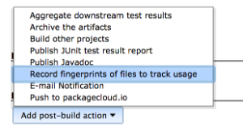

This plugin adds a post-build step that allows you to upload any
fingerprinted artifacts to https://packagecloud.io/[packagecloud.io].

Be sure to check the https://packagecloud.io/docs#jenkins[packagecloud
Jenkins plugin documentation] as well.

[[PackagecloudPlugin-PluginInstallation(Jenkins1.5orhigherrequired):]]
== *Plugin Installation (Jenkins 1.5 or higher required):*

[#PackagecloudPlugin-plugininstall .confluence-anchor-link .conf-macro .output-inline]#
# +
Go to 'Manage Jenkins' +
[.confluence-embedded-file-wrapper .confluence-embedded-manual-size]##

Click 'Manage Plugins'

[.confluence-embedded-file-wrapper .confluence-embedded-manual-size]##

Find the 'packagecloud' plugin under the 'Available' section

[.confluence-embedded-file-wrapper .confluence-embedded-manual-size]##

[[PackagecloudPlugin-CredentialsSetup:]]
== *Credentials Setup:*

[#PackagecloudPlugin-credssetup .confluence-anchor-link .conf-macro .output-inline]#
# +
From the main page go to 'Credentials'

[.confluence-embedded-file-wrapper .confluence-embedded-manual-size]##

Click 'Add domain' to create a new domain

[.confluence-embedded-file-wrapper .confluence-embedded-manual-size]##

Name it whatever you wish, but make sure you add the 'Hostname'
specification

[.confluence-embedded-file-wrapper .confluence-embedded-manual-size]##

Use 'packagecloud.io' (or your custom
https://enterprise.packagecloud.io/[packagecloud:enterprise] domain
name) as the 'Include' domain

[.confluence-embedded-file-wrapper .confluence-embedded-manual-size]##

Add a 'Username with password' entry using your
https://packagecloud.io/[packagecloud.io] (or https://enterprise.packagecloud.io/[packagecloud:enterprise]) username
as the username and your https://packagecloud.io/api_token[API token] as
the password.

*You can get your token via the API Token settings page
here: https://packagecloud.io/docs/api[Packagecloud API Token]*

[.confluence-embedded-file-wrapper .confluence-embedded-manual-size]##

[[PackagecloudPlugin-Uploadingartifactsfromajob:]]
== *Uploading artifacts from a job:*

[#PackagecloudPlugin-uploadartifacts .confluence-anchor-link .conf-macro .output-inline]#
#

Ensure that your build job is set to record fingerprints matching the
artifacts you wish to upload

[.confluence-embedded-file-wrapper .confluence-embedded-manual-size]## +
For example, given a job that builds an rpm, you'd use this as your
fingerprint regular expression

[.confluence-embedded-file-wrapper .confluence-embedded-manual-size]#image:docs/images/JenkinsDocs11@2x.png[image,width=200]#

Refer to this table for what regular expression to use for a particular
package type:

[cols=",",options="header",]
|===
|Package Type |Fingerprint Expression
|rpm |*.rpm
|dsc |*.dsc, *.bz2, *.gz, *.deb
|deb |*.deb
|gem |*.gem
|node |*.tgz
|python |*.gz, *.bz2, *.z, *.tar, *.egg-info, *.zip, *.whl, *.egg
|===

Read more about artifact fingerprinting
here: https://wiki.jenkins-ci.org/display/JENKINS/Fingerprint[Jenkins
Fingerprint]

Add the post-build step to your build

[.confluence-embedded-file-wrapper .confluence-embedded-manual-size]## +
Set the username, repository and distribution for the artifact:

[.confluence-embedded-file-wrapper .confluence-embedded-manual-size]##

If using https://enterprise.packagecloud.io/[packagecloud:enterprise],
enter the hostname (same one used for the credentials step above), port
and protocol:

[.confluence-embedded-file-wrapper .confluence-embedded-manual-size]##

Then build your job as usual, and your artifact will be pushed up to
packagecloud!

[.confluence-embedded-file-wrapper .confluence-embedded-manual-size]##
