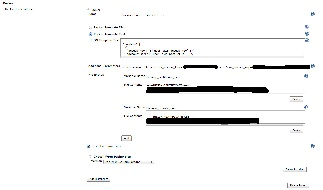

This plugin allows for a job to publish an image generated
http://packer.io/[Packer]

[[PackerPlugin-Configuration]]
== Configuration

[[PackerPlugin-SystemConfiguration]]
=== System Configuration

At the system level this plugin supports choosing a specific installable
binary to use and a (optional)
http://www.packer.io/docs/templates/introduction.html[packer template]
in the form of a text or file that is located on the slave node.  If
utilized, jobs can share this global system-wide packer template and
specify any necessary variables, which either replace or add to
variables specified at the system level. Files can also be specified for
items such as
http://www.packer.io/docs/builders/amazon-instance.html[x509 certs], and
these files are created temporarily for the packer execution and the
file location bound to the specified variable for use within a template.

[.confluence-embedded-file-wrapper]##

[[PackerPlugin-JobConfiguration]]
=== Job Configuration

At the job level this plugin can either use a global system-wide
template for the chosen installation or packer template as text or a
file.  As our available at the system level
http://www.packer.io/docs/templates/user-variables.html[variables] and
temporary files can be configured and referenced in the template.

The plugin will automatically install the desired version of packer on
the node.

[.confluence-embedded-file-wrapper]##

[[PackerPlugin-Note:thispluginrequiresJenkinsrunningunderaminimumofJava7]]
==== Note: this plugin requires Jenkins running under a minimum of Java 7

[[PackerPlugin-Changelog]]
== *Changelog*

[[PackerPlugin-Release1.5(March20,2018)]]
=== *Release 1.5 (March 20, 2018)*

* [.jira-issue .conf-macro .output-block]#
https://issues.jenkins-ci.org/browse/JENKINS-49715[[.aui-icon .aui-icon-wait .issue-placeholder]##
##JENKINS-49715] - [.summary]#Getting issue details...#
[.aui-lozenge .aui-lozenge-subtle .aui-lozenge-default .issue-placeholder]#STATUS#
#
* increase prefix length for temp files

[[PackerPlugin-Release1.4]]
=== Release 1.4 

* Open requests
* Packer Push support? https://packer.io/docs/templates/push.html

[[PackerPlugin-Release1.3(March18,2016)]]
=== Release 1.3 (March 18, 2016)

* https://github.com/jenkinsci/packer-plugin/issues?q=milestone%3A1.3

[[PackerPlugin-Release1.2(May18,2015)]]
=== Release 1.2 (May 18, 2015)

* https://issues.jenkins-ci.org/browse/JENKINS-26966

[[PackerPlugin-Release1.0(Apr04,2014)]]
=== Release 1.0 (Apr 04, 2014)

* Initial release
