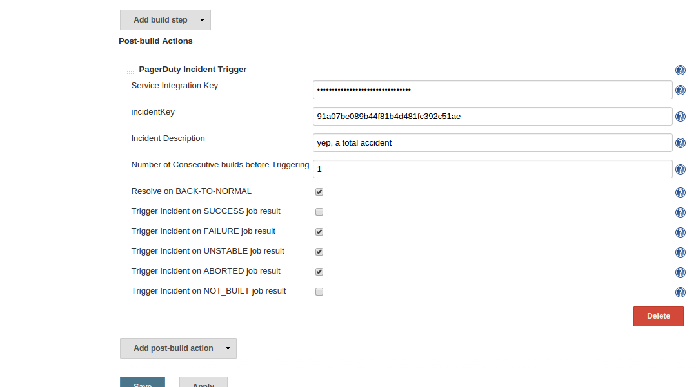

Allows users to trigger postbuild incidents via
https://www.pagerduty.com/[PagerDuty]

[[PagerDutyPlugin-Features]]
== Features

* Trigger incidents on various job statuses
Success/Failure/Aborted/Unstable/Not_Built
* Trigger incidents based on number of consecutive build results
* Automatically Resolve incidents when job is *back to normal*
* Pipeline compatible
* TokenMacro consumer
(https://plugins.jenkins.io/token-macro[TokenMacro] - adds reusable
macro expansion capability)

 +

[.underline]#*pipeline example:*#

 +

if resolve == false, the pagerduty triggers an incident and returns the
incidentKey

*pagerduty(resolve: false, serviceKey: "$SERVICE_KEY", incidentKey:
"$INCIDENT_KEY", incDescription: "pipeline test incident", incDetail:
"pipeline test")*

[[PagerDutyPlugin-Requirements]]
== Requirements

* Jenkins version 1.580.1 or newer is required.
* PagerDuty account (you can create a
https://signup.pagerduty.com/accounts/new[free developer account here])

[[PagerDutyPlugin-Configuration]]
== Configuration [.confluence-embedded-file-wrapper]##

[[PagerDutyPlugin-VersionHistory]]
== Version History

[[PagerDutyPlugin-Version0.4.1(Mar12,2019)]]
=== Version 0.4.1 (Mar 12, 2019)

* Add *TokenMacro* support
* Bug fixes
* Code refactor

[[PagerDutyPlugin-Version0.3.0(Jan31,2017)]]
=== Version 0.3.0 (Jan 31, 2017)

* Pipeline compatible
* Code refactor

[[PagerDutyPlugin-Version0.2.6(June20,2017)]]
=== Version 0.2.6 (June 20, 2017)

* Bug fixes
* PagerDuty v2 compatibility (migrating from
https://github.com/square/pagerduty-incidents[square] PD utility to
https://github.com/dikhan/pagerduty-client[dikhan's] PD client)

[[PagerDutyPlugin-Version0.2.5(March10,2017)]]
=== Version 0.2.5 (March 10, 2017)

* Bug fixes

[[PagerDutyPlugin-Version0.2.4(March30,2016)]]
=== Version 0.2.4 (March 30, 2016)

* Allow automatic resolution of the incident on *_BACK-TO-NORMAL_* (from
*not* success to *success*)

[[PagerDutyPlugin-Version0.2.3(March09,2016)]]
=== Version 0.2.3 (March 09, 2016)

* Bug fixes

[[PagerDutyPlugin-Version0.2.2(January03,2016)]]
=== Version 0.2.2 (January 03, 2016)

* Allow triggering alert in all job statuses
(SUCCESS/FAILED/ABORTED/UNSTABLE/NOT_BUILT)
* Allow using multiple service keys for different job

[[PagerDutyPlugin-Version0.2.1(December08,2015)]]
=== Version 0.2.1 (December 08, 2015)

* Allow using Environment Variables for config

[[PagerDutyPlugin-Version0.2.0(September26,2015)]]
=== Version 0.2.0 (September 26, 2015)

* Initial public release
