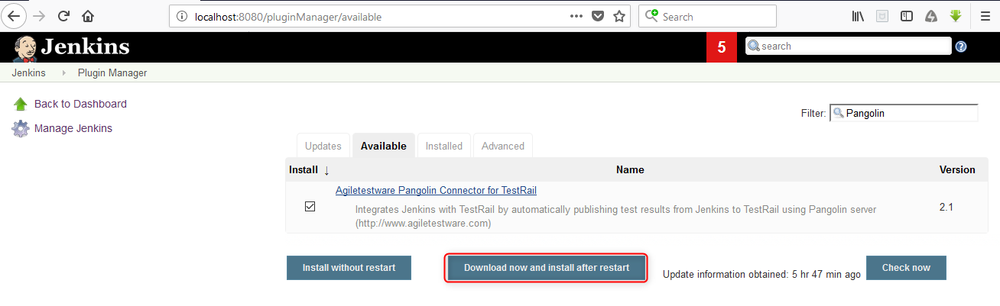

[.confluence-embedded-file-wrapper .confluence-embedded-manual-size]##

Agiletestware Pangolin TestRail Connector plugin integrates Jenkins with
TestRail by automatically publishing test results from Jenkins to
TestRail using Pangolin server (http://www.agiletestware.com/pangolin/).

The plugin allows users to
integrate http://www.gurock.com/testrail/[TestRail] into their CI
workflow without writing a single line of
code.[.conf-macro .output-inline]##

[cols="",options="header",]
|===
|Plugin Information
|View Agiletestware Pangolin Connector for TestRail
https://plugins.jenkins.io/pangolin-testrail-connector[on the plugin
site] for more information.
|===

[.aui-icon .aui-icon-small .aui-iconfont-info .confluence-information-macro-icon]##

Older versions of this plugin may not be safe to use. Please review the
following warnings before using an older version:

* https://jenkins.io/security/advisory/2018-07-30/#SECURITY-995[CSRF
vulnerability and missing permission checks allowed overriding plugin
configuration]

 +

[[PangolinTestRailConnector-Prerequisites]]
== Prerequisites

* https://agiletestware.com/docs/pangolin-docs/en/latest/setup/server-installation/[Pangolin
Server] must be installed and accessible from Jenkins host

[[PangolinTestRailConnector-JenkinspluginInstallation]]
== Jenkins plugin Installation

Installation of Jenkins plugin can be easily done from Jenkins Plugin
Manager:

[.confluence-embedded-file-wrapper .confluence-embedded-manual-size]##

Please restart Jenkins Server after the installation of plugin

[[PangolinTestRailConnector-PangolinGlobalConfiguration]]
== Pangolin Global Configuration

Pangolin global configuration is accessible on "Mange Jenkins" -
"Configure System" screen:

[.confluence-embedded-file-wrapper .confluence-embedded-manual-size]##

[cols=",",options="header",]
|===
|Field Name |Description
|Pangolin URL |URL for Pangolin server. Example:
http://some-server:8888/[http://some-server:8888]

|TestRail URL |URL for your TestRail instance. Example:
https://testrail:8080/[https://testrail:8080]

|TestRail User |Name of user in TestRail

|TestRail Password |Password for TestRail user

|Upload Timeout |The number of minutes to wait for the Pangolin server
to process the request. 0 means wait indefinitely
|===

 +
When all fields are set, please click on "Save Configuration" button -
Pangolin will check availability of entered URLs and encrypt your
password.

 

[[PangolinTestRailConnector-UploadingtestframeworkreportsintoTestRail]]
== Uploading test framework reports into TestRail

[[PangolinTestRailConnector-"Pangolin:UploadtestresultsintoTestRail"post-buildactionconfiguration]]
=== "Pangolin: Upload test results into TestRail" post-build action configuration

To upload test results into TestRail, a new "Pangolin: Upload test
results into TestRail" post-build action has to be added:

[.confluence-embedded-file-wrapper]##

[cols=",,",options="header",]
|===
|Field Name (pipeline property) |Required |Description
|Project (testRailProject) |Yes |The name of project in TestRail to
which results should be exported

|TestRail User (testRailUserName) |No |If specified, overrides TestRail
user name defined in Global Configuration

|TestRail Password (testRailPassword) |No |If specified, overrides
TestRail user password defined in Global Configuration

|Test Path (testPath) |Yes |Path to where Pangolin should test
definitions, must contain suite name in the beginning (for single-suite
project, suite name is always 'Master'), e.g. Master\Section1\Section2

|Format (format) |Yes |Format of test results generated during the
build. Available values: junit, nunit, testng, trx, cucumber, robot

|Results File Pattern (resultPattern) |Yes |Provide path to the report
file(s) generated during the build. This is a comma separated list of
test result directories. You can also use Ant style patterns such
as **/surefire-reports/*.xml

|Test Run (testRun) |No |Name of test run in TestRail to which test
results will be added

|Test Plan (testPlan) |No |Name of test plan in TestRail to which test
results will be added

|Milestone Path (milestonePath) |No |Path to a milestone in TestRail to
which test run/plan will be added. E.g. Milestone1\Milestone2

|Case Fields (customProperties) |No |Values for custom case fields in
TestRail. The format is [TestRail field system name]=[value 1],
[TestRail field system name]=[value 2]... E.g.: custom_user_field1=foo,
custom_user_field2=bar

|Fail build if upload unsuccessful (failIfUploadFailed) |N/A |If
checked, the build will be marked as failed if for any reason the plugin
was not able to upload the results. This could be due to Pangolin server
issues, TestRail server issues, network issues, etc.
|===

Several configuration can be specified

[.aui-icon .aui-icon-small .aui-iconfont-info .confluence-information-macro-icon]#
#

To add more than one upload configuration, just click on "Add More"
button.

[[PangolinTestRailConnector-"Pangolin:UploadtestresultsintoTestRail"pipelineconfiguration]]
=== "Pangolin: Upload test results into TestRail" pipeline configuration

Here is an example of pipeline configuration for exporting test results
to TestRail:

*Pipeline configuration*

[source,syntaxhighlighter-pre]
----
pangolinTestRail([
     testRailProject: 'project',
     testRailUserName: 'user',
     testRailPassword: 'encrypted password',
        configs:[[
         testPath: 'Master\\Section1\\Section2',
         format: 'JUNIT',
         resultPattern:'**/surefire-reports/*.xml',
         testRun:'test run',
         testPlan:'test plan',
         milestonePath:'milestonePath',
         customProperties:'custom_required_field=foo',
         failIfUploadFailed: true
         ]],
       ])
----

TestRail password must be encrypted

[.aui-icon .aui-icon-small .aui-iconfont-info .confluence-information-macro-icon]#
#

When pipeline script is used, value for testRailPassword must be
encrypted. Password can be encrypted by navigating to Pangolin Server
GUI page (http://pangolinurl/[http://pangolinUrl]) and clicking
to Password Encryption link.

[[PangolinTestRailConnector-Execution]]
== Execution

Once the job is configured, simply run the job. Here is Jenkins job
output example:

[.confluence-embedded-file-wrapper .confluence-embedded-manual-size]##

 +

Results in TestRail:

Test Cases:

[.confluence-embedded-file-wrapper]##

 +

Test Plan and Test Run:

[.confluence-embedded-file-wrapper]##

[.confluence-embedded-file-wrapper .confluence-embedded-manual-size]##

 +

Created Milestones hierarchy:

[.confluence-embedded-file-wrapper]##

 +

[[PangolinTestRailConnector-Changelog]]
== Changelog

[[PangolinTestRailConnector-Version2.3(ReleasedNov,2018)]]
=== Version 2.3 (Released Nov, 2018)

* Add support for https://cucumber.io/[Cucumber] JSON reports
* Add support for http://robotframework.org/[Robot Framework] xUnit
reports
* Upload NUnit report attachments
* Publish TestRail Run link to build page

[[PangolinTestRailConnector-Version2.2(ReleasedJuly,2018)]]
=== Version 2.2 (Released July, 2018)

* Security fix for CSRF vulnerability and missing permission checks
(https://jenkins.io/security/advisory/2018-07-30/#SECURITY-995[SECURITY-995])

[[PangolinTestRailConnector-Version2.1(ReleasedMay,2018)]]
=== Version 2.1 (Released May, 2018)

* The first public release
