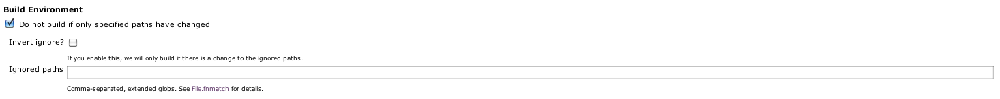

[.conf-macro .output-inline]# #

[.aui-icon .aui-icon-small .aui-iconfont-warning .confluence-information-macro-icon]##

*This plugin is up for adoption.* Want to help improve this plugin?
https://wiki.jenkins-ci.org/display/JENKINS/Adopt+a+Plugin[Click here to
learn more]!

This plugin allows SCM-triggered jobs to ignore build requests if only
certain paths have changed, or to build if and only if certain paths are
changed.

[[PathignorePlugin-TableofContents]]
== Table of Contents

[[PathignorePlugin-Description]]
== Description

Pathignore allows you to do one of two things:

. Do NOT allow a build to run if *ALL* of the changed paths match a
given set of patterns.
* This allows you to ignore specific paths, not triggering a build if
only the specified paths have changed.
. Only allow a build to run if at least *ONE* of the files changed match
a given set of patterns.
* This allows you to only build for specific paths, not triggering a
build if the paths you care about haven't changed.

[[PathignorePlugin-Setup]]
=== Setup

To filter whether a build builds based on path, go to the configuration
page of the job you care about, and check the box named
`+Do not build if only specified paths have changed+`.

[.confluence-embedded-file-wrapper]##

The default mode will not rebuild if only the specified paths have
changed. The "inverted" mode will do #2 above, and only build if the
specific paths have changed.

Patterns are separated by comma, and matched using
http://www.ruby-doc.org/core-1.9.3/File.html#method-c-fnmatch[Ruby's
fnmatch].

A skipped build will be marked as NOT BUILT, not FAILED or SUCCESS.

[[PathignorePlugin-Knownissues]]
== Known issues

type

key

summary

assignee

reporter

priority

status

resolution

created

updated

due

[.icon-in-pdf]# # Data cannot be retrieved due to an unexpected error.

http://issues.jenkins-ci.org/secure/IssueNavigator.jspa?reset=true&jqlQuery=component%20=%20pathignore%20AND%20project%20=%20JENKINS%20AND%20resolution%20=%20Unresolved%20ORDER%20BY%20updated%20DESC&tempMax=1000&src=confmacro[View
these issues in Jira]

[[PathignorePlugin-Versionhistory]]
== Version history

[[PathignorePlugin-0.6(Nov17,2011)]]
=== 0.6 (Nov 17, 2011)

* Upgrade to ruby-runtime v0.6
* Upgrade to jenkins-plugin-runtime v0.1.15

This should resolve any ConcurrentModificationException you might have
been seeing.
image:docs/images/smile.svg[(smile)]

[[PathignorePlugin-0.5(Nov14,2011)]]
=== 0.5 (Nov 14, 2011)

* Update metadata to include repository URL and a display name.

[[PathignorePlugin-0.4(Nov12,2011)]]
=== 0.4 (Nov 12, 2011)

* Integration tests - which means higher quality code!
image:docs/images/wink.svg[(wink)]
* Fixed JENKINS-11708: Link not opening in a new window.
* Workaround for JENKINS-11709: We now provide a blank global.erb so
that the global config page loads properly.
* Fixed compatibility with jenkins-plugin-runtime 0.1.11: Builds were
broken because of an upgrade to jenkins-plugin-runtime.

[[PathignorePlugin-0.3(Nov10,2011)]]
=== 0.3 (Nov 10, 2011)

* Shortname 'pathfilter'
* Better metadata

[[PathignorePlugin-0.2(Nov10,2011)]]
=== 0.2 (Nov 10, 2011)

* First release.
