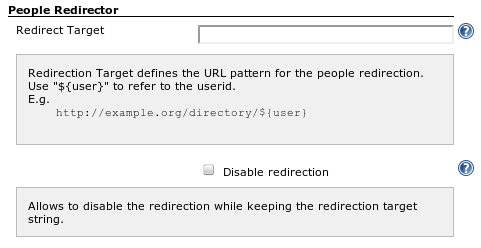

Allows you to integrate with an external user management system.

HTTP requests which go to the Jenkins-internal "people" page are
redirected to the external site.

[[PeopleRedirectorPlugin-Configuration]]
== Configuration

[[PeopleRedirectorPlugin-Globalconfiguration]]
=== Global configuration

[.confluence-embedded-file-wrapper]##

[[PeopleRedirectorPlugin-Changelog]]
== Changelog

[[PeopleRedirectorPlugin-Version1.3(May11,2012)]]
=== Version 1.3 (May 11, 2012)

* Fixed
https://issues.jenkins-ci.org/browse/JENKINS-12224[JENKINS-12224]

[[PeopleRedirectorPlugin-Version1.2(Oct12,2011)]]
=== Version 1.2 (Oct 12, 2011)

* Redirects now also when the URL has a single trailing slash.

[[PeopleRedirectorPlugin-Version1.1(Oct11,2011)]]
=== Version 1.1 (Oct 11, 2011)

* Fixed
https://issues.jenkins-ci.org/browse/JENKINS-11058[JENKINS-11058]
* Added
https://github.com/jenkinsci/people-redirector-plugin/blob/master/src/test/java/com/cisco/step/jenkins/plugins/people/redirector/BasicTest.java[unit
test]

[[PeopleRedirectorPlugin-Version1.0(Sep4,2011)]]
=== Version 1.0 (Sep 4, 2011)

* First release
