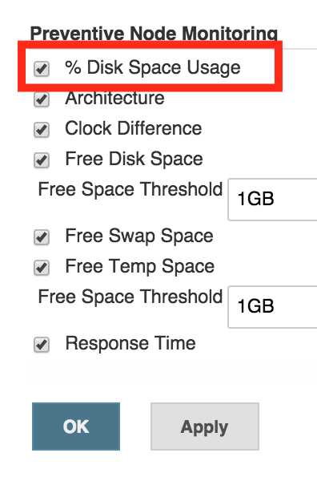
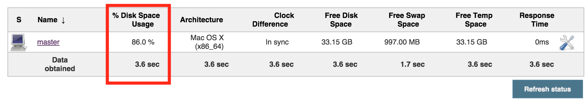

  This plugin just shows the percentage of disk space usage column on
"Manage Nodes" page. 

 +

[[PercentageDiskSpaceNodeColumnPlugin-Usage]]
== Usage

You can find it under `+<jenkins_url>/computer+` or reach it via links
in the sidepanel of the main page. 

[[PercentageDiskSpaceNodeColumnPlugin-NodeMonitoringConfiguration]]
=== Node Monitoring Configuration

[.confluence-embedded-file-wrapper .confluence-embedded-manual-size]##

[[PercentageDiskSpaceNodeColumnPlugin-ManageNodespage]]
=== Manage Nodes page

[.confluence-embedded-file-wrapper .confluence-embedded-manual-size]##

[[PercentageDiskSpaceNodeColumnPlugin-Samplegroovyscript]]
=== Sample groovy script

You can query this monitoring field programmatically in Groovy, see the
below groovy example:

*Groovy Script*

[source,syntaxhighlighter-pre]
----
for (node in jenkins.model.Jenkins.instance.slaves) {
  computer = node.toComputer()
  if (computer.getChannel() == null) continue
    rootPath = node.getRootPath()
  def percentage = computer.getMonitorData()['org.jenkins.ci.plugins.percentagecolumn.PercentageDiskSpaceMonitor']
  if (percentage != null ) {
    println("node: ${node.getDisplayName()} has got ${percentage} disk space usage.")
  }
}
----

 Further
references: https://wiki.jenkins-ci.org/display/JENKINS/Jenkins+Script+Console[Jenkins
Script Console]

[[PercentageDiskSpaceNodeColumnPlugin-Plannedupcomingfeatures]]
=== Planned upcoming features

* Security layout.

[[PercentageDiskSpaceNodeColumnPlugin-OpenIssues]]
== Open Issues

[#jiraissues]##

[.aui-icon .aui-icon-small .aui-iconfont-warning .confluence-information-macro-icon]#
#

[[PercentageDiskSpaceNodeColumnPlugin-Versionhistory]]
== Version history

[[PercentageDiskSpaceNodeColumnPlugin-Version0.1.0(26thSept)]]
=== Version 0.1.0 (26th Sept)

* image:docs/images/information.svg[(info)]
  Initial release
