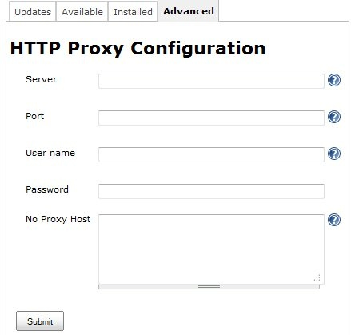

[.conf-macro .output-inline]# #

[.aui-icon .aui-icon-small .aui-iconfont-error .confluence-information-macro-icon]##

The current version of this plugin may not be safe to use. Please review
the following warnings before use:

* https://jenkins.io/security/advisory/2019-04-03/#SECURITY-1061[Perfecto
Mobile Plugin stores credentials in plain text]

 +

The MobileCloud for Jenkins plugin enables  mobile apps to automatically
upload from within the Jenkins build “job” to the MobileCloud Platform,
where the app is installed on real mobile devices. It then launches a
pre-defined Perfecto Mobile script and generates a detailed report,
allowing developers to get early warnings of bugs and correct them prior
to the QA stage. By using the MobileCloud Jenkins plugin, organizations
can streamline the release cycle by delivering more mature and robust
mobile apps to QA for a full mobile application test cycle (functional,
performance, UI  testing).

[[MobileCloudforJenkinsPlugin-AboutThisPlugin]]
== About This Plugin

This plugin runs MobileCloud™ scripts written in the Perfecto Mobile
Native Automation as a build step.

* Executes the whole build cycle, including running the script and
generating a report including video
* Uploads files to the MobileCloud 
* Upload artifacts from another project to the MobileCloud 

[[MobileCloudforJenkinsPlugin-HowtoUse]]
== How to Use

[[MobileCloudforJenkinsPlugin-Prerequisites]]
=== Prerequisites

The Jenkins machine, or the slave running the job, needs to access the
MobileCloud via https (port 443).

*Checking your connectivity*

Enter the following URL on the machine:

, substituting MyCloud, MyUsername, and MyPassword as appropriate. 

Users on the *www.perfectomobile.com* can use the below URL:

, substituting MyUsername and MyPassword as appropriate.

*Getting a response*

The reply should be an XML confirming a successful connection. For
Example:

[.confluence-embedded-file-wrapper]##

[[MobileCloudforJenkinsPlugin-Proxy]]
=== Proxy

For Jenkins or slaves that will be running the job that are behind a
proxy, enter the proxy information in the _Manage Jenkins_ > _Manage
Plugins_ > _Advanced_ page.

 
[.confluence-embedded-file-wrapper]##

[[MobileCloudforJenkinsPlugin-ConfiguringyourMobileCloud]]
=== Configuring your MobileCloud

Before using the plug-in, provide your Perfecto MobileCloud credentials
in the _Manage Jenkins_ > _Configure System_ page.

 
[.confluence-embedded-file-wrapper]## +
Click on _Test Connection_ to verify your MobileCloud credentials.

*Note*: The MobileCloud name does not need to contain http/https.

*Note*: The username being used with the plugin must have an Automation
role. 

*Job Setup*

. Click _New Item._
. Enter Item name.
. Select *_Build a free-style software project_*
. Click *OK*.*_ _*

[[MobileCloudforJenkinsPlugin-Configuringyourjob]]
==== Configuring your job

There are three possible build steps:

*Execute MobileCloud script* - Executes the whole build cycle, including
running the script and generating a report.  +
*Upload files to MobileCloud* - Access files easily.   +
*Upload artifacts from another project to MobileCloud* - Enables
flexibility between projects. 

[[MobileCloudforJenkinsPlugin-ExecuteMobileCloudscript:]]
===== *Execute MobileCloud script*:

. Enter a project description (Optional).
. Under *Build* > *Add Build Step*, select the build step: *Execute
MobileCloud script.*
. Under *Automation Script*, enter the Perfecto Mobile repository path
name. For example, to find a script called _AndroidScript_ located in
the my scripts folder, in the _PRIVATE_ subarea,enter _PRIVATE:my
scripts/AndroidScript_.  +
For more information on the MobileCloud repository
click http://help.perfectomobile.com/article/AA-00929[here]. 
. Script Parameters - Click the *Refresh parameters* button to display
the runtime parameters defined in the script.

_Fill in the parameter values as specified below for each type. _

*String/integer*: simply type them +
For example, “appIdentifier(string)=Perfecto Mobile OSE”

*Device parameter*: The value should be the device id of the required
device. +
Use the "Device and Media parameter value assistance" to find the id.
For example: "DUT(Device)=TA8830NFLG"

*Media/Data table parameters*: Type in the repository path where to
upload to and the workspace location of the file to upload from,
separated by a semicolon. +
For example, "PRIVATE:myfolder/TestApp.apk;TestApp.apk" +
Use the "Device and Media parameter value assistance" to find the
repository path.

*How to use the "Device and Media parameter value assistance":*

*NOTICE*: It is not recommended to use runtime parameter of type Handset
(Device) ; the specified device may be unavailable at runtime. Instead,
use the http://help.perfectomobile.com/article/AA-02265[Select device]
command within your script to select an available device at runtime. 

Device: Scroll and select the required device. Click on "Copy to
clipboard" and then copy the id and paste into the parameter. 

Media: Find the repository path by typing the path in the field. Select
an item from the list, then use the clipboard to copy/paste the value
into the parameter.

[.confluence-embedded-file-wrapper]##

[[MobileCloudforJenkinsPlugin-UploadFilestoMobileCloud]]
===== Upload Files to MobileCloud

. Specify the path of the file relative to the workspace. 
. Type or select the repository item path.

          
[.confluence-embedded-file-wrapper]##

[[MobileCloudforJenkinsPlugin-UploadArtifactsfromanotherprojecttoMobileCloud]]
===== Upload Artifacts from another project to MobileCloud

. Enter the name of the source project. Once entered, validate the
project name.   +
*Note*: If a project name is not entered or validated an error message
appears.
. Select build.
. Enter paths to upload artifacts or leave blank to upload all
artifacts. 
. Type or select the item path in the media repository. 
. Enter parameter filters.  +
*Note*: Jobs can be filtered to select only builds matching particular
parameters or other build variables.    
[.confluence-embedded-file-wrapper]##

[[MobileCloudforJenkinsPlugin-RuntheJob]]
==== Run the Job

. *Run the job*
. *View the Perfecto Mobile report - *Click on the _View Report_ link,
in the _Console Output_ page, once the script run is complete +
[.confluence-embedded-file-wrapper .confluence-embedded-manual-size]##
. *View the device video*

          
[.confluence-embedded-file-wrapper .confluence-embedded-manual-size]##

[[MobileCloudforJenkinsPlugin-Limitations]]
== Limitations

. Plugin supports one MobileCloud only.
. UFT Mobile Scripts are not supported.

[[MobileCloudforJenkinsPlugin-VersionHistory]]
=== Version History

[[MobileCloudforJenkinsPlugin-2.41(Jul10,2015)]]
==== 2.41 (Jul 10, 2015)

* Support for Jenkins Environment Variables
* Compatible with Copy Artifacts plugin. Includes support of copying
software artifacts between projects.

[[MobileCloudforJenkinsPlugin-2.20(Jun20,2014)]]
==== 2.20 (Jun 20, 2014)

* GA version

[[MobileCloudforJenkinsPlugin-1.0(Feb19,2014)]]
==== 1.0 (Feb 19, 2014)

* Beta version
