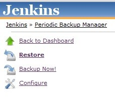
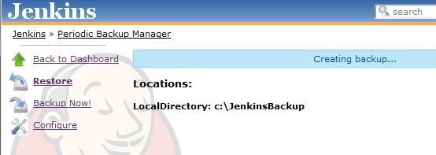
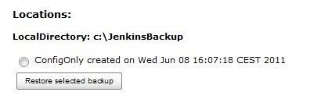

[.conf-macro .output-inline]##

[cols="",options="header",]
|===
|Plugin Information
|View Periodic Backup https://plugins.jenkins.io/periodicbackup[on the
plugin site] for more information.
|===

[.aui-icon .aui-icon-small .aui-iconfont-info .confluence-information-macro-icon]##

Older versions of this plugin may not be safe to use. Please review the
following warnings before using an older version:

* https://jenkins.io/security/advisory/2017-07-10/[Missing permission
checks and CSRF vulnerability in Periodic Backup Plugin]

[.aui-icon .aui-icon-small .aui-iconfont-warning .confluence-information-macro-icon]##

*This plugin is up for adoption.* Want to help improve this plugin?
https://wiki.jenkins-ci.org/display/JENKINS/Adopt+a+Plugin[Click here to
learn more]!

[[PeriodicBackupPlugin-Description]]
== Description

This plugin was created as alternative to existing
https://wiki.jenkins-ci.org/display/JENKINS/Backup+Plugin[Backup Plugin]
that would work periodically. +
The main idea was to create a backup plugin that provides an *easy* way
to be *extended* with new functionality in the future without the need
of hacking around the code. +
The plugin defines three extension points (basically plugins inside the
plugin):

* FileManager - defines what files should be included in the backup and
what will be the restore policy of the files. Example: ConfigOnly - will
choose only the configuration XML files from HUDSON_HOME, all the
configuration files of each job and the XML of every user if you are
using an internal database for access control.
* Storage - specifies method of archiving and unarchiving backups.
Example: ZipStorage - will compress backup files into a zip archive.
* Location - specifies localization of the backups. Example:
LocalDirectory - will store the backup files inside the specified path.

[[PeriodicBackupPlugin-Usage]]
== Usage

. After installing the plugin and restarting Jenkins, new icon will
appear in the *Manage Jenkins* section. +
[.confluence-embedded-file-wrapper]##
. After pressing *Periodic Backup Manager* in the side panel choose
*configure* to set up the plugin. +
[.confluence-embedded-file-wrapper]##
. In the configuration page set all the required parameters which are:
* *Temporary Directory* - path to the directory for creating archives
during backup, storing archives during restore, and unpacking their
content. It is vital for PeriodicBackup that this directory is writable,
empty, and outside of the Jenkins home directory.
* *Backup schedule (cron)* - schedule following the syntax of cron (with
minor differences). Validate cron button may be useful to check if the
syntax of the input is correct. More about cron can be found here:
http://adminschoice.com/crontab-quick-reference
* *Maximum backups in location* - A number of existing old backups
exceeding this value in each location will be deleted after backup.
* *Store no older than (days)* - Backups older then number of days
specified here will be deleted after backup.
* *File Management Strategy* - choose a suitable FileManager and fill in
required fields (if any)
* *Storage Strategy* - add a suitable Storage(s) and fill in required
fields (if any)
* *Backup Location* - add a suitable Location(s) and fill in required
fields (if any)
+
Temporary Directory

[.aui-icon .aui-icon-small .aui-iconfont-warning .confluence-information-macro-icon]#
#

Please be aware the using a path inside *Temporary Directory* (for
example for location like LocalDirectory) will lead to a very bad things
(like loss of data).
. After setting up all values correctly and pressing *Save* button,
configuration will be persisted and user will be redirected to the main
page of the plugin. Any backup available for restore will be listed
here, and one can navigate here via *Restore* link from the *sidepanel*.
The backup will be performed according to the cron schedule or when
*Backup Now!* is pressed from the *sidepanel*. A message will be shown
on the top of the page as on the picture below. +
[.confluence-embedded-file-wrapper]##
. When the backup is successfully created it will be listed on the web
page as on the picture below. +
[.confluence-embedded-file-wrapper]## +
To restore the backup it has to be chosen from the list and the "restore
selected backup" button has to be pressed.
+
Backup not showed/"Creating backup..."/"Restoring backup..." message
does not disappear

[.aui-icon .aui-icon-small .aui-iconfont-warning .confluence-information-macro-icon]#
#

Sometimes the backup will not be shown on the web page just after
performing the backup. Also the "Creating backup..."/"Restoring
backup..." messages may not disappear from the page when they should. In
that case page has to be refreshed or the link to *Restore* has to be
pressed in order to show the new backup. This will be fixed in future by
a widget informing about the current status of the backup/restore
process

[[PeriodicBackupPlugin-ChangeLog]]
== Change Log

[[PeriodicBackupPlugin-Version1.5(July10,2017)]]
=== Version 1.5 (July 10, 2017)

* https://jenkins.io/security/advisory/2017-07-10/[Fix security issue]

[[PeriodicBackupPlugin-Version1.4(Jun22,2017)]]
=== Version 1.4 (Jun 22, 2017)

* https://issues.jenkins-ci.org/browse/JENKINS-17487[image:docs/images/add.svg[(plus)] JENKINS-17487]
- Add support of excludes in Full Backup
* https://issues.jenkins-ci.org/browse/JENKINS-17487[image:docs/images/add.svg[(plus)] ]https://github.com/jenkinsci/periodicbackup-plugin/pull/10[PR
#10] - Update minimal Jenkins core requirement to 1.609.3
* https://issues.jenkins-ci.org/browse/JENKINS-25887[image:docs/images/error.svg[(error)] JENKINS-25887]
- Do not follow symbolic links when performing Full Backups
* https://issues.jenkins-ci.org/browse/JENKINS-25887[image:docs/images/error.svg[(error)] ]https://issues.jenkins-ci.org/browse/JENKINS-44997[JENKINS-44997]
- Restore the "Restore Backup" button, which was doing nothing in modern
Jenkins UIs
* https://issues.jenkins-ci.org/browse/JENKINS-25887[image:docs/images/error.svg[(error)] ]https://github.com/jenkinsci/periodicbackup-plugin/pull/10[PR
#10] - Prevent NullPointerException if an error happens during listing
directories
* https://github.com/jenkinsci/periodicbackup-plugin/pull/10[image:docs/images/information.svg[(info)] PR
#10] - Internal: Update the release flow, fix generation of the Maven
Site, FindBugs cleanup

[[PeriodicBackupPlugin-Version1.3(Jan4,2013)]]
=== Version 1.3 (Jan 4, 2013)

* JENKINS-12846: Add support for backing up user XMLs in users folder.

[[PeriodicBackupPlugin-Version1.2(Jan3,2013)]]
=== Version 1.2 (Jan 3, 2013)

* JENKINS-13635: TarGzStorage changed to GNU long file mode (long
filenames up to 256 chars).
* JENKINS-16223: Update plexus dependencies.

[[PeriodicBackupPlugin-Version1.0(Jun3,2011)]]
=== Version 1.0 (Jun 3, 2011)

* Initial release
