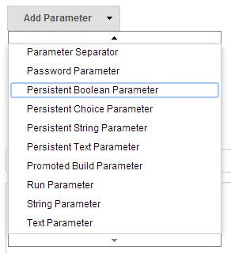
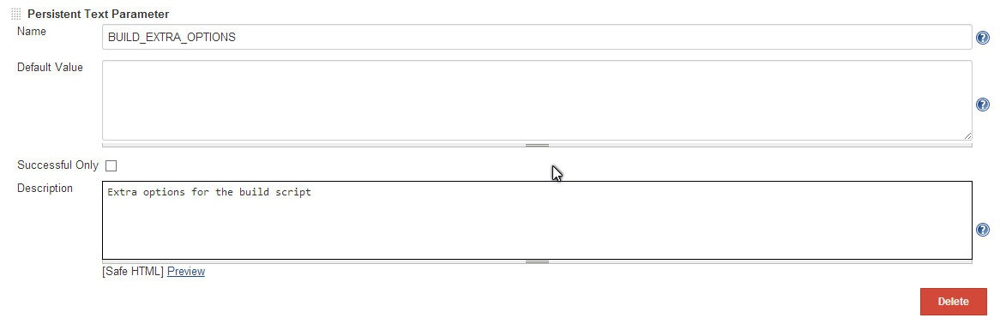

String, text, boolean and choice parameters with default values taken
from the previous build (if any).

[.confluence-embedded-file-wrapper]##

[.confluence-embedded-file-wrapper]##

[[PersistentParameterPlugin-VersionHistory]]
== Version History

[[PersistentParameterPlugin-1.1(Feb20,2015)]]
=== 1.1 (Feb 20, 2015)

* Support for non-interactive (periodic, SCM poll etc) builds

[[PersistentParameterPlugin-1.0(Oct24,2014)]]
=== 1.0 (Oct 24, 2014)

* Initial release
