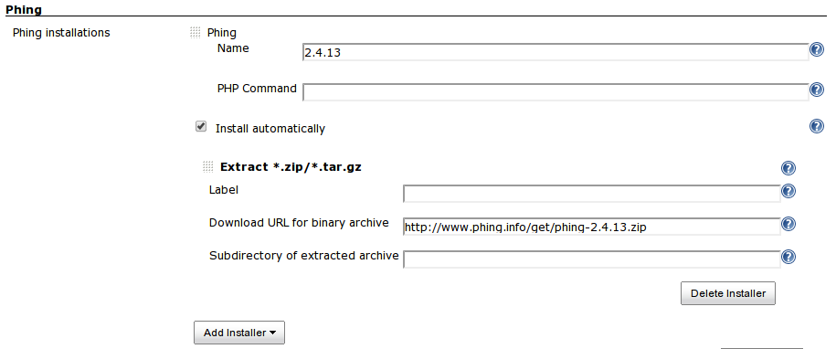
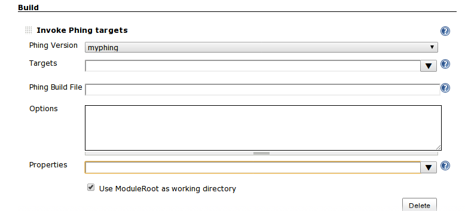

[[PhingPlugin-PhingPlugin]]
== Phing Plugin

[.conf-macro .output-inline]#This plugin allows you to use
http://phing.info/trac/[Phing] to build PHP projects.#

[[PhingPlugin-Configuration]]
=== Configuration

[[PhingPlugin-SystemConfiguration]]
==== System Configuration

 +
If you have *multiple* Phing installations, you can configure Jenkins to
allow that each project will select the installation that will use.

[.aui-icon .aui-icon-small .aui-iconfont-error .confluence-information-macro-icon]#
#

If phing is in the path, you don't have to configure phing.

[.aui-icon .aui-icon-small .aui-iconfont-info .confluence-information-macro-icon]#
#

You can use environment variables in PHING_HOME like $WORKSPACE, $HOME
etc.

Composer users

[.aui-icon .aui-icon-small .aui-iconfont-approve .confluence-information-macro-icon]#
#

For composer users, if you have phing installed in
$HOME/vendor/bin/phing, then specify ''$HOME/vendor/'' or
''$HOME/vendor/bin'' as PHING_HOME.

PEAR users

[.aui-icon .aui-icon-small .aui-iconfont-approve .confluence-information-macro-icon]#
#

For PEAR users, if you have phing installed in /usr/bin/phing, then
specify ''/usr'' or ''/usr/bin'' as PHING_HOME.

[.confluence-embedded-file-wrapper .image-center-wrapper]##

[.aui-icon .aui-icon-small .aui-iconfont-error .confluence-information-macro-icon]#
#

Do not specify "Subdirectory of extracted archive".

[[PhingPlugin-ProjectConfiguration]]
===== Project Configuration

 +
This plugin works as other builders like Ant builder or Gant builder.

[.confluence-embedded-file-wrapper .image-center-wrapper]##

[[PhingPlugin-History]]
=== History

[[PhingPlugin-Version0.13.2(Mar22,2015)]]
==== Version 0.13.2 (Mar 22, 2015)

* sone fixes.

[[PhingPlugin-Version0.13.1(Apr20,2013)]]
==== Version 0.13.1 (Apr 20, 2013)

* Windows phing is broken, jenkins tries to execute phing.bat with
php.exe
(https://issues.jenkins-ci.org/browse/JENKINS-17668[JENKINS-17668]).

[[PhingPlugin-Version0.13(Apr6,2013)]]
==== Version 0.13 (Apr 6, 2013)

* Support Phing auto installer.

[[PhingPlugin-Version0.12(Mar18,2013)]]
==== Version 0.12 (Mar 18, 2013)

* added Options field to specify logger
(https://issues.jenkins-ci.org/browse/JENKINS-17073[JENKINS-17073]).
* Allow environment variables in phing properties
(https://issues.jenkins-ci.org/browse/JENKINS-16967[JENKINS-16967]).

[[PhingPlugin-Version0.11(Mar19,2012)]]
==== Version 0.11 (Mar 19, 2012)

* Specifying custom phing build file does not work
(https://issues.jenkins-ci.org/browse/JENKINS-12995[JENKINS-12995]).

[[PhingPlugin-Version0.10(Mar2,2012)]]
==== Version 0.10 (Mar 2, 2012)

* Fixed that 'Use ModuleRoot as working directory' checkbox is not
checked correctly.

[[PhingPlugin-Version0.9(Dec21,2011)]]
==== Version 0.9 (Dec 21, 2011)

* added "Use ModuleRoot as working dire 'Use ModuleRoot as working
directory' checkbox is not checked correctly. ctory" checkbox on project
configuration page.
(https://issues.jenkins-ci.org/browse/JENKINS-12078[JENKINS-12078])

[[PhingPlugin-Version0.8(Jun3,2011)]]
==== Version 0.8 (Jun 3, 2011)

* Jenkins
* Fixed the description of Phing on system configuration page.

[[PhingPlugin-Version0.7(Jan.21,2011)]]
==== Version 0.7 (Jan. 21, 2011)

* Support Environment variables in the "Build file" field such as
"$WORKSPACE/build.xml".
(https://issues.jenkins-ci.org/browse/JENKINS-8549[JENKINS-8549])

[[PhingPlugin-Version0.6.1(Dec.8,2010)]]
==== Version 0.6.1 (Dec. 8, 2010)

* Fixed Information of certain Phing tasks does not display in console
output of the build.
(https://issues.jenkins-ci.org/browse/JENKINS-8097[JENKINS-8097])

[[PhingPlugin-Version0.6(Oct.8,2010)]]
==== Version 0.6 (Oct. 8, 2010)

* Supported ConsoleNoteAnnotator.
* Added "Executed Phing Target".

[[PhingPlugin-Version0.5]]
==== Version 0.5

* Fixed NotSerializableException using Phing plugin with slaves. Thanks
mdillon.
(https://issues.jenkins-ci.org/browse/JENKINS-6615[JENKINS-6615])

[[PhingPlugin-Version0.4]]
==== Version 0.4

* Fixed https://issues.jenkins-ci.org/browse/JENKINS-4398[JENKINS-4398].
* Fixed deprecated api.

[[PhingPlugin-Version0.3]]
==== Version 0.3

* Fixed https://issues.jenkins-ci.org/browse/JENKINS-2504[JENKINS-2504].

[[PhingPlugin-Version0.2]]
==== Version 0.2

* Fixed NPE when no targets are specified.

[[PhingPlugin-Version0.1]]
==== Version 0.1

* First Version
