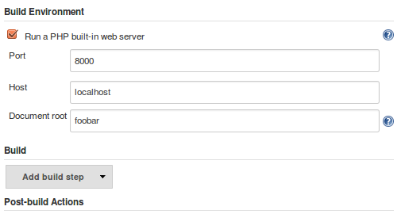

[.conf-macro .output-inline]# #

A plugin to run a
http://php.net/manual/en/features.commandline.webserver.php[PHP built-in
web server] for each build.

This is useful if you need to run tests on a local website and less
overkill than making Apache point at the workspace root.

[[PHPBuilt-inWebServerPlugin-Screenshot]]
== Screenshot

[.confluence-embedded-file-wrapper]##

[[PHPBuilt-inWebServerPlugin-Usage]]
== Usage

* The system configuration page allows to set the location of PHP ('php'
will be used by default, this can be customized to e.g. '/usr/bin/php')
* When configuring a project, a checkbox titled 'Run a PHP built-in web
server' should show up

[[PHPBuilt-inWebServerPlugin-Dependencies]]
== Dependencies

* PHP 5.4.0+

[[PHPBuilt-inWebServerPlugin-ChangeLog]]
== Change Log

[[PHPBuilt-inWebServerPlugin-0.1(release2015-08-07)]]
=== 0.1 (release 2015-08-07)

* Initial release
