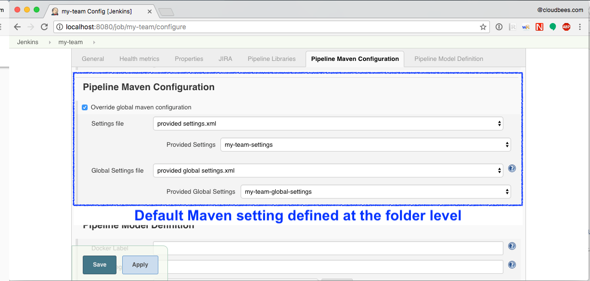

[.conf-macro .output-inline]# #

[.aui-icon .aui-icon-small .aui-iconfont-info .confluence-information-macro-icon]##

Older versions of this plugin may not be safe to use. Please review the
following warnings before using an older version:

* https://jenkins.io/security/advisory/2017-03-09/[Arbitrary files from
Jenkins master available in Pipeline by using the withMaven step]
* https://jenkins.io/security/advisory/2019-05-31/#SECURITY-1409[XML
External Entity processing vulnerability]

 +

[[PipelineMavenPlugin-Introduction]]
== Introduction

[.conf-macro .output-inline]#Provides Maven integration with
https://wiki.jenkins-ci.org/display/JENKINS/Pipeline+Plugin[Pipeline
Plugin] by using the withMaven step, which configures a maven
environment to use within a pipeline job by calling sh mvn or bat mvn.#

[[PipelineMavenPlugin-Usage]]
== Usage

An example pipeline script using the pipeline Maven plugin:

*Maven build on a Linux agent*

[source,syntaxhighlighter-pre]
----
node{
  stage ('Build') {

    git url: 'https://github.com/cyrille-leclerc/multi-module-maven-project'

    withMaven(
        // Maven installation declared in the Jenkins "Global Tool Configuration"
        maven: 'maven-3',
        // Maven settings.xml file defined with the Jenkins Config File Provider Plugin
        // We recommend to define Maven settings.xml globally at the folder level using 
        // navigating to the folder configuration in the section "Pipeline Maven Configuration / Override global Maven configuration"
        // or globally to the entire master navigating to  "Manage Jenkins / Global Tools Configuration"
        mavenSettingsConfig: 'my-maven-settings') {

      // Run the maven build
      sh "mvn clean verify"

    } // withMaven will discover the generated Maven artifacts, JUnit Surefire & FailSafe & FindBugs & SpotBugs reports...
  }
}
----

Within a node or a docker.image block, create a withMaven block to setup
a with maven environment. The configured environment will be used when
calling maven inside the block by using `+sh mvn+` or `+bat mvn+`. The
following parameters can be used to configure maven:

* *Maven* (`+maven+`): Allow the selection of a Maven installation
configured on the Global Jenkins configuration or on the Global Tool
Configuration page if using Jenkins > 2.0. When auto-install is enabled,
maven will be downloaded and made available for the pipeline job.

* *JDK* (`+jdk+`): Allows the selection of a JDK installation. If
auto-install is enabled, the JDK will be downloaded and made available
for the pipeline job.

* *Maven Settings*
** *Maven Settings Config* (`+mavenSettingsConfig+`): Select a Maven
settings file *ID* from
https://wiki.jenkins-ci.org/display/JENKINS/Config+File+Provider+Plugin[Config
File Provider Plugin] allowing the replacement of server credentials and
variable substitutions as configured in
https://wiki.jenkins-ci.org/display/JENKINS/Config+File+Provider+Plugin[Config
File Provider Plugin]. The settings element in the `+settings.xml+` file
contains elements used to define values which configure Maven execution
in various ways, like the `+pom.xml+`, but should not be bundled to any
specific project, or distributed to an audience. See also
http://maven.apache.org/settings.html[settings.xml] reference

* {blank}
** *Maven Settings File Path* (`+mavenSettingsFilePath+`): Specify the
path to a Maven `+settings.xml+` file on the build agent. The specified
path can be absolute or relative to the workspace. 
** If none of "mavenSettingsConfig" and "mavenSettingsFilePath" are
defined, "withMaven()\{}" will use the Maven settings defined in the
Jenkins Global Tool Configuration if declared

* *Maven Global Settings +
*
** *Maven Global Settings Config* (`+globalMavenSettingsConfig+`):
Select a Maven global settings file *ID* from
https://wiki.jenkins-ci.org/display/JENKINS/Config+File+Provider+Plugin[Config
File Provider Plugin].
** *Maven Global Settings File Path* (`+globalMavenSettingsFilePath+`):
Specify the path to a Maven global `+settings.xml+` file on the build
agent. The specified path can be absolute or relative to the workspace.
** If none of "globalMavenSettingsConfig" and
"globalMavenSettingsFilePath" are defined, "withMaven()\{}" will use the
Maven global settings defined in the Jenkins Global Tool Configuration
if declared

* *Maven JVM Opts* (`+mavenOpts+`): Specify JVM specific options needed
when launching Maven as an external process, these are not maven
specific options. See:
https://docs.oracle.com/javase/8/docs/technotes/tools/windows/java.html#CBBIJCHG[Java
Options] +
Shell-like environment variable expansions work in this field, by using
the `+${VARIABLE+`} syntax.

* *Maven Local Repository* (`+mavenLocalRepo+`): Specify a custom local
repository path. Shell-like environment variable expansions work with
this field, by using the `+${VARIABLE+`} syntax. Normally, Jenkins uses
the local Maven repository as determined by Maven, by default
`+~/.m2/repository+` and can be overridden by `+<localRepository>+` in
`+~/.m2/settings.xml+` (see Configuring your Local Repository)) +
This normally means that all the jobs that are executed on the same node
shares a single Maven repository. The upside of this is that you can
save the disk space, the downside is that the repository is not multi
process safe and having multiple builds run concurrently can corrupt it.
Additionally builds could interfere with each other by sharing incorrect
or partially built artifacts. For example, you might end up having
builds incorrectly succeed, just because your have all the dependencies
in your local repository, despite that fact that none of the
repositories in POM might have them. +
By using this option, Jenkins will tell Maven to use a custom path for
the build as the local Maven repository by using
`+-Dmaven.repo.local+` +
If specified as a relative path then this value will be resolved against
the workspace root and not the current working directory. +
ie. `+$WORKSPACE/.repository+` if `+.repository+` value is specified.

image:docs/images/information.svg[(info)]
`+mavenSettingsConfig+` and `+globalMavenSettingsConfig+` use the *ID*,
not the *name*, of the Maven settings file (resp Maven Global Settings
file).

_The Pipeline Syntax snippet code generator can be used to assist on
generating the withMaven step parameters_

In the above example the following parameters are use to configure
maven:

* *maven:* 'M3' Maven Installation will be used, this installation has
to be declared in the Global Jenkins configuration or Tool installations
page.
* *mavenLocalRepo:* a local repository folder is specified to avoid
shared repositories
* *mavenSettingsConfig:* specifies an specific settings.xml
configuration from
https://wiki.jenkins-ci.org/display/JENKINS/Config+File+Provider+Plugin[Config
File Provider Plugin] plugin, allowing the replacement of variables and
credentials.

[[PipelineMavenPlugin-Features]]
== Features

[[PipelineMavenPlugin-SensibledefaultMavenparameters]]
=== Sensible default Maven parameters

The Maven parameters that are useful on a build server,
"`+--batch-mode+`" ("`+-B+`") and "`+--show-version+`" ("`+-V+`") are
enable by default, no need to add them in your mvn invocations.

[[PipelineMavenPlugin-MavenSettingsSupport]]
=== Maven Settings Support

The "`+withMaven()"+` pipeline step will setup the Maven settings file
and global settings file either explicitly using the attributes of the
"withMaven()\{}" step declaration or implicitly using the Maven Global
Settings and Settings files defined at the folder level or in the
Jenkins Global Tools Configuration.

Using implicit declaration, Jenkins administrators can simplify the work
of pipeline authors hiding the "boilerplate" to declare the credentials
of the Git, Nexus, Artifactory... servers and all the needed proxies,
mirrors...

[.confluence-embedded-file-wrapper .confluence-embedded-manual-size]#image:docs/images/global-tools-configuration-maven-settings.png[image,width=450]#

[.confluence-embedded-file-wrapper .confluence-embedded-manual-size]##

[[PipelineMavenPlugin-TraceabilityofMavenbuilds]]
=== Traceability of Maven builds

The "`+withMaven()"+` pipeline step will capture in the logs of the
build all the details of the execution:

* Version of the JVM
** `+"withMaven(){}"+` step initialization:
"`+[withMaven] use JDK installation JDK8+`"
** `+"mvn"+` executable invocation:
"`+Java version: 1.8.0_102, vendor: Oracle Corporation+`""
* Version of Maven
** `+"withMaven(){}"+` step initialization:
"`+[withMaven] use Maven installation 'M3'+`""
** `+"mvn"+` executable invocation:
"`+Apache Maven 3.3.9 (bb52d8502b132ec0a5a3f4c09453c07478323dc5; 2015-11-10T16:41:47+00:00)+`""
* Name or path of the Maven settings.xml and Maven global settings.xml
file.
** `+"withMaven(){}"+` step initialization:
"`+[withMaven] use Maven settings provided by the Jenkins Managed Configuration File 'maven-settings-for-supply-chain-build-job'+`"
* When using the Maven settings.xml and global settings.xml files
provided by the
https://wiki.jenkins-ci.org/display/JENKINS/Config+File+Provider+Plugin[Jenkins
Config File Provider Plugin], +
details of the Jenkins credentials injected in the Maven build.
** `+"withMaven(){}"+` step initialization:
"`+[withMaven] use Maven settings.xml 'maven-settings-for-supply-chain-build-job' with Maven servers credentials provided by Jenkins (replaceAll: true): [mavenServerId: 'nexus.beescloud.com', jenkinsCredentials: 'beescloud-nexus-deployment-credentials', username: 'deployment', ...]+`"

Sample:

....
[withMaven] use JDK installation JDK8
[withMaven] use Maven installation 'M3'
[withMaven] use Maven settings provided by the Jenkins Managed Configuration File 'maven-settings-for-supply-chain-build-job'
[withMaven] use Maven settings.xml 'maven-settings-for-supply-chain-build-job' with Maven servers credentials provided by Jenkins (replaceAll: true):
     [mavenServerId: 'nexus.beescloud.com', jenkinsCredentials: 'beescloud-nexus-deployment-credentials', username: 'deployment', type: 'UsernamePasswordCredentialsImpl'],
     [mavenServerId: 'github.beescloud.com', jenkinsCredentials: 'github-enterprise-api-token', username: 'dev1', type: 'UsernamePasswordCredentialsImpl']
...
Running shell script
+ mvn clean deploy
----- withMaven Wrapper script -----
Picked up JAVA_TOOL_OPTIONS: -Dmaven.ext.class.path=".../pipeline-maven-spy.jar" -Dorg.jenkinsci.plugins.pipeline.maven.reportsFolder="..."
Apache Maven 3.3.9 (bb52d8502b132ec0a5a3f4c09453c07478323dc5; 2015-11-10T16:41:47+00:00)
Maven home: /home/ubuntu/jenkins-home/tools/hudson.tasks.Maven_MavenInstallation/M3
Java version: 1.8.0_102, vendor: Oracle Corporation
Java home: /home/ubuntu/jenkins-home/tools/hudson.model.JDK/JDK8/jre
Default locale: en_US, platform encoding: UTF-8
OS name: "linux", version: "3.13.0-109-generic", arch: "amd64", family: "unix"
....

[[PipelineMavenPlugin-ReportPublishers]]
=== Report Publishers

Maven build executions inside the "`+withMaven(){...+`}" will be
detected and Jenkins will transparently

* Archive and fingerprint generated Maven artifacts and Maven attached
artifacts
* Publish JUnit / Surefire reports (if the
http://wiki.jenkins-ci.org/display/JENKINS/JUnit+Plugin[Jenkins JUnit
Plugin] is installed)
* Publish Findbugs reports (if the
http://wiki.jenkins-ci.org/display/JENKINS/FindBugs+Plugin[Jenkins
FindBugs Plugin] is installed)
* Publish a report of the tasks ("`+FIXME+`" and "`+TODO+`") found in
the java source code (if the
https://wiki.jenkins-ci.org/display/JENKINS/Task+Scanner+Plugin[Jenkins
Tasks Scanner Plugin] is installed)
* Concordion test reports (since 3.0.0)

image:docs/images/information.svg[(info)]
The detection of Maven builds require to use Maven 3.2+.

[cols=",,,,",options="header",]
|===
|Reporter |Description |Required Jenkins Plugin (1) a|
Configuration to disable the feature

Since v2.3.0 (2)

|Marker file to disable the feature (3)
|Generated Artifact |Archiving and the fingerprinting of the artifacts
and attached artifacts generated by the Maven build (jar, sources jar,
javadocs jar...) | +
|`+withMaven(options: [artifactsPublisher(disabled: true)],...)+`
|`+\`.skip-archive-generated-artifacts\`+`

|Generated JUnit, Surefire and FailSafe reports |Publishing of the
JUnit, Surefire and FailSafe reports generated by the Maven build
|http://wiki.jenkins-ci.org/display/JENKINS/JUnit+Plugin[JUnit Plugin]
|`+withMaven(options: [junitPublisher(disabled: true)],...)+`
|`+\`.skip-publish-junit-results\`+`

|Generated Findbugs reports |Publishing of the Findbugs reports
generated by the Maven build
|https://wiki.jenkins-ci.org/display/JENKINS/FindBugs+Plugin[FindBugs
Plugin] |`+withMaven(options: [findbugsPublisher(disabled: true)],...)+`
|`+\`.skip-publish-findbugs-results\`+`

|Tasks scanner report |Publishing of a report of the "`+FIXME+`" and
"`+TODO+`" tasks found in the java source code. The keywords can be
configured.
|https://wiki.jenkins-ci.org/display/JENKINS/Task+Scanner+Plugin[Jenkins
Tasks Scanner Plugin]
|`+withMaven(options: [openTasksPublisher(disabled: true)],...)+`
|`+\`.skip-task-scanner\`+`

a|
Dependencies Fingerprinting

(since 2.5.0)

a|
Fingerprint the Maven dependencies.

By default only the snapshot dependencies of scope compile, runtime and
provided are fingerprinted.

| +
|`+withMaven(options: [dependenciesFingerprintPublisher(disabled: true)],...)+`
|`+\`.skip-fingerprint-maven-dependencies\`+`

a|
http://concordion.org/[Concordion] test report

(since 3.0.0)

a|
Publishing of the http://concordion.org/[Concordion] test reports.

Publish the Concordion reports generated by the
maven-surefire-plugin:test and the
maven-failsafe-plugin:integration-test goals and located in the folder
described by the system property "concordion.output.dir" as documented
in http://concordion.org/integrations/java/html/#maven[Concordion >
Integration > Java > Maven]

 +

|https://wiki.jenkins.io/display/JENKINS/HTML+Publisher+Plugin[HTML
Publisher Plugin]
|`+withMaven(options: [concordionPublisher(disabled: true)],...)+`
|`+\`.skip-publish-concordion-results\`+`

|https://maven.apache.org/plugins/maven-invoker-plugin/[Maven Invoker
Plugin] test reports |Publish test reports generated by the
https://maven.apache.org/plugins/maven-invoker-plugin/[maven-invoker-plugin:run]
goal a|
....
Maven Invoker Plugin
....

|`+withMaven(options: [invokerPublisher(disabled: true)],...)+`
|`+\`.skip-publish-invoker-run\`+`

|JGiven reports |Publish http://jgiven.org/[JGiven] test reports
|https://wiki.jenkins.io/display/JENKINS/JGiven+Plugin[JGiven Plugin]
|`+withMaven(options: [jgivenPublisher(disabled: true)],...)+`
|`+\`.skip-publish-jgiven-results\`+`

|JaCoCo Code Coverage |Publish JaCoCo Code Coverage
|https://wiki.jenkins.io/display/JENKINS/JaCoCo+Plugin[JaCoCo Plugin]
|withMaven(options: [jacocoPublisher(disabled: true)],...) | +

|Maven Linker Publisher a|
Publish the Maven report on the pipeline build GUI (list of
dependencies, produced artifacts, downstream & upstream pipelines).

This publisher should be renamed "Maven Build Report Publisher".

A reason to disable this publisher is typically to not "pollute" the
build screen with Maven invocations when Maven is used as an utility
(e.g. invocations of "maven-help-plugin:3.2.0:evaluate"...)

| + |`+withMaven(options: [mavenLinkerPublisher(disabled: true)],...)+`
|`skip-maven-linker-publisher`

|Pipeline Graph Publisher |Build the graph of dependencies between
Jenkins pipelines and Maven artifacts in order to trigger downstream
pipelines (when using the `snapshotDependencies` on downstream
pipelines) | +
|`+withMaven(options: [pipelineGraphPublisher(disabled: true)],...)+`
|`.skip-pipeline-graph`
|===

{empty}(1) Jenkins Plugin to publish the reports on the Jenkins build
page. If the plugin is not installed, then the MAven report is ignored.

{empty}(2)
Download https://repo.jenkins-ci.org/releases/org/jenkins-ci/plugins/pipeline-maven/2.3.0-beta-1/pipeline-maven-2.3.0-beta-1.hpi[pipeline-maven-2.3.0-beta-1.hpi]

(3) Marker file to temporarily disable the feature for a specific Maven
build. +
Typically used to disable a reporter for a specific build that would
generate too much data for the default configuration of the reporter
(e.g. too many generated artifacts...) or to workaround a bug in the
"`+withMaven+`" waiting for a fix. These marker file must be located in
the home directory of the build.

[[PipelineMavenPlugin-ImplicitorExplicitactivationofPublishers]]
==== Implicit or Explicit activation of Publishers

By default, all the publishers are enabled by default.

It is possible to change the default activation of a publisher
navigating to the "Global Tool Configuration" screen.

It is possible to disable the default activation of publishers on a
specific "`+withMaven(){...}+`" step using the
"`+publisherStrategy='EXPLICIT'+`" attribute in the step
"`+withMaven(publisherStrategy='EXPLICIT'){...}+`". The publishers can
then be enabled explicitly in the "`+withMaven(){...}+`" step using the
"publishers" attribute

[[PipelineMavenPlugin-DefaultConfiguration]]
=== Default Configuration

Default Maven settings can be defined globally and at the folder level.

[[PipelineMavenPlugin-GlobalDefaultConfiguration]]
==== Global Default Configuration

In the "Global Tool Configuration" screen

* Maven settings and Maven global settings 
* Publishers settings: enable/disable publishers...

[.confluence-embedded-file-wrapper .confluence-embedded-manual-size]##

[[PipelineMavenPlugin-FolderLevelConfiguration]]
==== Folder Level Configuration

In the Folder "configuration" screen

* Maven settings and Maven global settings 

[.confluence-embedded-file-wrapper .confluence-embedded-manual-size]##

[[PipelineMavenPlugin-Triggerdownstreampipelinewhenasnapshotisbuilt(since3.0.0)]]
=== Trigger downstream pipeline when a snapshot is built (since 3.0.0)

Trigger downstream pipeline that depend on Maven artifact generated by
upstream pipelines.

image:docs/images/information.svg[(info)] Notes

* The upstream artifact must be generated in a "`+withMaven(){}+`"
wrapping step to be detected by the triggering system
* The downstream pipeline must have selected the build trigger "Build
whenever a SNAPSHOT dependency is built"
** The build trigger can be defined at the pipeline level ("Build
Triggers"), at the multibranch pipeline level ("Scan Repository
Triggers") or at the GitHub Organization / Bitbucket Project level
("Scan Organizations Triggers")
* You have to manually trigger once the upstream pipeline and the
downstream pipeline so that the link between the pipelines based on the
SNAPSHOT dependency is established
* The dependency graph is, for the moment, exclusively stored in an H2
embedded database ("`+$JENKINS_HOME/jenkins-jobs/jenkins-jobs.mv.db+`").
Support for an external H2 database and then for alternate databases
(PostgreSQL) is on the roadmap
(see https://github.com/jenkinsci/pipeline-maven-plugin/blob/pipeline-maven-3.0.0-beta-1/jenkins-plugin/src/main/java/org/jenkinsci/plugins/pipeline/maven/dao/PipelineMavenPluginH2Dao.java[PipelineMavenPluginH2Dao.java])

[.confluence-embedded-file-wrapper .confluence-embedded-manual-size]##

[.confluence-embedded-file-wrapper .confluence-embedded-manual-size]##

[.confluence-embedded-file-wrapper .confluence-embedded-manual-size]#image:docs/images/image2017-8-7_15:19:41.png[Downstream
Pipeline Trigger - Org Level
Configuration,title="Downstream Pipeline Trigger - Org Level Configuration",width=810,height=146]#

* Thresholds are applied to define on which type of maven build the
downstream pipelines are triggered
** Threshold based on the status of the upstream pipeline ("success",
"unstable", "failure", "no build", "aborted"). By default, only builds
with a "success" result will trigger downstream builds.
*** [.confluence-embedded-file-wrapper .confluence-embedded-manual-size]#image:docs/images/downstream-pipeline-trigger-threshold-build-result.png[image,width=600]#
** Threshold based on the
https://maven.apache.org/guides/introduction/introduction-to-the-lifecycle.html[Maven
lifecycle phase] reached in the Maven build of the upstream job
("package", "install", "deploy"). By default, only the maven builds who
reach the "deploy" phase will trigger downstream builds.
*** [.confluence-embedded-file-wrapper .confluence-embedded-manual-size]##

[[PipelineMavenPlugin-Linux,WindowsandMacOSXsupport]]
=== Linux, Windows and MacOSX support

The Pipeline Maven Plugin works with Linux, Windows and MacOSX build
agents.

*Maven build on a Windows agent*

[source,syntaxhighlighter-pre]
----
node ("windows") {
  stage ('Build') {

    git url: 'https://github.com/cyrille-leclerc/multi-module-maven-project'

    withMaven(...) {

      bat "mvn clean install"

    } // withMaven will discover the generated Maven artifacts, JUnit Surefire & FailSafe reports and FindBugs reports
  }
}
----

[[PipelineMavenPlugin-SupportofTakari'sMavenWrapper'mvnw'(since3.0.3)]]
=== Support of Takari's Maven Wrapper 'mvnw' (since 3.0.3)

The Pipeline Maven Plugin works
with https://github.com/takari/maven-wrapper[Takari's Maven wrapper]
'mvnw'.

[source,syntaxhighlighter-pre]
----
withMaven(...) {
   sh "./mvnw clean deploy"
}
...
----

[[PipelineMavenPlugin-AddingmoreMavenReporters]]
==  +
Adding more Maven Reporters

The API for Maven reporters is still experimental. Please open a Request
for Enhancement Jira issue to discuss how to add Maven reporters.

We want to quickly add reporters for CheckStyle, Jacoco...

[[PipelineMavenPlugin-Setup]]
== Setup

[[PipelineMavenPlugin-UsingaMySQLDatabase(since3.6.0)]]
=== Using a MySQL Database (since 3.6.0)

The Jenkins Pipeline Maven Plugin relies on a database to store its data
(list of dependencies and of generated artifacts of each build...).

By default, the Jenkins Pipeline Maven Plugin uses an H2 embedded
database but it is recommend to use an external MySQL database.

Configuration steps to use a MySQL:

* Create an empty MySQL database with a dedicated MySQL user with
permissions for Data Manipulation Language actions (DML) and Data
Definition Language (DDL) actions
** Tested with MySQL 8.0, with MariaDB 10.2 and 10.3 and with
Amazon Aurora MySQL 5.6
* Install the Jenkins "MySQL Database" plugin
** Navigate to "Manage Jenkins / Manage Plugins / Available", select the
"MySQL Database" plugin and click on "Download now and install after
restart"
*  Configure the Pipeline Maven Plugin to use the created MySQL
database +
** Create Jenkins credentials for the MySQL connection navigating to
"Credentials" on the left menu
** Navigate to "Manage Jenkins / Global Tools Configuration" and go to
the "Pipeline Maven Configuration"
** [.confluence-embedded-file-wrapper .confluence-embedded-manual-size]#image:docs/images/pipeline-maven-plugin-configuration-1.png[image,width=773,height=250]#
** In the Database configuration section, define the following
*** JDBC URL: url of the database, e.g.
"jdbc:mysql://mysql.example.com/jenkins"
*** JDBC Credentials: select the credentials of the MySQL database
*** The
https://github.com/brettwooldridge/HikariCP/wiki/MySQL-Configuration[parameters
recommended by the Hikari Connection Pool team] are used by default for
the MySQL connections and for the datasource (max pool size:10, server
side prepared statements cache with 250 entries...).  To overwrite these
defaults, click on the "Advanced Database Convfiguration" button.
** Click on "Validate Database Configuration" button to verify that the
connection is successful
** Click on "Save"
** [.confluence-embedded-file-wrapper .confluence-embedded-manual-size]#image:docs/images/pipeline-maven-plugin-configuration-2.png[image,width=559,height=250]#

 +

[[PipelineMavenPlugin-UsingaPostgreSQLDatabase(since3.7.0)]]
=== Using a PostgreSQL Database (since 3.7.0)

The Jenkins Pipeline Maven Plugin relies on a database to store its data
(list of dependencies and of generated artifacts of each build...).

By default, the Jenkins Pipeline Maven Plugin uses an H2 embedded
database but it is recommended to use an external PostgreSQL or MySQL /
MariaDB database.

Configuration steps to use a PostgreSQL:

* Create an empty PostgreSQL database with a dedicated PostgreSQL user
with permissions for Data Manipulation Language actions (DML) and Data
Definition Language (DDL) actions
** Tested with PostgreSQL 10.6 and 11.3
* Install the Jenkins the
"https://wiki.jenkins.io/display/JENKINS/PostgreSQL+API+Plugin[PostgreSQL
API]" plugin
** Navigate to "Manage Jenkins / Manage Plugins / Available", select the
"PostgreSQL API" plugin and click on "Download now and install after
restart"
*  Configure the Pipeline Maven Plugin to use the created PostgreSQL
database +
** Create Jenkins credentials for the PostgreSQL connection navigating
to "Credentials" on the left menu
** Navigate to "Manage Jenkins / Global Tools Configuration" and go to
the "Pipeline Maven Configuration"
** [.confluence-embedded-file-wrapper .confluence-embedded-manual-size]#image:docs/images/pipeline-maven-plugin-configuration-postgresql.png[image,width=764,height=250]#
** In the Database configuration section, define the following
*** JDBC URL: url of the database, e.g.
"jdbc:postgresql://postgresql.example.com:5432/jenkins"
*** JDBC Credentials: select the credentials of the PostgreSQL database
*** The underlying datasource,
https://github.com/brettwooldridge/HikariCP[HikariCP], comes with
sensible default configuration values (see
https://github.com/brettwooldridge/HikariCP#configuration-knobs-baby[here]).
To overwrite these defaults, click on the "Advanced Database
Configuration" button.
** Click on "Validate Database Configuration" button to verify that the
connection is successful
** Click on "Save"
** Navigate to "Manage Jenkins / Global Tools Configuration" and go to
the "Pipeline Maven Configuration" to verify that the database
connection is successful and the database tables have been created (see
screenshot above)

[[PipelineMavenPlugin-FAQ]]
== FAQ

[#PipelineMavenPlugin-withMavenAndDockerPipeline .confluence-anchor-link .conf-macro .output-inline]#
#

[[PipelineMavenPlugin-HowtousethePipelineMavenPluginwithDocker?(sinceversion3.0.3)]]
=== How to use the Pipeline Maven Plugin with Docker? (since version 3.0.3)

Since the version 1.14 of the Docker Pipeline plugin, "withMaven"
requires to

* Either prepend the '`+MVN_CMD_DIR+`' environment variable to the
'`+PATH+`' environment variable in every '`+sh+`' step that invokes
'`+mvn+`' (e.g.
"`+sh 'export PATH=$MVN_CMD_DIR:$PATH && mvn clean deploy'+` ").
* Or use Takari's Maven Wrapper (e.g. "sh './mvnw clean deploy'")

If omitted, the Maven settings file and Mven global settings file will
not be injected in the Maven execution.

[[PipelineMavenPlugin-Using"withMaven"with"docker.image(...).inside{...}"andaJenkinsScriptedPipeline]]
==== Using "`+withMaven+`" with "`+docker.image(...).inside{...}+`" and a Jenkins Scripted Pipeline 

*Prepending MVN_CMD_DIR to PATH*

[source,syntaxhighlighter-pre]
----
node("linux-agent-running-docker") { // Linux agent with the Docker daemon
    docker.image('maven').inside { // Docker image with Maven installed
        withMaven(...) {
            git "https://github.com/cyrille-leclerc/my-jar.git"
            sh "export PATH=$MVN_CMD_DIR:$PATH && mvn clean deploy" // 'mvn' command: need to add the $MVN_CMD_DIR to $PATH
        }
    }
}
----

 

*Using Takari's Maven Wrapper mvnw*

[source,syntaxhighlighter-pre]
----
node("linux-agent-running-docker") { // Linux agent with the Docker daemon
    docker.image('openjdk:8-jdk').inside { // Docker image with Java installed
        withMaven(...) {
            git "https://github.com/cyrille-leclerc/my-jar.git"
            sh "./mvnw clean deploy" // 'mvnw' command (e.g. "./mvnw deploy")
        }
    }
}
----

 +

[[PipelineMavenPlugin-Using"withMaven"with"docker.image(...).inside{...}"toaJenkinsDeclarativePipeline]]
==== Using "`+withMaven+`" with "`+docker.image(...).inside{...}+`" to a Jenkins Declarative Pipeline 

TODO provide a sample with Jenkins Declarative Pipeline

 

 +

[[PipelineMavenPlugin-SamplemessagedisplayedinthebuildlogswhenusingwithMaveninaDockerPipelineexecutionenvironment]]
==== Sample message displayed in the build logs when using withMaven in a Docker Pipeline execution environment

Warning message displayed in the logs when invoking withMaven within
Docker Pipeline:

....
[withMaven] WARNING: "withMaven(){...}" step running within "docker.image('image').inside {...}". Since the Docker Pipeline Plugin version 1.14, you MUST:
[withMaven] * Either prepend the 'MVN_CMD_DIR' environment variable to the 'PATH' environment variable in every 'sh' step that invokes 'mvn' (e.g. "sh 'export PATH=$MVN_CMD_DIR:$PATH && mvn clean deploy' "). 
[withMaven] * Or use Takari's Maven Wrapper (e.g. "sh './mvnw clean deploy'")
[withMaven] See Pipeline Maven Plugin FAQ.
....

[[PipelineMavenPlugin-HowtodisabletheMavenEventSpyinjectedbythePipelineMavenPlugininMavenbuilds?]]
===  +
How to disable the Maven Event Spy injected by the Pipeline Maven Plugin in Maven builds?

It may be convenient to temporarily disable the Maven Event Spy of the
Jenkins Pipeline Maven plugin, for example for troubleshooting purpose.

You can disable the Maven Event Spy of the Jenkins Pipeline Maven plugin
(making it no-op) doing one of the following:

* Setting the environment variable "`+JENKINS_MAVEN_AGENT_DISABLED+`" to
"`+true+`" in the job execution

 +

[source,syntaxhighlighter-pre]
----
...
withMaven() {
   sh """
export JENKINS_MAVEN_AGENT_DISABLED=true
mvn package
"""
}
----

[source,syntaxhighlighter-pre]
----
...
withEnv(['JENKINS_MAVEN_AGENT_DISABLED=true']) {
   sh "mvn package"
}
----

 +

* Adding the system property
"`+-Dorg.jenkinsci.plugins.pipeline.maven.eventspy.JenkinsMavenEventSpy.disabled=true+`"
to the invocation of the mvn build

[[PipelineMavenPlugin-WhydoIseemessages"[WARNING]PickedupJAVA_TOOL_OPTIONS..."inthebuildlogs?]]
=== Why do I see messages "`+[WARNING] Picked up JAVA_TOOL_OPTIONS...+`" in the build logs?

The Jenkins Pipeline Maven Plugin uses the "`+JAVA_TOOL_OPTIONS+`"
environment variable to pass options to subsequent Maven builds such as
the actual release build when invoking
"`+mvn release:prepare release:perform+`". The plugins passes the
properties "`+-Dmaven.ext.class.path+`" and
"`+-Dorg.jenkinsci.plugins.pipeline.maven.reportsFolder+`".

When using the "`+JAVA_TOOL_OPTIONS+`", the JVM outputs a message during
its initialization.

With the Jenkins Pipeline Maven Plugin, this message looks like:

....
[WARNING] Picked up JAVA_TOOL_OPTIONS: -Dmaven.ext.class.path="/path/to/workspace/...@tmp/withMaven.../pipeline-maven-spy.jar" -Dorg.jenkinsci.plugins.pipeline.maven.reportsFolder="/path/to/workspace/...@tmp"
....

image:docs/images/information.svg[(info)] It
is not possible to disable this warning message

[[PipelineMavenPlugin-Mydownstreampipelinesdon'tgettriggeredevenifIuse"BuildwheneveraSNAPSHOTdependencyisbuilt"]]
=== My downstream pipelines don't get triggered even if I use "Build whenever a SNAPSHOT dependency is built"

A common reason why downstream pipelines don't get triggered when using
"Build whenever a SNAPSHOT dependency is built" is that the upstream
pipeline is using "mvn install" when the Jenkins Pipeline Maven
integration is configured to trigger pipelines on "mvn deploy".

To configure the Jenkins Pipeline Maven integration to trigger
downstream pipelines on "mvn install":

* Either change the default configuration:
** Navigate to "Manage Jenkins / Global Tools Configuration"
** Click on "Add Publisher" and select "Pipeline Graph Publisher"
** In the section "Downstream Pipeline Triggers", change the the "Maven
lifecycle threshold" from "deploy" to "install"

[.confluence-embedded-file-wrapper .confluence-embedded-manual-size]##

* Or in the script of the upstream pipeline, configure
"`+withMaven(options: [pipelineGraphPublisher(lifecycleThreshold: 'install')]) {...}+`"

 +

[[PipelineMavenPlugin-HowcanItroubleshootproblemsoftriggerofdownstreampipelines]]
=== How can I troubleshoot problems of trigger of downstream pipelines

* The Pipeline Maven Plugin uses the Jenkins log levels (see
https://wiki.jenkins.io/display/JENKINS/Logging#Logging-LogsinJenkins[here])
to output additional troubleshooting information in the pipeline build
logs (the "Console Output" menu of the build)
* To output additional troubleshooting information about the  trigger of
downstream pipelines, enable in "Manage Jenkins / System Log" (docs
https://wiki.jenkins.io/display/JENKINS/Logging#Logging-LogsinJenkins[here]) 
the following loggers at a level FINE or FINER or more:
** org.jenkinsci.plugins.pipeline.maven.publishers.PipelineGraphPublisher
** org.jenkinsci.plugins.pipeline.maven.listeners.DownstreamPipelineTriggerRunListener
* Re run the pipeline that is supposed to trigger downstream pipelines.
* Look at the pipeline build logs ("Console Output" menu), ensure that
the build is completed and that the following message is displayed in
the logs: "[withMaven] downstreamPipelineTriggerRunListener - completed
in XXX ms". Troubleshooting details are added

[[PipelineMavenPlugin-HowdoIcapturethelogfilegeneratedbytheJenkinsMavenEventSpy]]
=== How do I capture the log file generated by the Jenkins Maven Event Spy

You can archive the XML log file generated by the Jenkins Maven Event
Spy creating the marker file ".archive-jenkins-maven-event-spy-logs".

Sample:

[source,syntaxhighlighter-pre]
----
withMaven() {
    sh "mvn package"
    writeFile file: '.archive-jenkins-maven-event-spy-logs', text: ''
} // will discover the marker file ".archive-jenkins-maven-event-spy-log" and will archive the maven event spy log file maven-spy-....log 
----

[[PipelineMavenPlugin-HowdoIchecktheMavensettingsinusebymybuild]]
=== How do I check the Maven settings in use by my build

You can dump the effective Maven settings of your pipeline using the
Maven Help plugin and the
"http://maven.apache.org/plugins/maven-help-plugin/effective-settings-mojo.html[help:effective-settings]"
goal

[source,syntaxhighlighter-pre]
----
withMaven(){
   mvn help:effective-settings
}
----

 +

[[PipelineMavenPlugin-HowcanIreducethefootprintofthedatabaseoftheJenkinsPipelineMavenPlugin?]]
=== How can I reduce the footprint of the database of the Jenkins Pipeline Maven Plugin?

The Jenkins pipeline Maven plugin uses a database to trigger downstream
pipelines when a snapshot is built.

For production grade deployments, a MySQL database is needed instead of
the embedded H2 database. My SQL 5.6+, Amazon Aurora MySQL and MariaDB
10.2+ have been successfully tested.

To reduce the usage of the database, disable the "Pipeline Graph
Publisher" navigating to "Manage Jenkins / Global Tool Configuration /
Pipeline Maven Configuration" then clicking on "Add Publisher Options",
selecting "Pipeline Graph Publisher" and checking the "disabled"
checkbox.

[.confluence-embedded-file-wrapper .confluence-embedded-manual-size]##

[#PipelineMavenPlugin-mavenExecutionInterrupted .confluence-anchor-link .conf-macro .output-inline]#
#

[[PipelineMavenPlugin-WhydoIseemessages"[withMaven]OneormultipleMavenexecutionshavebeenignored..."inthebuildlogs?]]
=== Why do I see messages "[withMaven] One or multiple Maven executions have been ignored..." in the build logs?

The message "[withMaven] One or multiple Maven executions have been
ignored by the Jenkins Pipeline Maven Plugin because they have been
interrupted before completion..." because one or several Maven execution
(e.g. "`+mvn deploy+`") have been interrupted before they could
gracefully complete.

The event "`+org.apache.maven.eventspy.EventSpy#close()+`" has not been
invoked on the Maven event spies.

This interruption usually happens because the mvn process has been
killed by the Operating System, typically for memory constraints in
Docker or cgroups environments. Another cause is a "`+kill -9+`" during
the build.

[[PipelineMavenPlugin-WhydoIseemessages"javax.xml.parsers.FactoryConfigurationError:Providerforclassjavax.xml.parsers.DocumentBuilderFactorycannotbecreated"]]
=== Why do I see messages "javax.xml.parsers.FactoryConfigurationError: Provider for class javax.xml.parsers.DocumentBuilderFactory cannot be created"

This error is caused by the installation of another plugin that pulls an
outdated version of Apache Xerces. That pulls a version of Apache Xerces
that is not compatible with the version of the JVM. Typically, Xerces
2.6 will not be compatible with a JDK 8 due to changes in the JAXP API
(sample: [.jira-issue .conf-macro .output-block]#
https://issues.jenkins-ci.org/browse/JENKINS-47486[[.aui-icon .aui-icon-wait .issue-placeholder]##
##JENKINS-47486] - [.summary]#Getting issue details...#
[.aui-lozenge .aui-lozenge-subtle .aui-lozenge-default .issue-placeholder]#STATUS#
# ).

The solution is to get this plugin updated so that it uses a more recent
of Xerces that would be compatible with the JDK.

To identify the plugin that is pulling an outdated version of a JAXP
implementation (typically Xerces), navigate to the Jenkins Script
Console ("Manage Jenkins" then "Script Console") and execute the
following groovy script:

[source,syntaxhighlighter-pre]
----
String className = "org.apache.xerces.jaxp.DocumentBuilderFactoryImpl"

Class klass
try {
  klass = Class.forName(className)
} catch (Exception e) {
  println("Exception trying to load " + className + " from the system classloader, try the thread context classloader " + e)
  // contextClassLoader should not work but let's try it.
  klass = Class.forName(className, false, Thread.currentThread().getContextClassLoader())
}

java.security.CodeSource codeSource = klass.getProtectionDomain().getCodeSource()

if (codeSource == null) {
  println(klass.toString() + " -> source not found")
} else {
  println(klass.toString() + " -> " + codeSource.getLocation());
}
----

The output message will show from which plugin the XercesParser is
loaded. Sample with a plugin "my_plugin" that would load an outdated
2.6.2 version of Xerces:

....
class org.apache.xerces.jaxp.DocumentBuilderFactoryImpl -> file:/var/lib/jenkins/plugins/my_plugin/WEB-INF/lib/xercesImpl-2.6.2.jar 
....

[[PipelineMavenPlugin-HowtouseMavenbuilddataingeneratedemails]]
=== How to use Maven build data in generated emails

It is possible to use informations generated by Maven pipelines in
emails generated by the
https://wiki.jenkins.io/display/JENKINS/Email-ext+plugin[Jenkins Email
Ext Plugin].

See https://groups.google.com/forum/#!topic/jenkinsci-users/sPAYLh1W1cM

*Sample Pipeline code to expose artifact details in emails*

[source,syntaxhighlighter-pre]
----
env.DEPLOYEDARTIFACTS = getDeployedArtifacts()

@NonCPS
def getDeployedArtifacts() {
    def deployed = ''
    Collection<org.jenkinsci.plugins.pipeline.maven.MavenArtifact> generatedArtifacts = currentBuild.rawBuild.getAction(org.jenkinsci.plugins.pipeline.maven.publishers.MavenReport.class).getGeneratedArtifacts();
    for (org.jenkinsci.plugins.pipeline.maven.MavenArtifact generatedArtifact:generatedArtifacts) {
        if (generatedArtifact.isDeployed()) {
           
            deployed= deployed.concat(generatedArtifact.getUrl())
            deployed = deployed.concat("===")
            deployed = deployed.concat(generatedArtifact.getShortDescription())
            deployed = deployed.concat(",") 
        }

    }
    return deployed
}
----

 +

In EXT-MAIL-STANDARD-TEMPLATE

*Sample mail template using Maven build details*

[source,syntaxhighlighter-pre]
----
     
    <!-- MAVEN ARTIFACTS -->
    <j:set var="mbuilds" value="${it.getAction('org.jenkinsci.plugins.workflow.cps.EnvActionImpl').getOverriddenEnvironment()}" />
        <h5>Deployed Artifacts</h5>
         <j:set var="generatedArtifacts" value="${mbuilds.get('DEPLOYEDArtifacts')}" />

       <table width="100%" style="font-family: Verdana, Helvetica, sans serif; font-size: 11px; color: black">
        <j:forEach var="artifacts" items="${generatedArtifacts.split(',')}" >
        <j:set var="artifact" value="${artifacts.split('===')}" />
         <tr bgcolor="white" >
          <td class="bg1" colspan="2" style="font-family: Verdana, Helvetica, sans serif; font-size: 120%; color: black">
          <li>
            <a href="${artifact[0]}">
            ${artifact[1]}
          </a>
          </li>
           </td>
         </tr>
         </j:forEach>
       </table>
  
----

[[PipelineMavenPlugin-KnownLimitations]]
==  +
Known Limitations

[[PipelineMavenPlugin-MavenandJDKinstallationnotsupportedindocker.image('xxx').inside{...}]]
=== Maven and JDK installation not supported in `+docker.image('xxx').inside{...}+`

Maven and JDK installers do not work with
"`+docker.image('xxx').inside{...}+`" as the docker step does not allow
the use of Tool Installer, the preinstalled Maven and JDK on the docker
image will be auto-discovered and used.

[[PipelineMavenPlugin-withMaven()notsupportedin"docker.image('xxx').inside{...}"witholdversionsoftheDockerengine]]
=== `+withMaven()+` not supported in "`+docker.image('xxx').inside{...}"+` with old versions of the Docker engine

`+withMaven()+` not supported in "`+docker.image('xxx').inside{...}+`"
with old versions of the Docker engine such as Docker 1.13.1 on CentOS7.

Any help to fix this bug is more than welcome.

[.jira-issue .conf-macro .output-block]#
https://issues.jenkins-ci.org/browse/JENKINS-40484[[.aui-icon .aui-icon-wait .issue-placeholder]##
##JENKINS-40484] - [.summary]#Getting issue details...#
[.aui-lozenge .aui-lozenge-subtle .aui-lozenge-default .issue-placeholder]#STATUS#
#

[[PipelineMavenPlugin-Changelog]]
== Changelog

See https://github.com/jenkinsci/pipeline-maven-plugin/releases

 +

 +
