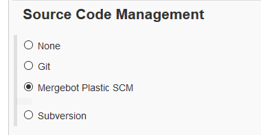
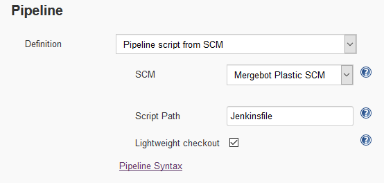
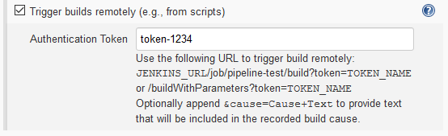
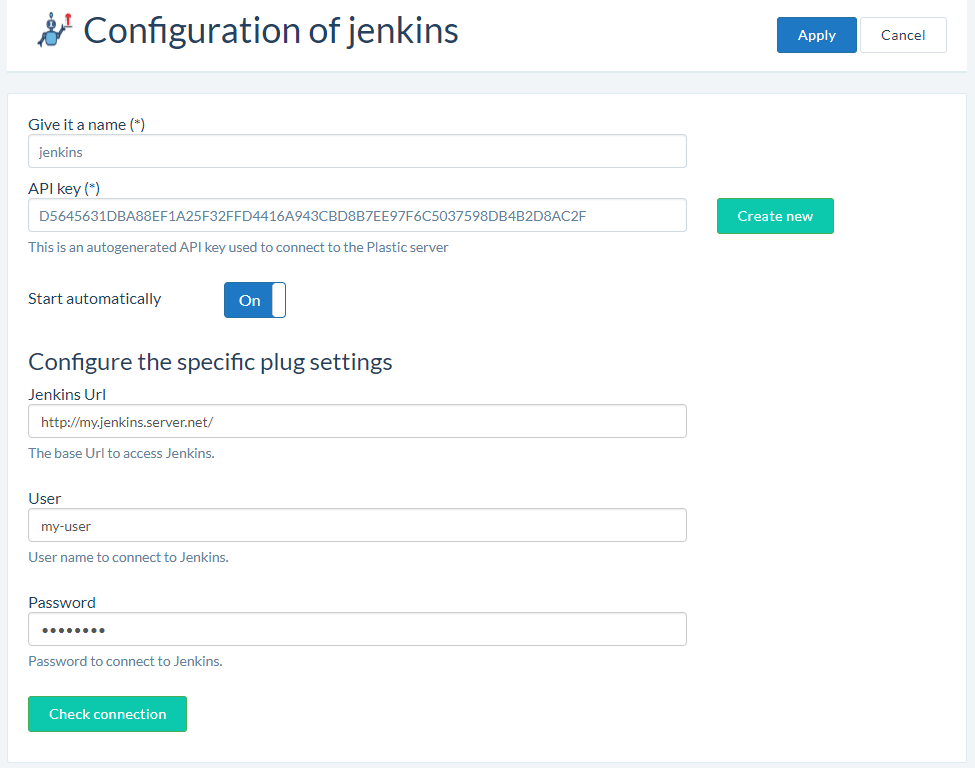
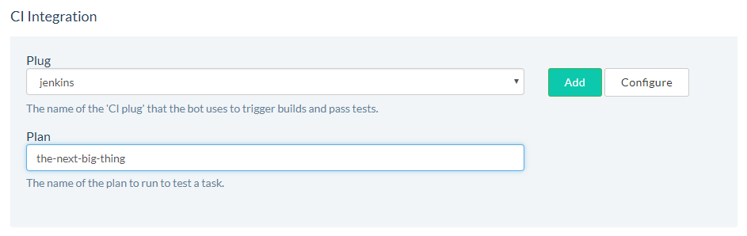

[.conf-macro .output-inline]#This plugin enables DevOps automation
features using https://www.plasticscm.com/[Plastic SCM]'s mergebot.#

[[PlasticSCMMergeBotplugin-Configuration]]
== Configuration

[[PlasticSCMMergeBotplugin-Freestyleprojects]]
=== Freestyle projects

First of all, create a new freestyle project and select *Mergebot*
*Plastic SCM* as the Source Code Management option:

[.confluence-embedded-file-wrapper]##

The plugin itself doesn't need any specific configuration. All settings
and parameters are set through Plastic SCM WebAdmin when you configure
your *mergebot*.

[[PlasticSCMMergeBotplugin-Pipelineprojects]]
=== Pipeline projects

If you wish to use the pipeline workflow for the Jenkins part of your
DevOps cycle, you have two options (as usual): defining a Pipeline
script in the plan configuration or retrieve it from SCM in each build.

Regardless of the option you choose, *remember to put the
`+mergebotCheckout()+` command* in your Groovy script when you wish to
perform the sources checkout from Plastic SCM.

This is an example of a Pipeline script using the mergebot checkout:

____
....
node {
....

....
   def mvnHome
....

....
   stage('Preparation') { // for display purposes
....

....
      // Get code from Plastic SCM as specified in the build parameters
....

....
      mergebotCheckout()
....

....
      // Get the Maven tool.
....

....
      // ** NOTE: This 'M3' Maven tool must be configured
....

....
      // **       in the global configuration.           
....

....
      mvnHome = tool 'M3'
....

....
   }
....

....
   stage('Build') {
....

....
      // Run the maven build
....

....
      if (isUnix()) {
....

....
         sh "'${mvnHome}/bin/mvn' -Dmaven.test.failure.ignore clean package"
....

....
      } else {
....

....
         bat(/"${mvnHome}\bin\mvn" -Dmaven.test.failure.ignore clean package/)
....

....
      }
....

....
   }
....

....
   stage('Results') {
....

....
      junit '**/target/surefire-reports/TEST-*.xml'
....

....
      archive 'target/*.jar'
....

....
   }
....

....
}
....
____

You can also choose to retrieve the script from the Plastic SCM
changeset to build. Set the definition dropdown list in the Pipeline
section to "Pipeline script from SCM", and then select "Mergebot Plastic
SCM". You can also choose the file path where the Jenkinsfile will be
found. The "Lightweight checkout" will only download said file if it's
enabled; otherwise, an auxiliary checkout will be performed before the
build to retrieve the Jenkinsfile.

[.confluence-embedded-file-wrapper .confluence-embedded-manual-size]##

[[PlasticSCMMergeBotplugin-Enableremotelytriggeredbuilds]]
=== Enable remotely triggered builds

To allow the Plastic SCM to trigger builds in your Jenkins plan, be sure
to check the "Trigger builds remotely" option in the "Build triggers"
section of the plan configuration.

[.confluence-embedded-file-wrapper .confluence-embedded-manual-size]##

[[PlasticSCMMergeBotplugin-SetupinPlasticSCM]]
== Setup in Plastic SCM

You can configure the Jenkins plug parameters from the WebAdmin. These
include creating the Jenkins plug configuration:

[.confluence-embedded-file-wrapper .confluence-embedded-manual-size]##

And then selecting that new configuration when you create the *mergebot*
configuration:

[.confluence-embedded-file-wrapper .confluence-embedded-manual-size]##

At this point, Jenkins builds will be automatically triggered by the
*mergebot*. You don't need to worry about this anymore!

[[PlasticSCMMergeBotplugin-Buildparameters&environmentvariables]]
== Build parameters & environment variables

These are the build parameters set by
https://github.com/PlasticSCM/trunk-mergebot[TrunkBot] when it triggers
a build. They are injected as environment variables so that the build
steps can use them in their processes.

Please note that only `+PLASTICSCM_MERGEBOT_UPDATE_SPEC+` is mandatory;
the rest depend on the particular implementation of the mergebot. If you
are using a custom mergebot you can define your own build parameters.

* *`+PLASTICSCM_MERGEBOT_UPDATE_SPEC+`*: the target object to checkout.
It can be a shelve spec, a branch spec, a label spec or a changeset
spec.
** The plasticscm-mergebot-plugin *requires* this build parameter
* *`+PLASTICSCM_MERGEBOT_BRANCH_HEAD_CHANGESET_AUTHOR+`*: the name of
the user that created the changeset that is being built.
* *`+PLASTICSCM_MERGEBOT_BRANCH_HEAD_CHANGESET_NUMBER+`*: the number
(also called ChangesetID) of the changeset that is being built.
* *`+PLASTICSCM_MERGEBOT_BRANCH_HEAD_CHANGESET_GUID+`*: the GUID of the
changeset that is being built.
* *`+PLASTICSCM_MERGEBOT_BRANCH_NAME+`*: the branch name where the
changeset being built is located.
* `+PLASTICSCM_MERGEBOT_TRUNK_HEAD_CHANGESET_NUMBER+`: the number of the
changeset where the build changeset will be merged if the build is
successful.
* `+PLASTICSCM_MERGEBOT_TRUNK_HEAD_CHANGESET_GUID+`: the GUID of the
changeset where the build changeset will be merged if the build is
successful.
* `+PLASTICSCM_MERGEBOT_REPSPEC+`: the repository where the changeset
being built is stored.
* `+PLASTICSCM_MERGEBOT_TASK_NUMBER+`: the issue identifier related to
the branch of the changeset being built.

 +

[[PlasticSCMMergeBotplugin-Requirements]]
== Requirements

The plugin requires that Plastic SCM "cm" command line tool is installed
and configured for the jenkins user on the master and slave machines.

[[PlasticSCMMergeBotplugin-Pluginversioninformation]]
== Plugin version information

This plugin has been developed by Codice Software S.L., owner of the
Plastic SCM product.

Visit us at:

https://www.plasticscm.com/[https://www.plasticscm.com]

Meet us:

https://www.plasticscm.com/company/team.html

Feel the power of merging branches easier than ever with SemanticMerge:

http://semanticmerge.com/

[[PlasticSCMMergeBotplugin-Changelog]]
=== Change log

[[PlasticSCMMergeBotplugin-Version0.13(2019-06-12)]]
==== Version 0.13 (2019-06-12)

* The jenkins job using mergebot could fail with "Workspace already
exists" error when the Jenkins server is a Linux machine but the job
runs in a Windows agent.
** This could happen if the configured Windows agent "Root directory"
has a different drive letter case than the registered existing plastic
workspace paths. Now it's fixed.

[[PlasticSCMMergeBotplugin-Version0.12(2018-10-08)]]
==== Version 0.12 (2018-10-08)

* We improved how the plugin reports errors in a Pipeline with
Lightweight checkout. Before this, if the Jenkinsfile download failed
only a 'NULL' message was printed. Now the complete command execution is
displayed.
* Fixed an incompatibility with other plugins if they require the SCM
plugin to support the ChangeLogSet.Entry.getAffectedFiles() method.

[[PlasticSCMMergeBotplugin-Version0.11(2018-09-28)]]
==== Version 0.11 (2018-09-28)

* Add Pipeline support, including lightweight checkout.
* Ensure environment variables are available for build steps in all
platforms.
* *Warning:* Make sure the client version installed in your Jenkins
machines is *7.0.16.2630* or higher

[[PlasticSCMMergeBotplugin-Version0.10(2018-09-06)]]
==== Version 0.10 (2018-09-06)

* Initial preview version. Supports only freestyle projects.
