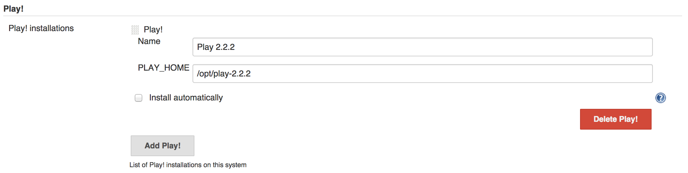
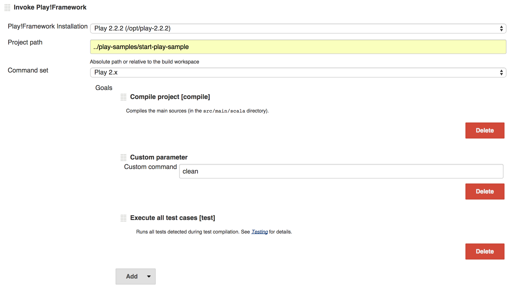
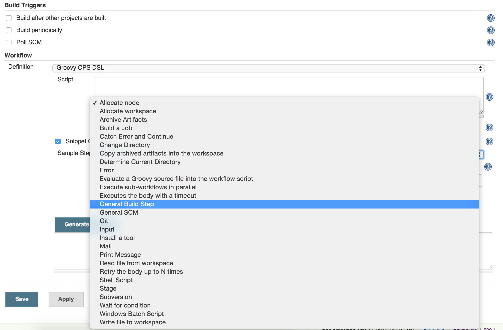
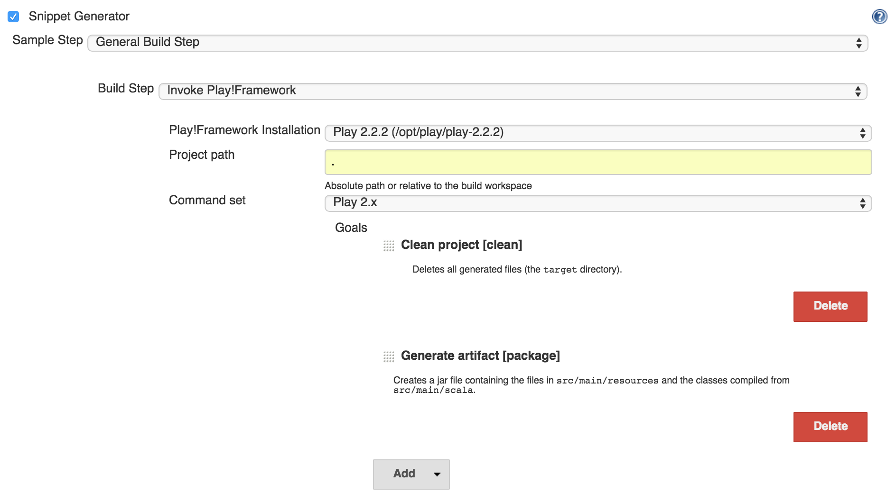

[.conf-macro .output-inline]# #

[.aui-icon .aui-icon-small .aui-iconfont-warning .confluence-information-macro-icon]##

*This plugin is up for adoption.* Want to help improve this plugin?
https://wiki.jenkins.io/display/JENKINS/Adopt+a+Plugin[Click here to
learn more]!

[[PlayFrameworkPlugin-PlayFrameworkplugin]]
== Play Framework plugin

The Play Framework plugin brings the command-line capabilities of _Play_
and _Activator_ into the _Jenkins_ environment, integrating these
powerful tools to the most widely used *Continuous Integration*
platform. This way, Play projects can benefit from the growing number of
features provided by the Jenkins community while improving the
traceability of their build elements and visualisation of the respective
results.

The plugin supports _Play 1.x_, _Play 2.x_ as well as _Activator_
projects. It provides a smart selection of most commands available in
their CLI. Moreover, it’s also possible to input custom commands via
Jenkins interface.

[[PlayFrameworkPlugin-GlobalConfiguration]]
=== Global Configuration

In _Manage Jenkins_, _Configure System_, a new section will be
available: *Play*.

[.confluence-embedded-file-wrapper .confluence-embedded-manual-size]##

Select *Add Play* and give it a name and the PLAY_HOME path. Play
Framework or Activator tools can be provided also via _Install
automatically_ option, when properly configured.

[.confluence-embedded-file-wrapper .confluence-embedded-manual-size]##

Save the configuration and move forward.

[[PlayFrameworkPlugin-JobConfiguration]]
=== Job Configuration

Open/create a Jenkins job. Add a build-step _Invoke Play Framework_.

[.confluence-embedded-file-wrapper .confluence-embedded-manual-size]##

Select the Play or Activator tool provided in the global configuration.
Provide also the project path and the command set (Play 1.x or Play 2.x,
which includes the Activator as well).

[.confluence-embedded-file-wrapper .confluence-embedded-manual-size]##

Several *Goals* are listed below according to the selected command set.
Create your sequence of goals in the desired order. Commands are
executed from top to bottom. A description is provided for each goal
right below their respective title.

[.confluence-embedded-file-wrapper .confluence-embedded-manual-size]##

*Save* your job configuration and you are ready to go!

[[PlayFrameworkPlugin-Workflowplugincompatibility]]
=== Workflow plugin compatibility

Starting from version 0.2.0, Play Framework plugin can be used within
the Workflow plugin for Jenkins. This allows your Play project to be
inserted into a more complex build environment that only Workflow
provides. Delivery Pipelines are one of the main benefits, allowing
higher parallelism and better control of the build chain.

In order to use it, simply create a new Workflow job and use its
*Snippet Generator* feature to create the Play command from the already
known User Interface.

Select _General Build Step_ and _Invoke Play Framework_.

[.confluence-embedded-file-wrapper .confluence-embedded-manual-size]##

Fill up the fields and select the goals as in a regular *Freestyle
Project*.

[.confluence-embedded-file-wrapper .confluence-embedded-manual-size]##

Pressing *Generate Groovy* will provide the complete Groovy command.

[.confluence-embedded-file-wrapper .confluence-embedded-manual-size]##

Copy the command and paste it into the Groovy text field. The _node_
function is a basic requirement for any script executed within the
Workflow plugin.

[.confluence-embedded-file-wrapper .confluence-embedded-manual-size]##

Copy the command and paste it into the Groovy text field. The _node_
function is a basic requirement for any script executed within the
Workflow plugin.

[[PlayFrameworkPlugin-Changelog]]
=== Change log

[[PlayFrameworkPlugin-Version1.0.1(Feb8,2016)]]
==== Version 1.0.1 (Feb 8, 2016)

* Windows compatibility fixed.
(https://issues.jenkins-ci.org/browse/JENKINS-31851[JENKINS-31851])

[[PlayFrameworkPlugin-Version1.0.0(Nov20,2015)]]
==== Version 1.0.0 (Nov 20, 2015)

* New interface: Play goals configurable via dropdown menus.
* Play tool installation implemented.
(https://issues.jenkins-ci.org/browse/JENKINS-31528[JENKINS-31528])

[[PlayFrameworkPlugin-Version0.0.12(Sep29,2011)]]
==== Version 0.0.12 (Sep 29, 2011)

* Bug fix: ensure job doesn't fail without configuring application path

[[PlayFrameworkPlugin-Version0.0.11(Sep28,2011)]]
==== Version 0.0.11 (Sep 28, 2011)

* Bug fix: to resolve workspace path when used in slave server

[[PlayFrameworkPlugin-Version0.0.10(Sep21,2011)]]
==== Version 0.0.10 (Sep 21, 2011)

* Modified supported Jenkins version number for adapting Cloudbees
support

[[PlayFrameworkPlugin-Version0.0.9(Sep18,2011)]]
==== Version 0.0.9 (Sep 18, 2011)

* Supported to allow using
https://wiki.jenkins-ci.org/display/JENKINS/Parameterized+Build[parameterized
build]
* Enable to configure play application path instead of using the
workspace root path as application path
* Ensure to quote application path when executing

[[PlayFrameworkPlugin-Version0.0.8(Jul27,2011)]]
==== Version 0.0.8 (Jul 27, 2011)

* Enable to run multiple commands at once with each options

[[PlayFrameworkPlugin-Version0.0.5(Jul3,2011)]]
==== Version 0.0.5 (Jul 3, 2011)

* Enable to configure play path per job

[[PlayFrameworkPlugin-Version0.0.4(Feb7,2011)]]
==== Version 0.0.4 (Feb 7, 2011)

* Fixed a bug builder's global.jelly misses its setting after Jenkins
restart 
* Supported unstable build status when some tests failed

[[PlayFrameworkPlugin-Version0.0.1(Jan25,2011)]]
==== Version 0.0.1 (Jan 25, 2011)

* First release
