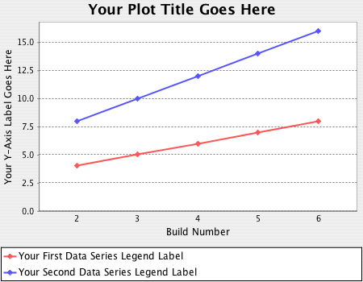

[.aui-icon .aui-icon-small .aui-iconfont-warning .confluence-information-macro-icon]#
#

2.0.0 version of the plugin brings Jenkins Pipeline support. It might
break compatibility if you update from 1.X versions, as it contains some
API changes. Please test in non-production environment before update.

This plugin provides generic plotting (or graphing) capabilities in
Jenkins.

This plugin will *plot* one or more *single values variations across
builds* in one or more plots. Plots for a particular job (or project)
are configured in the job configuration screen, where each field has
additional *help information*. Each plot can have one or more lines
(called data series). After each build completes the plots' data series
latest values are pulled from *Java properties file(s), CSV file(s), or
XML file(s)* via an XPath (which you should have generated during the
build) somewhere below your workspace. Data for each plot is stored in a
CSV file within the job's root project directory.

It can generate various kind of plots, including *Area*, *Bar*, *Line*,
*Stacked Bar*, *Waterfall*...

Here is an example of the plots generated by this plugin:
[.confluence-embedded-file-wrapper .image-center-wrapper]##

[[PlotPlugin-Configuration]]
== Configuration

[[PlotPlugin-Currentlysupportedparameters]]
=== Currently supported parameters

The currently supported parameters are:

* *`+width+` `+(int, default: 750)+`* The width of the plot in pixels.
* *`+height (int, default: 750)+`* The height of the plot in pixels.
* *`+rightBuildNum (int, default: 2^38 - 1)+`* The right-most build
number on the plot.
* *`+hasLegend (boolean, default: true)+`* Whether or not the plot has a
legend.
* *`+urlNumBuilds (string, default: 2^38 - 1)+`* Number of builds back
to show on this plot from URL.
* *`+urlTitle (string, default: "")+`* Title of plot from URL.
* *`+urlStyle (string, default: "")+`* Style of plot from URL.
* *`+urlUseDescr (boolean, default: false)+`* Use description flag from
URL.
* *`+title (string, default: "")+`* Title of plot.
* *`+yaxis (string, default: "")+`* Y-axis label.
* *`+series (list)+`* List of data series.
* *`+group (string)+`* Group name that this plot belongs to.
* *`+numBuilds (string, default:"")+`* Number of builds back to show on
this plot. An empty string means all builds. Must not be "0".
* *`+csvFileName (string, default: "$ROOT_DIR/plot-XXXX.csv")+`* The
name of the CSV file that persists the plots data. The CSV file is
stored in the projects root directory. This is different from the source
CSVle that can be used as a source for the plot.
* *`+csvLastModification (long, default: "last modified date")+`* The
date of the last change to the CSV file.
* *`+style (string, default: "line")+`* Style of plot: line, line3d,
stackedArea, stackedBar, etc.
* *`+useDescr (boolean, default: false)+`* Whether or not to use build
descriptions as X-axis labels.
* *`+keepRecords (boolean, default: false)+`* Keep records for builds
that were deleted.
* *`+exclZero (boolean, default: false)+`* Whether or not to exclude
zero as default Y-axis value.
* *`+logarithmic (boolean, default: false)+`* Use a logarithmic Y-axis.
* *`+yaxisMinimum (string, default: "")+`* Minimum y-axis value.
* `+yaxisMaximum (string, default: "") +`Maximum y-axis value.

For a full list of parameters the best place to view is
https://github.com/jenkinsci/plot-plugin/blob/master/src/main/java/hudson/plugins/plot/Plot.java[Plot.java]
class.

[[PlotPlugin-ExampleUsagetogeneratedetailedPMDreports]]
=== Example Usage to generate detailed PMD reports

Attached is
a https://wiki.jenkins-ci.org/download/attachments/2752526/pmd2plot.pl?version=1&modificationDate=1236135288000&api=v2[Perl
script] which generates more detailed "summaries" out of PMD report
files. We use this for several _code analysis_ projects, all
named `+trunk.codeanalysis+`._prefix_.

To have all resulting plots on one page, give all Plots the same _plot
group_. Because each code quality has its very own range, define each on
a separate plot, not as an additional data series.

[[PlotPlugin-Pipelinejobconfiguration]]
==== Pipeline job configuration

You can generate the
required https://jenkins.io/doc/book/pipeline/syntax/#scripted-pipeline[Scripted
Pipeline] syntax via
the https://jenkins.io/blog/2016/05/31/pipeline-snippetizer/[Snippet
Generator] by choosing the "plot: Plot build data" step.

Below you can find sample configuration which is auto-generated
using https://jenkins.io/blog/2016/05/31/pipeline-snippetizer/[Snippet
Generator].

[source,syntaxhighlighter-pre]
----
plot csvFileName: 'plot-8e54e334-ab7b-4c9f-94f7-b9d8965723df.csv', 
        csvSeries: [[
                            file: 'data.csv',
                            exclusionValues: '',
                            displayTableFlag: false,
                            inclusionFlag: 'OFF',
                            url: '']],
        group: 'Plot Group',
        title: 'Plot Title',
        style: 'line',
        exclZero: false,
        keepRecords: false,
        logarithmic: false,
        numBuilds: '',
        useDescr: false,
        yaxis: '',
        yaxisMaximum: '',
        yaxisMinimum: ''
----

* *csvFileName *- autogenerated value, but you might want to change it
to something more descriptive for your case.
* *file* - source file for plot generation (relative to workspace)

[[PlotPlugin-JIRAissues]]
== JIRA issues

If you have any proposals/bug reports, please create an issue on Jenkins
JIRA.

[[refresh-module--1678491573]]
[[refresh--1678491573]][[jira-issues--1678491573]]
Key

Summary

T

Created

Updated

Due

Assignee

Reporter

P

Status

Resolution

[.refresh-action-group]# #

[[refresh-issues-loading--1678491573]]
[.aui-icon .aui-icon-wait]#Loading...#

[#refresh-issues-button--1678491573]##
[#refresh-issues-link--1678491573]#Refresh#
[#error-message--1678491573 .error-message .hidden]# #

[[PlotPlugin-ChangeLog]]
=== Change Log

[[PlotPlugin-Version2.1.1(Jun14,2019)]]
==== Version 2.1.1 (Jun 14, 2019) 

* Trim labels and y-values
(https://github.com/jenkinsci/plot-plugin/pull/52[PR-52]). 
** Thanks to https://github.com/skelliam[skelliam]

[[PlotPlugin-Version2.1.0(Jun4,2018)]]
==== Version 2.1.0 (Jun 4, 2018) 

* Use @DataBoundSetter for optional pipeline parameters
(https://issues.jenkins-ci.org/browse/JENKINS-50636[JENKINS-50636], https://github.com/jenkinsci/plot-plugin/pull/48[PR-48]). 
** Base Jenkins version was
https://github.com/jenkinsci/plot-plugin/pull/48/commits/00da15d7f42b7e7904a1f897448c2d1fae9f9206[updated
to 2.0] version.
** Thanks to https://github.com/rmstyrczula[rmstyrczula]

[[PlotPlugin-Version2.0.5(May15,2018)]]
==== Version 2.0.5 (May 15, 2018) 

* Update values table CSS style and number
formatting (https://github.com/jenkinsci/plot-plugin/pull/47[PR-47]). 
** Thanks to https://github.com/radekdoulik[Radek Doulik]

[[PlotPlugin-Version2.0.4(May5,2018)]]
==== Version 2.0.4 (May 5, 2018) 

* Fix chart style value comparison, STACKED_AREA in
particular (https://issues.jenkins-ci.org/browse/JENKINS-50924[JENKINS-50924]). 

[[PlotPlugin-Version2.0.3(January24,2018)]]
==== Version 2.0.3 (January 24, 2018) 

* Pass PlotBuilder CTOR params to Plot
(https://issues.jenkins-ci.org/browse/JENKINS-48887[JENKINS-48887]). 
** "useDescr"/"keepRecords"/"exclZero"/"logarithmic" parameters didn't
work properly in pipeline.
** Thanks
to https://issues.jenkins-ci.org/secure/ViewProfile.jspa?name=reinholdfuereder[Reinhold
Füreder]
* Use "regular numeric tick labels" by default
for http://www.jfree.org/jfreechart/api/javadoc/org/jfree/chart/axis/LogarithmicAxis.html[LogarithmicAxis]
(https://issues.jenkins-ci.org/browse/JENKINS-48888[JENKINS-48888])
** Thanks
to https://issues.jenkins-ci.org/secure/ViewProfile.jspa?name=reinholdfuereder[Reinhold
Füreder] +

[[PlotPlugin-Version2.0.2(January3,2018)]]
==== Version 2.0.2 (January 3, 2018) 

* Fixed ConcurrentModificationException in PlotBuildAction.java
(https://issues.jenkins-ci.org/browse/JENKINS-48465[JENKINS-48465])
* Fixed typo's in help files
(https://issues.jenkins-ci.org/browse/JENKINS-48530[JENKINS-48530])
* Moved plugin description to wiki
(https://issues.jenkins-ci.org/browse/JENKINS-48537[JENKINS-48537])
* Configured Checkstyle and reformatted the project according to the
rules

[[PlotPlugin-Version2.0.0(November2,2017)]]
==== Version 2.0.0 (November 2, 2017) 

* Added support
for https://wiki.jenkins-ci.org/display/JENKINS/Pipeline+Plugin[Pipeline
Plugin] (https://issues.jenkins-ci.org/browse/JENKINS-35571[JENKINS-35571]). 
** *Note:* Might break compatibility if you update from 1.X version.
Update carefully!

[[PlotPlugin-Version1.11(April26,2017)]]
==== Version 1.11 (April 26, 2017) 

* Final Release: includes all PRs and fixes up to now

[[PlotPlugin-Version1.9(Mar15,2015)]]
==== Version 1.9 (Mar 15, 2015)

* Added an option to draw plots using a logarithmic Y-axis.
* Fixed %name% and %index% replacements in the URL for XML files
(http://stackoverflow.com/q/13271710/2654518).
* Added %build%, build number placeholder.

[[PlotPlugin-Version1.8(Sep28,2014)]]
==== Version 1.8 (Sep 28, 2014)

* Added option to exclude zero as default Y-axis value.
* Added option to keep records for deleted builds
(https://issues.jenkins-ci.org/browse/JENKINS-22575[JENKINS-22575]).
* Fixed matrix project support
(https://issues.jenkins-ci.org/browse/JENKINS-24666[JENKINS-24666]).
* Fixed %name% and %index% replacements in the URL
(http://stackoverflow.com/q/13271710/2654518).

[[PlotPlugin-Version1.7(Mar11,2014)]]
==== Version 1.7 (Mar 11, 2014)

* Fixed issues parsing XML files, introduced in version 1.6
(https://issues.jenkins-ci.org/browse/JENKINS-21493[JENKINS-21493]).

[[PlotPlugin-Version1.6(Jan16,2014)]]
==== Version 1.6 (Jan 16, 2014)

* Fixed plot data being retained for deleted builds
(https://issues.jenkins-ci.org/browse/JENKINS-4934[JENKINS-4934]).
* Fixed data out of sync with graph
(https://issues.jenkins-ci.org/browse/JENKINS-15358[JENKINS-15358]).
* Plugin is now available for maven2
(https://issues.jenkins-ci.org/browse/JENKINS-8478[JENKINS-8478]) and
matrix jobs
(https://issues.jenkins-ci.org/browse/JENKINS-15396[JENKINS-15396]).
* Improved XPath support.

[[PlotPlugin-Version1.5(Jul10,2011)]]
==== Version 1.5 (Jul 10, 2011)

* Thread safety fix
(https://issues.jenkins-ci.org/browse/JENKINS-9662[JENKINS-9662]).
* Japanese localization.

[[PlotPlugin-Version1.4(Nov21,2010)]]
==== Version 1.4 (Nov 21, 2010)

* Use Uri.rawencode instead of URLEncoder.encode for Plot Group
(https://issues.jenkins-ci.org/browse/JENKINS-7245[JENKINS-7245],
https://issues.jenkins-ci.org/browse/JENKINS-8143[JENKINS-8143]).

[[PlotPlugin-Version1.3(Jul20,2010)]]
==== Version 1.3 (Jul 20, 2010)

* Configurable graph style for each plot.
* Read data from XML files
(https://issues.jenkins-ci.org/browse/JENKINS-2796[JENKINS-2796]).
* Read data from CSV files
(https://issues.jenkins-ci.org/browse/JENKINS-2899[JENKINS-2899]).
* Update code for more recent Hudson.

[[PlotPlugin-Version1.2(Sep24,2008)]]
==== Version 1.2 (Sep 24, 2008)
