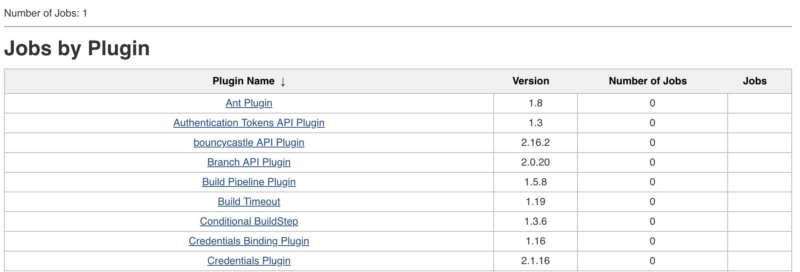

This plugin gives you the possibility to analyze the usage of your
installed plugins.

[[PluginUsagePlugin(Community)-Usage]]
== Usage

You can find the plugin on sidepanel of Jenkins. Every user is able to
use this plugin.

The plugin will give you a report on how much every plugin will be used
in all of your jobs (see the screenshot below). Therefore it will
analyze the used extension points of each job. +
*Plugins used in pipeline scripts would not be listed normally as used
by jobs, because they are used dynamically in Jenkinsfiles.*

[.confluence-embedded-file-wrapper .confluence-embedded-manual-size]##

[[PluginUsagePlugin(Community)-SupportedExtensionpoints]]
== Supported Extension points

This plugins will first iterate through jobs to gather those types of
extension points:

* Builder
* BuildWrapper
* JobProperty
* Publisher
* SCM
* Trigger

and will add other plugins at the end. 

[[PluginUsagePlugin(Community)-VersionHistory]]
== Version History

[[PluginUsagePlugin(Community)-Version0.4(04/22/2018)]]
=== Version 0.4 (04/22/2018)

* add column with plugin's version
* list all plugins, not only specified types of Extension Points

[[PluginUsagePlugin(Community)-Version0.3(07/29/2014)]]
=== Version 0.3 (07/29/2014)

* bugfix for sorting the table
* Added support for french
* Made the plugin available for every user and not just for the admins

[[PluginUsagePlugin(Community)-Version0.2(07/11/2014)]]
=== Version 0.2 (07/11/2014)

* UI improvements

[[PluginUsagePlugin(Community)-Version0.1(07/09/2014)]]
=== Version 0.1 (07/09/2014)

* initial Version
