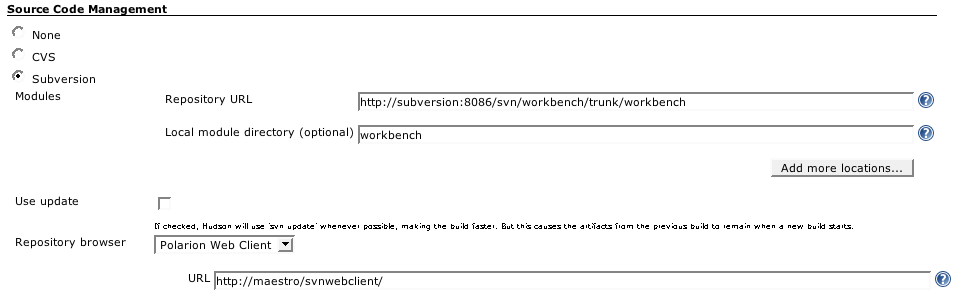
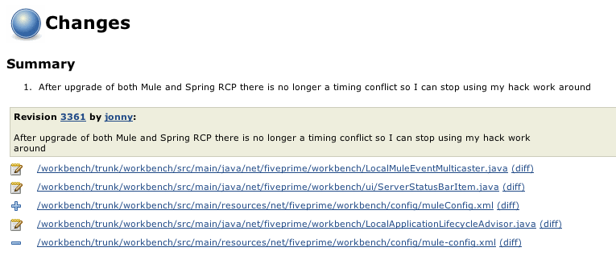

[[PolarionPlugin-PolarionPlugin]]
== Polarion Plugin

[.conf-macro .output-inline]#This plugin integrates the
http://www.polarion.com/products/svn/svn_webclient.php[Polarion
WebClient for SVN], an open source, web based interface to Subversion.#

Configuration simply involves choosing 'Polarion Web Client' as the
repository browser when configuring a project to use Subversion as its
source code management.

[.confluence-embedded-file-wrapper .image-center-wrapper]##

Once configured, the change logs of a build will provide links to the
specific Subversion revision as well as the color coded difference views
within Polarion WebClient.

[.confluence-embedded-file-wrapper .image-center-wrapper]##

Note that JIRA also integrates the Polarion WebClient as a web based
viewer of subversion changes related to issues. When coupled with the
Jenkins https://wiki.jenkins-ci.org/display/JENKINS/JIRA+Plugin[JIRA
Plugin] this combination provides a very useful integration between
source control viewing, issue tracking and continuous integration and
builds.

[[PolarionPlugin-ChangeHistory]]
== Change History

[[PolarionPlugin-Version1.3(Nov03,2011)]]
=== Version 1.3 (Nov 03, 2011)

* JENKINS-11602

[[PolarionPlugin-Version1.2(Jan29,2010)]]
=== Version 1.2 (Jan 29, 2010)

* Update code for more recent Hudson

[[PolarionPlugin-Version1.1(Sep5,2007)]]
=== Version 1.1 (Sep 5, 2007)

* Added the location option
(http://www.nabble.com/Polarion-plugin-extension-tf4358881.html[report])
