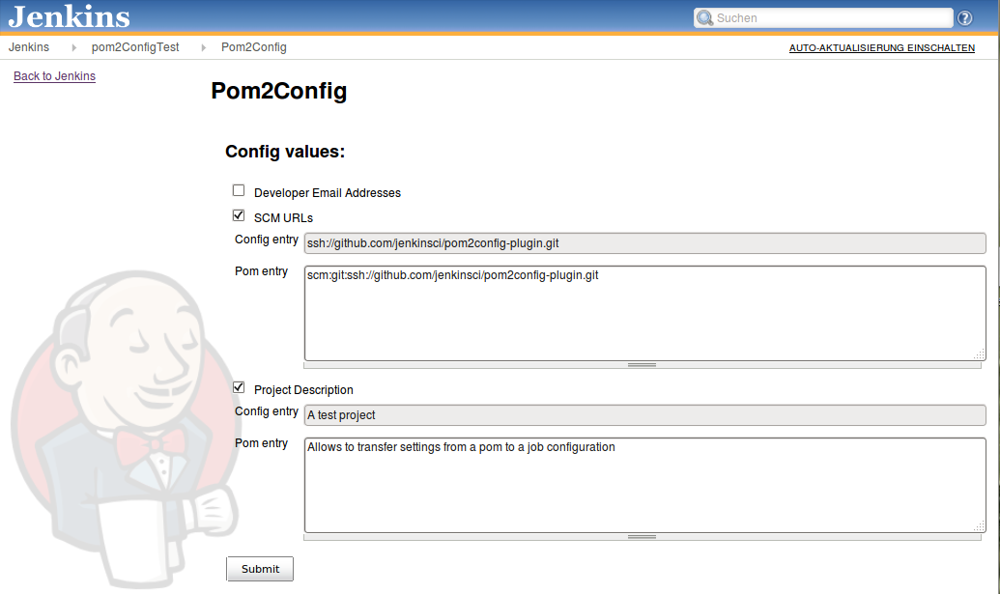

Jenkins plugin which allows to transfer settings from a POM to a job
configuration. +

The plugin parses a given POM and gives you afterwards the opportunity
to replace different job settings like project description or the SCM
URL with the found values from the POM.

The plugin shows up in the left bar of a job. There are three
possibilities to give the plugin a POM file to parse, you can either use
an existing POM in the workspace of the current job, get it from an URL
or just upload one.
[.confluence-embedded-file-wrapper .image-center-wrapper .confluence-embedded-manual-size]##

*The following functions are supported*

* Project description
* https://wiki.jenkins-ci.org/display/JENKINS/Email-ext+plugin[Editable
Email Notification (recipient list only)]
* https://wiki.jenkins-ci.org/display/JENKINS/Git+Plugin[Git SCM URL]
* https://wiki.jenkins-ci.org/display/JENKINS/Subversion+Plugin[SVN SCM
URL]

[[Pom2ConfigPlugin-Changelog]]
== Changelog

[[Pom2ConfigPlugin-Version1.2(Dez112013)]]
=== Version 1.2 (Dez 11 2013)

* First version of this plugin

[[Pom2ConfigPlugin-Version1.0/1.1failedrelease]]
=== Version 1.0 / 1.1 failed release
