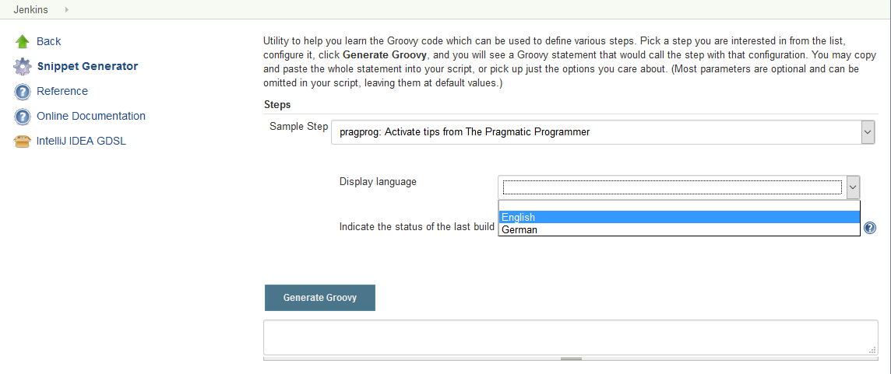
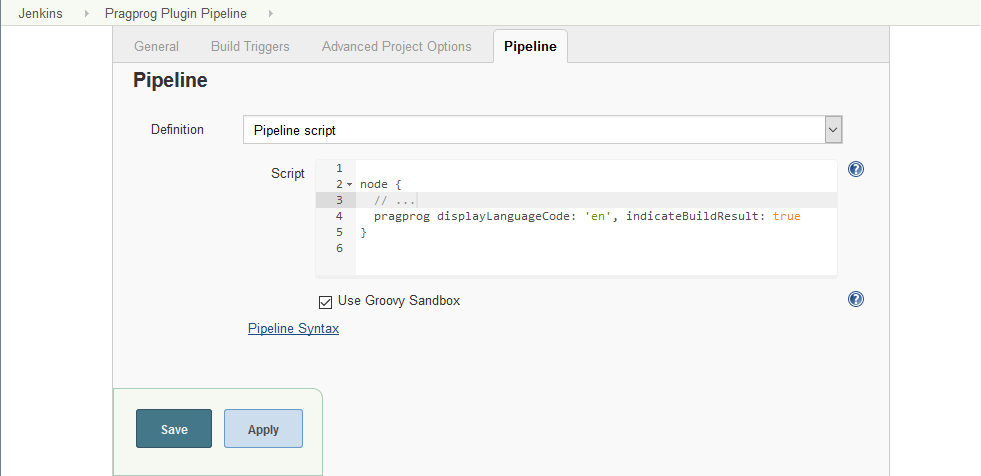
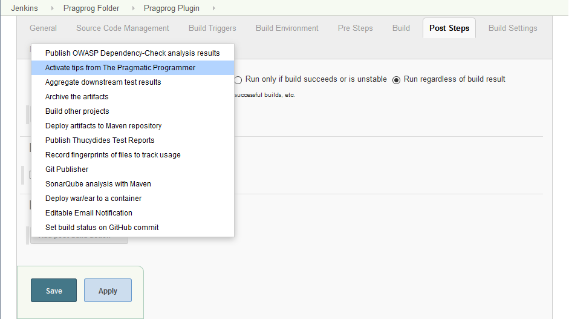
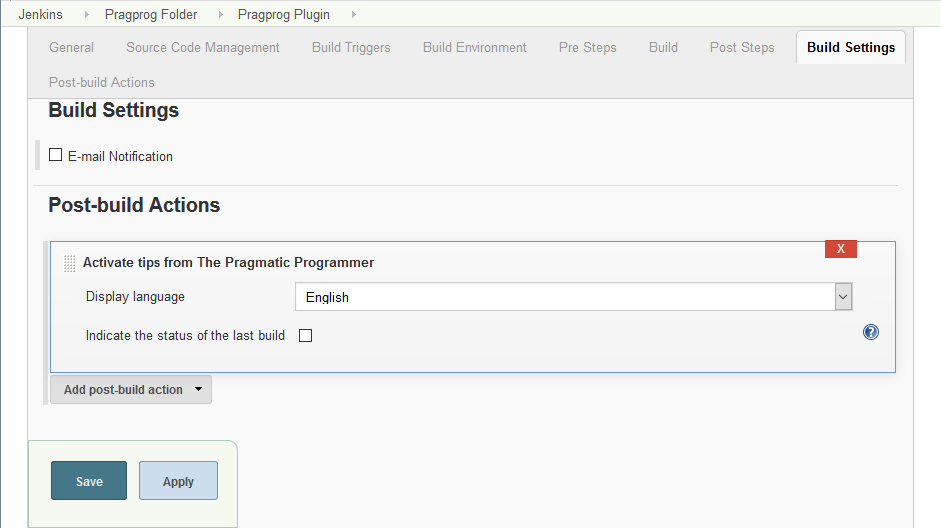
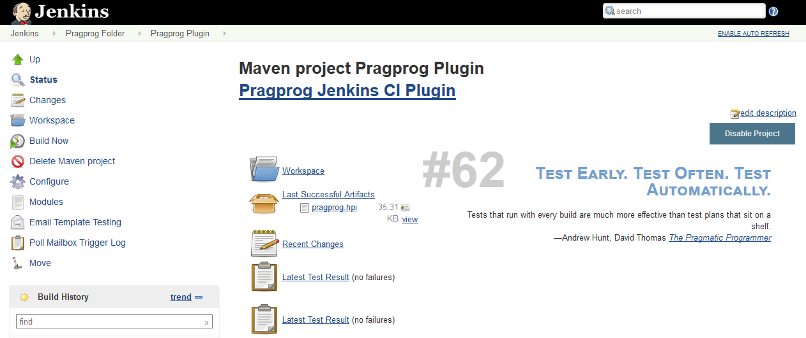
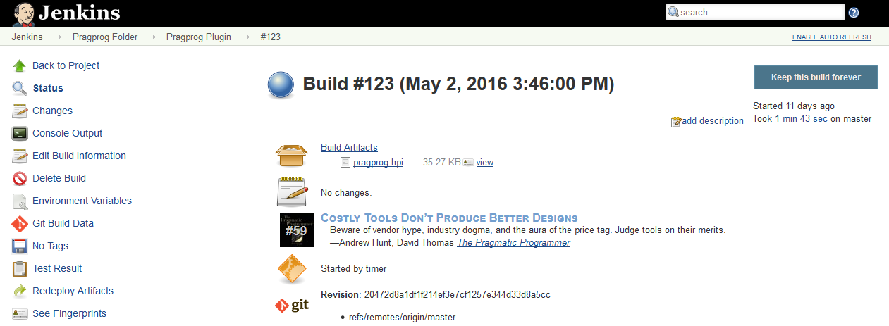

[[PragprogPlugin-PluginInformation]]
== Plugin Information

[width="100%",cols="25%,25%,25%,25%",]
|===
|Plugin ID |pragprog |Changes | 

|Latest Release +
Latest Release Date +
Required Core +
Dependencies |http://updates.jenkins-ci.org/latest/pragprog.hpi[2.0.0]
http://updates.jenkins-ci.org/download/plugins/pragprog/[(archives)] +
June 10, 2016 +
http://updates.jenkins-ci.org/download/war/1.642.3/jenkins.war[1.642.3] +
https://wiki.jenkins-ci.org/display/JENKINS/Pipeline+Step+API+Plugin[workflow-step-api]
(version:
http://updates.jenkins-ci.org/download/plugins/workflow-step-api/1.15/workflow-step-api.hpi[1.15])
|Source Code +
Issue Tracking +
Maintainer(s) |  +
http://bitbucket.org/torsten_ehrhorn/pragprog/issues/?status=new&status=open[Open
Issues] +
https://wiki.jenkins-ci.org/display/~torsten[Unknown User (torsten)]
(id: torsten)
|===

[.conf-macro .output-inline]# This plugin displays random chosen tips
extracted from the book
http://pragprog.com/the-pragmatic-programmer/[The Pragmatic Programmer:
From Journeyman to Master] by Andrew Hunt and David Thomas on the job
page and each build page.#

[[PragprogPlugin-Installation]]
== Installation

[[PragprogPlugin-Automaticinstallation]]
=== Automatic installation

This is the easiest and recommended way. Open your Jenkins instance's
_Plugin Manager_ and find the _Pragprog Plugin_ in the _Available_ tab,
`+http+``+://<jenkins>/pluginManager/available+`. Check the checkbox and
decide whether to _Install without restart_ or _Download now and install
after restart_ by clicking the corresponding button.

[[PragprogPlugin-Manualinstallation]]
=== Manual installation

Download the latest
http://updates.jenkins-ci.org/latest/pragprog.hpi[pragprog.hpi] file.
Open your Jenkins instance's _Plugin Manager_ and install the file by
using the upload form in the _Advanced_ tab,
`+http+``+://<jenkins>/pluginManager/advanced+`, or save the file (and
all its dependencies) into the `+$JENKINS_HOME/plugins+` directory. Note
that you will need to restart your Jenkins instance.

[[PragprogPlugin-Usage]]
== Usage

[[PragprogPlugin-Pipelines]]
=== Pipelines

[.aui-icon .aui-icon-small .aui-iconfont-info .confluence-information-macro-icon]#
#

Pipelines require a Jenkins instance that is set up with the appropriate
plugins. See the
https://jenkins.io/doc/pipeline/#preparing-jenkins-to-run-pipelines[Getting
Started Guide] for more information.

Open the pipeline snippet generator,
`+http+``+://<jenkins>/pipeline-syntax+`. Expand the _Sample Step_ list
and select the _Activate tips from The Pragmatic Programmer_ option.
Adjust the provided _Pragprog Plugin options_ and commit all changes by
clicking the _Generate Groovy_ button.

[.confluence-embedded-file-wrapper .confluence-embedded-manual-size]##

Copy the generated code, e.g.

[source,syntaxhighlighter-pre]
----
pragprog displayLanguageCode: 'en', indicateBuildResult: true
----

Open your pipeline's configuration page and find the _Pipeline_ section.
Paste the previously copied code into the _Script_ field and commit all
changes by clicking the _Save_ or _Apply_ button.

[.confluence-embedded-file-wrapper .confluence-embedded-manual-size]##

[[PragprogPlugin-Commonjobs]]
=== Common jobs

Open your job's configuration page and find the _Post-build Actions_
section. Expand the _Add post-build action_ button and select the
_Activate tips from The Pragmatic Programmer_ option. Adjust the
provided _Pragprog Plugin options_ and commit all changes by clicking
the _Save_ or _Apply_ button.

[.confluence-embedded-file-wrapper .confluence-embedded-manual-size]##

[.confluence-embedded-file-wrapper .confluence-embedded-manual-size]##

[[PragprogPlugin-Screenshots]]
== Screenshots

[.confluence-embedded-file-wrapper .confluence-embedded-manual-size]##

[.confluence-embedded-file-wrapper .confluence-embedded-manual-size]##

[[PragprogPlugin-Helpandsupport]]
== Help and support

Please make sure to check the changelog and the
http://bitbucket.org/torsten_ehrhorn/pragprog/issues/[bug tracker] for
solved and open issues. Feel free to
http://bitbucket.org/torsten_ehrhorn/pragprog/issues/new[create a new
issue] if yours has not yet been reported.

[[PragprogPlugin-Changelog]]
== Changelog

[[PragprogPlugin-Version2.0.0(June10,2016)]]
=== Version http://updates.jenkins-ci.org/download/plugins/pragprog/2.0.0/pragprog.hpi[2.0.0] (June 10, 2016)

* https://bitbucket.org/torsten_ehrhorn/pragprog/issues/3/[Issue #3]:
Support for
https://wiki.jenkins-ci.org/display/JENKINS/Pipeline+Plugin[pipelines]
** Requires at least Jenkins Core
http://updates.jenkins-ci.org/download/war/1.642.3/jenkins.war[1.642.3]
** Requires at least
https://wiki.jenkins-ci.org/display/JENKINS/Pipeline+Step+API+Plugin[Pipeline
Step API]
http://updates.jenkins-ci.org/download/plugins/workflow-step-api/1.15/workflow-step-api.hpi[1.15]

[[PragprogPlugin-Version1.0.5(May13,2016)]]
=== Version http://updates.jenkins-ci.org/download/plugins/pragprog/1.0.5/pragprog.hpi[1.0.5] (May 13, 2016)

* Minor UI improvements
** https://bitbucket.org/torsten_ehrhorn/pragprog/issues/1/[Issue #1]:
Tips are partially hidden on the job page
** https://bitbucket.org/torsten_ehrhorn/pragprog/issues/2/[Issue #2]:
Configuration shows initial validation error

[[PragprogPlugin-Version1.0.4(May01,2013)]]
=== Version http://updates.jenkins-ci.org/download/plugins/pragprog/1.0.4/pragprog.hpi[1.0.4] (May 01, 2013)

* Initial public release

[[PragprogPlugin-Disclaimer]]
== Disclaimer

Permission to use the tips from the book
http://pragprog.com/the-pragmatic-programmer/[The Pragmatic Programmer:
From Journeyman to Master] by Andrew Hunt and David Thomas in this
plugin was granted by http://www.pearson.com/[Pearson Education, Inc.],
Upper Saddle River, NJ.
