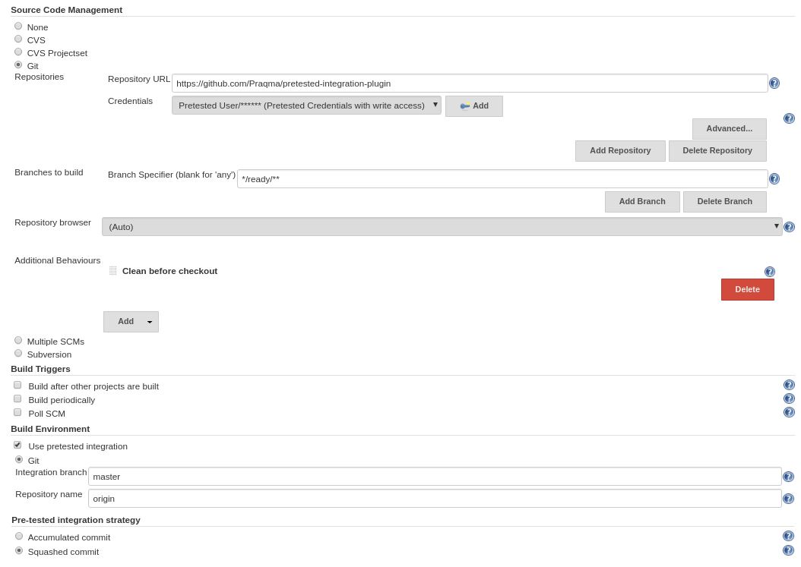
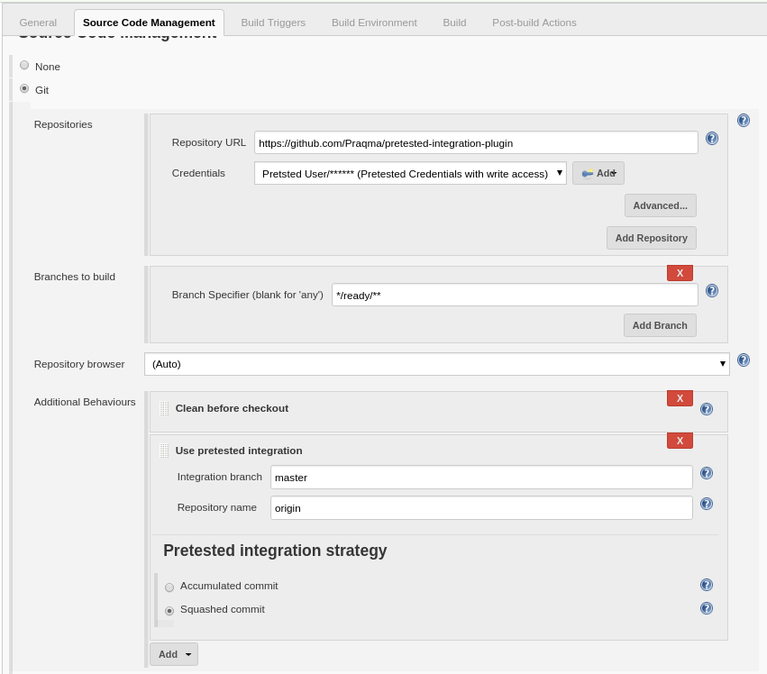
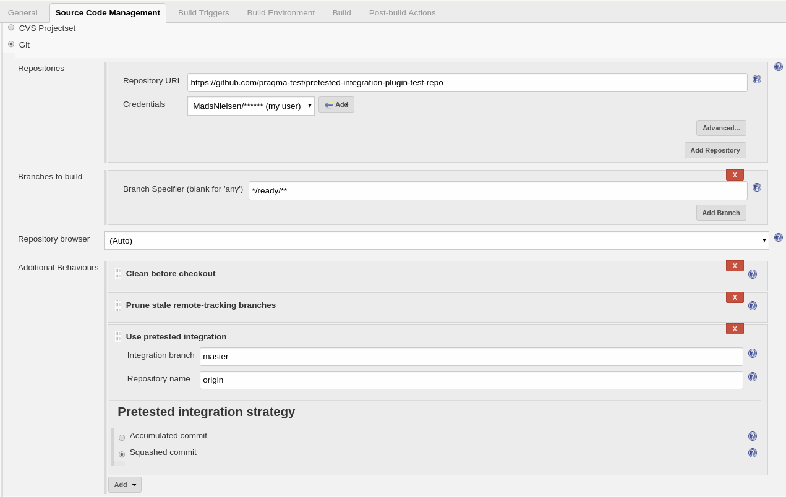
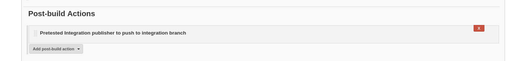
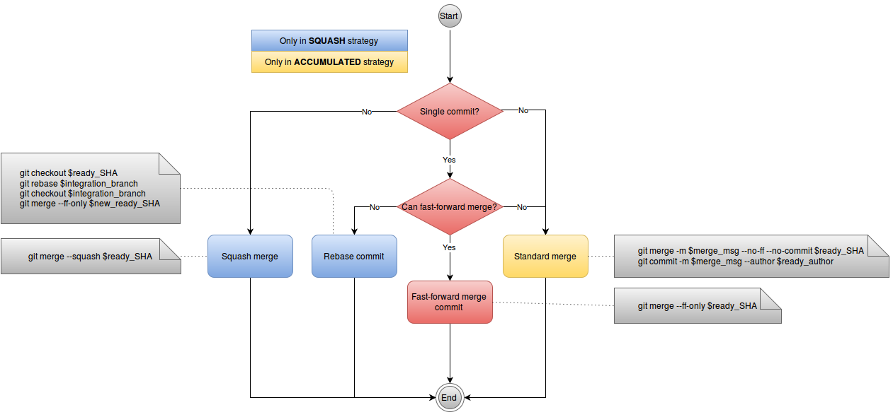

[[PretestedIntegrationPlugin-Developedby]]
===== Developed by

[.confluence-embedded-file-wrapper .confluence-embedded-manual-size]##

[[PretestedIntegrationPlugin-Sponsoredbymembersofthe]]
===== Sponsored by members of the

[.confluence-embedded-file-wrapper .confluence-embedded-manual-size]##

 

[[PretestedIntegrationPlugin-Introduction]]
== Introduction

[.conf-macro .output-inline]##The Pretested Integration Plugin offers a
branchy approach to pretested integration (also known as pre-tested
commits), which upholds the invariant; that for a specific branch, known
as the integration branch, all commits have been verified.##This plugin
is developed by https://www.praqma.com/[Praqma] and sponsored and
maintained by the http://alliance.praqma.com/[Continuous Delivery
Alliance] members (earlier named Josra)

The plugin relies on the SCM plugin to establish the workspace and then
takes over to do the integration in the local workspace of the job.
Finally the job makes the decision whether to like and push the result
or hate and discard it.

[[PretestedIntegrationPlugin-Features]]
=== Features

* If you deliver (git push) more than one commit on the **ready** branch
it will be delivered to the integration branch using the strategy.
* Two strategies are supported: **squashed** (using git --squash merges)
and **accumulated** (using git --no-ff merges).
* If you deliver one commit that can be fast-forwarded, it will be.
* Credentials support for the SCM configuration.
* Adding the Pretested Integration Plugin publisher as a post-build step
is optional, leaving room for more customized jobs.
* The plugin support Job DSL, scripted and declarative pipeline syntax
if you script your jobs.
* Pretested Integration Plugin can integrate repositories with git
submodules if they are processed as part of the git scm additional
behavior.

[[PretestedIntegrationPlugin-Majorversion3incompatiblewithearlierversion]]
== Major version 3 incompatible with earlier version

Starting with version 3.0.0 we have changed the plugin to work as a Git
Plugin extension, so you will find under Additional behaviors in your
Git SCM configuration. +
Earlier it was a build wrapper which was configured in the “Prepare an
environment for this build”

The change was necessary in order to support the new Pipeline job types
and requires you to migrate your job configuration.

[[PretestedIntegrationPlugin-Migrationguidefrom2.xto3.x]]
=== Migration guide from 2.x to 3.x

[[PretestedIntegrationPlugin-JobDSL]]
==== Job DSL

If you’re using Job DSL to generate your jobs this is an easy fix. Just
update your Job DSL script with the new syntax, which is show in the
JobDSL example section below.

[[PretestedIntegrationPlugin-Manuallycreatedjobs]]
==== Manually created jobs

If you’re creating your jobs manually, you’ll need to manually
reconfigure your jobs.

When updating the plugin your current configuration will not show so you
need to know how your jobs was configured and make the analogue
configuration as Git Plugin extension.

Example below in the pictures.

The names of the fields have not changed and the strategies remain
unchanged as well.

[width="100%",cols="3%,97%",options="header",]
|===
|Build wrapper |Git 'Additonal behaviour'
a|
[.confluence-embedded-file-wrapper .confluence-embedded-manual-size]##

a|
[.confluence-embedded-file-wrapper .confluence-embedded-manual-size]##

|===

 +

Additional behaviours → “Use pretested integration” -> Configure
Integration branch and repository

[[PretestedIntegrationPlugin-Whoshouldupgradeandwhoshouldnot]]
=== Who should upgrade and who should not

* Users who rely on *Multiple SCM plugin should not upgrade to 3.x*
since we’ve removed support for this plugin in 3.0.0.  If you use this
plugin, consider moving to the Pipeline job type instead and leave the
deprecated MultiSCM behind.
* If you use *purely FreeStyle jobs in your environment**, upgrading to
3.0.0 is recommended*. It won't provide any benefits and *won’t be
strictly necessary*, but we recommend to follow along and if you have
many manual configured job, take the opportunity to script them using
Job DSL or Jenkins Pipeline syntax.
* *If you use Matrix job, you can benefit from version 3.x* as the post
build step is now optional and thus gives you flexibility to use
pretested integration in a Matrix job setup.

[[PretestedIntegrationPlugin-Pluginlimitations]]
== Plugin limitations

*There is one requirement: You should only try to integrate changes from
one repository pr. job.*

So see this as a limitation, but it actually a design decision as we
will never be able to guarantee an atomic integration of two DVCS
repositories as one process.

* *So only configure the Pretested Integration Plugin on one Git
repository pr. job*

Beside this the Pretested Integration plugin works with most known job
types :

* FreeStyle and Matrix jobs are supported. See the section below for
configuring Matrix jobs.
* Pipeline jobs are also supported, with a small caveat for Multibranch
Pipeline: The pipeline is executed before the merge of the Jenkinsfile,
so changes you push for the Jenkinsfile will only have effect the next
time the pipeline executes.
* Maven job type are unsupported and we will print a warning, but should
function just like the FreeStyle Job type in many cases.

*There can be more repositories in your job - only one under
integration.*

When you use Git SCM with more than 1 repository configured it is
absolutely required that you ensure that the remote name is unique pr.
repository as we only allow integration of 1 git repo per job. Call them
by the saying repository name or simply just origin1, origin2 ...

For Pipeline you also need to make sure you only perform 1 integration
in the course of the flow, you can have multiple checkouts, but only one
of your repositories can have pretested integration happening, otherwise
we cannot reliably determine which branch to delete upon the success of
the job.

[[PretestedIntegrationPlugin-References]]
== References

* For more background information and discussions on the different merge
strategies available please read the blog post at the
JOSRA: http://www.josra.org/blog/Pretested+integration+plugin.html[Pretested
Integration Plugin].
* For a paper on how to implement at complete flow of automated
continuous delivery - including pretested integration - read the white
paper:
http://www.josra.org/blog/An-automated-git-branching-strategy.html[An
Automated Git Branching Flow]
* To follow the roadmap for this plugin see the
https://trello.com/b/tOQL6crl/pretested-integration-plugin[Trello
board].
* Developer oriented documentation is found in the
https://github.com/Praqma/pretested-integration-plugin/blob/master/README.md[repository
readme].

[[PretestedIntegrationPlugin-ChangesinJenkinsfile(forusersofpipelinewithJenkinsfile)]]
== Changes in Jenkinsfile (for users of pipeline with Jenkinsfile)

The default behaviour of the pretested integration plugin is to run
`jenkinsfile` that is located on the branch that is being integrated, so
if branch `ready/457-uses-gradle-instead-of-maven` if being processed by
the plugin, it is the file located on that branch that will be executed,
not the one on the integration branch.

[[PretestedIntegrationPlugin-Conflicts]]
=== Conflicts

There can be cases where users have edited the jenkins file, and that
can result in a merge conflict. The pretested integration plugin does
not handle merge conflict in a Jenkinsfile, so to update the Jenkins
file, another strategy must be applied.

{empty}1. Change the Jenkins file and merge it to the integration branch
(`master`) locally in a separate commit +
2. Push it to remote master +
3. Delivering the other changes on a ready branch, which also has the
updates to the jenkinsfile

If `master` (in the case above) is also being build by a job, that can
result in a failing build if the new Jenkinsfile is using resources not
yet available. This will however be fixed the moment the `ready`-branch
have been integrated.

[[PretestedIntegrationPlugin-Supportandcontact]]
== Support and contact

If you find issues or have questions please contact us using Github
issues here
https://github.com/Praqma/pretested-integration-plugin/issues

Comments and discussions on this page is not noticed.

[[PretestedIntegrationPlugin-Pluginconfiguration]]
== Plugin configuration

[[PretestedIntegrationPlugin-Tipsformatrixjobconfiguration]]
=== Tips for matrix job configuration

When you use the Matrix Job type, the merge is performed for each child
job in your matrix and even thought the Pretested Integration Plugin
post-build step is added we make sure it is only executed once in the
parent job. This ensures that we only attempt to remove the branch once
during a Matrix build after all childs have completed and have completed
successfully.

We assume that your integration process using Pretested Integration
Plugin is serialized so only one of this kind of job pr. project is
building at the time. Else you're not sure the child jobs are
integrating and verifying the same changes.

[[PretestedIntegrationPlugin-Manualbuilding]]
=== Manual building

In general you are not able to use 'Build now' with a Pretested
Integration Plugin job configuration. The Pretested Integration Plugin
is first in action when a "workspace" is handed over from the Git Plugin
it will when manually building serve the last build revision again. If
that succeeded last time, the revision is deleted after the integration
and retrying the integration fails. +

 Some successful and failing cases using manual builds are:

* If last build failed, thus the integration failed, for a
non-persistent error (disk problem, licensing problem ...) rebuilding
the job can succeed if no other build have been executed since last
time.
* If you have done a job configuration change, and need to trigger the
job to test the configuration you typically need to make a commit that
triggers the job. Push a commit to a ready branch, or wait for one.
* There is a work around, that often enables you to build manually: Make
the job parametrized with BRANCH_TO_BUILD and use that variable in the
'branch specifier'. Make BRANCH_TO_BUILD have the default ready-branch
specifier, so if not given the job works as if there were no parameters.
If you now build the job manually, you can type in a branch to build.

[[PretestedIntegrationPlugin-Failedand‘Nothingtodo’statuseswhenmerging]]
=== Failed and ‘Nothing to do’ statuses when merging

The ‘Nothing to do’ build status is added to your build description in
the following scenarios

* Pushing a development branch that has no changes (result of merge is
empty)
* Using the plugin in a setup with more than 1 remote configured where
the build is triggered by repository that does not have pretested
integration plugin configured.

Failed builds can happen if there is a merge conflict which cannot be
solved by a merge. In this scenario it is up to the user to merge the
integration branch into their own development branch to fix their issues
and deliver it again.

[[PretestedIntegrationPlugin-HowPretestedIntegrationusescredentials]]
=== How Pretested Integration uses credentials

The Pretested Integration plugin will re-use the credentials for
configured for the SCM that performed the merge. That means that if
you've properly configured credentials in your git plugin, that is,
credentials with write acces to your repository no further configuration
is required. 

[[PretestedIntegrationPlugin-Therecommendedsetupandgitworkflow]]
=== The recommended setup and git workflow

Here is a simple git workflow where you can work on a features branch,
and when ready push to a *ready*-branch. The Pretested Integration
plugin, if configured as described will then pick up your changes, merge
them and verify them. If verified they are integrated on the
*integration* branch. The ready branch are automatically deleted if
integration was successful.

Recommendation:

* Use one repository in your job configuration - *the integration
repository*. Avoid using several repositories - model your dependencies
in other (better) ways.
* Name your repository *origin*
* Use *master* as *integration* branch (destination).
* Use *origin/ready/*** as specifier for *ready* branches - only
branches matching this expression will trigger the build

[[PretestedIntegrationPlugin-ThesimpleGitworkflow]]
==== The simple Git workflow

_Get your repository up to date:_

[source,syntaxhighlighter-pre]
----
git fetch --prune

git checkout master

git pull origin master
----

_Create a feature- or development- or... branch_

[source,syntaxhighlighter-pre]
----
git checkout -b feat_1337-improved-login-screen
----

_...work, stage and commit changes._

_Then push changes to a_ *_ready_* _branch, which is basically just a
branch following a naming conventions for branches matching_
**_ready/_**__*__*_._

[source,syntaxhighlighter-pre]
----
git push origin feat_1337-improved-login-screen:ready/feat_1337-improved-login-screen
----

_The change will be picked up by the plugin if configured as shown in
the picture below._

* You can then delete your local branch and continue with a new feature
or development branch.
* You are free to push to any branch name not matching the ready branch
naming convention without triggering an integration build.

This is how the default configuration should look like:

[.confluence-embedded-file-wrapper]##

And a publisher to delete on success:

[.confluence-embedded-file-wrapper]##

[[PretestedIntegrationPlugin-Integrationflow]]
== Integration flow

Below is a simplified diagram of what Pretested Integration actually
does once you've pushed your branch to integrate. +
At the start, HEAD is at the integration branch, ready to merge in your
branch. +
In the end the merge result is verified and, if successful, pushed.

[.confluence-embedded-file-wrapper]##

[[PretestedIntegrationPlugin-Helpanderrormessages]]
== Help and error messages

We tried to gather some common errors and problems seen, together with
some suggested solutions but not much have been contributed. See
https://wiki.jenkins.io/display/JENKINS/Help+and+error+messages[Help and
error messages]

[[PretestedIntegrationPlugin-Scriptedjobexamples]]
== Scripted job examples

The following are examples on how to script jobs using this plugin.
Refer to either the pipeline script generator in Jenkins or Job DSL API
viewer for all the details.

[[PretestedIntegrationPlugin-JobDSL.1]]
=== Job DSL

[[PretestedIntegrationPlugin-Exampleintegratingthepluginrepositoryitselfusingourrecommendeddefaultconfiguration]]
==== _Example integrating the plugin repository itself using our recommended default configuration +
_

[source,syntaxhighlighter-pre]
----
job("pretested-integration-plugin_our-integration-job") {
  scm {
     git {
          remote {
              name("origin")
              url("https://your.repo.com.git")              
          }
          branch("*/ready/**")
          extensions {
              pretestedIntegration("SQUASHED","master","origin")
          }
      }
   }
  publishers {
    pretestedIntegrationPublisher()
  }
}
----

[[PretestedIntegrationPlugin-Scriptedpipeline]]
===  Scripted pipeline +

[[PretestedIntegrationPlugin-Exampleintegratingthepluginrepositoryitselfusingourrecommendeddefaultconfiguration.1]]
====  __Example integrating the plugin repository itself using our recommended default configuration__

[source,syntaxhighlighter-pre]
----
node {
    checkout([$class: 'GitSCM', branches: [[name: '*/ready/**']], doGenerateSubmoduleConfigurations: false, extensions: [[$class: 'CleanBeforeCheckout'], pretestedIntegration(gitIntegrationStrategy: squash(), integrationBranch: 'master', repoName: 'origin')], submoduleCfg: [], userRemoteConfigs: [[credentialsId: 'pipCredentials', url: 'https://your.repo.com.git']]])
    pretestedIntegrationPublisher()
}
----

[[PretestedIntegrationPlugin-Declarativepipeline]]
=== Declarative pipeline +

[[PretestedIntegrationPlugin-Exampleintegratingthepluginrepositoryitselfusingourrecommendeddefaultconfiguration.2]]
==== _Example integrating the plugin repository itself using our recommended default configuration +
_

[source,syntaxhighlighter-pre]
----
pipeline {
   agent any
   stages {
       stage("checkout") {
           steps {
               checkout([$class: 'GitSCM', branches: [[name: '*/ready/**']], doGenerateSubmoduleConfigurations: false, extensions: [[$class: 'CleanBeforeCheckout'], pretestedIntegration(gitIntegrationStrategy: squash(), integrationBranch: 'master', repoName: 'origin')], submoduleCfg: [], userRemoteConfigs: [[credentialsId: 'pipCredentials', url: 'https://your.repo.com.git']]])
           }
       }
       stage("publish") {
           steps {
               pretestedIntegrationPublisher()
           }
       }
   }
}
----

[[PretestedIntegrationPlugin-MultibranchPipelineProject]]
=== Multibranch Pipeline Project

When configuring the plugin with multibranch projects the configuration
is a little different. When you create your Multibranch Project you do
not put the Pretested Integration extension in the SCM configuration as
part of the branch source. Instead you need to configure the pipeline to
ignore default checkout and perform the checkout in a step, where you do
add the pretestedIntegration extension. Like so:

*Multibranch Declarative Example*

[source,syntaxhighlighter-pre]
----
pipeline {
   agent any
   options { skipDefaultCheckout() }
   stages {
       stage("checkout") {
           steps {
        checkout([$class: 'GitSCM', branches: [[name: '*/ready/**']], doGenerateSubmoduleConfigurations: false, extensions: [[$class: 'CleanBeforeCheckout'], pretestedIntegration(gitIntegrationStrategy: squash(), integrationBranch: 'master', repoName: 'origin')], submoduleCfg: [], userRemoteConfigs: [[credentialsId: 'pipCredentials', url: 'https://your.repo.com.git']]])
           }
       }
       stage("publish") {
           steps {
               pretestedIntegrationPublisher()
           }
       }
   }
}
----

[[PretestedIntegrationPlugin-Usagescenarios]]
== Usage scenarios

[[PretestedIntegrationPlugin-AsadeveloperusingCLI]]
=== As a developer using CLI

See this
link:  https://github.com/praqma-training/pretested-integration-handbook/blob/master/cli/README.md[Link
to usage with the CLI]

[[PretestedIntegrationPlugin-AsadeveloperusingEclipse]]
=== As a developer using Eclipse

Follwo the
guide https://github.com/praqma-training/pretested-integration-handbook/blob/master/eclipse-egit/README.md[Using
Eclipse]

[[PretestedIntegrationPlugin-Issues]]
== Issues

See https://github.com/Praqma/pretested-integration-plugin[Github
issues] for current backlog and know issues.

[[PretestedIntegrationPlugin-Changes]]
== Changes

[[PretestedIntegrationPlugin-Version3.1.0]]
=== Version 3.1.0

* Fixed an issue that caused build to continue, even though integration
failed in the SCM step.
* Added option to shorten the merge commit message for the Accumulated
commit strategy. 
* Minor correction to output in console.

[[PretestedIntegrationPlugin-Version3.0.1]]
=== Version 3.0.1

* Identical to 3.0.0 we just changed version number to not include git
SHA as it breaks compatibility with Jenkins Docker install-plugins.sh
script and is not fully semver compliant. +

[[PretestedIntegrationPlugin-Version3.0.0incl.betas-Notbackwardscompatible!]]
=== Version 3.0.0 incl. betas - Not backwards compatible!

The overall changes in 3.0.0 all have to do with making the plugin
pipeline compatible. No changes to the behaviour of the plugin are in
this new release.

* Scripted pipeline support
* Declarative pipeline support
* Optional post build step, merge result is now optional
* Can be used with Matrix jobs since publisher is now optional.
* Deprecated use of MultiSCM Plugin

[[PretestedIntegrationPlugin-Version2.4.1]]
=== Version 2.4.1

* Made a clearer error message when the plugin fails to push empty
commits.
(https://github.com/Praqma/pretested-integration-plugin/issues/15[#15]) 

[[PretestedIntegrationPlugin-Version2.4.0]]
=== Version 2.4.0

* Added Credentials plugin support by replacing remaining CLI calls with
GitClient implementations.
(https://issues.jenkins-ci.org/browse/JENKINS-29104[issue #29104])
* No longer refuses to integrate branches whose names contain 'master'.
(Still blocks integration of 'master'.)
(https://issues.jenkins-ci.org/browse/JENKINS-31138[issue #31138])
* No longer marks builds with SUCCESS if the Pretested Integration step
fails. (https://issues.jenkins-ci.org/browse/JENKINS-30465[issue
#30465])
* Fixed post-install plugin description.
(https://issues.jenkins-ci.org/browse/JENKINS-31388[issue #31388])
* Plugin version is now printed to console.
(https://issues.jenkins-ci.org/browse/JENKINS-31139[issue #31139])

[[PretestedIntegrationPlugin-Version2.3.4]]
=== Version 2.3.4

* Single commits are fast-forward merged when possible.
(https://issues.jenkins-ci.org/browse/JENKINS-30891[issue #30891])

[[PretestedIntegrationPlugin-Version2.3.3]]
=== Version 2.3.3

* Added a license.
(https://issues.jenkins-ci.org/browse/JENKINS-31058[issue #31058])

[[PretestedIntegrationPlugin-Version2.3.2]]
=== Version 2.3.2

* Updated to compile with newer versions of Jenkins
(https://issues.jenkins-ci.org/browse/JENKINS-27343[issue #27343])
* Added JobDSL support
(https://issues.jenkins-ci.org/browse/JENKINS-30192[issue #30192])
* Added variable expansion for input fields
 (https://issues.jenkins-ci.org/browse/JENKINS-30885[issue #30885])

[[PretestedIntegrationPlugin-Version2.3.1]]
=== Version 2.3.1

* Squash integration strategy no longer replaces the message of single
commits. (https://issues.jenkins-ci.org/browse/JENKINS-30603[issue
#30603])

[[PretestedIntegrationPlugin-Version2.3.0]]
=== Version 2.3.0

* More logging and information in general for better debugging and
understanding why builds fail. Part of feature implementation and
re-factoring for
https://issues.jenkins-ci.org/browse/JENKINS-27690[JENKINS-27690],
https://issues.jenkins-ci.org/browse/JENKINS-28590[JENKINS-28590]
* Output to build console is extended and streamlines between the two
different integration strategies
(https://issues.jenkins-ci.org/browse/JENKINS-28590[JENKINS-28590])
* https://issues.jenkins-ci.org/browse/JENKINS-28590[JENKINS-28590]:
Author of the integration commit is the author of the last commit on the
development branch (instead of always the build user).
* https://issues.jenkins-ci.org/browse/JENKINS-28596[JENKINS-28596]: It
is possible for the accumulated to use a custom integration branch, a
bug was fixed in this area.
* Test were written to check commit message with quotes will not fail
integration (
https://issues.jenkins-ci.org/browse/JENKINS-27662[JENKINS-27662]).
There are still issue though, reported in *unfixed issue*
*https://issues.jenkins-ci.org/browse/JENKINS-28640[JENKINS-28640]*
* Changed test strategy toward static git repositories, that are added
as test resources for the functional tests
* https://issues.jenkins-ci.org/browse/JENKINS-27697[JENKINS-27697]:
Improvements around releasing files for test repositories, so functional
tests for the plugin will also run on Windows
* https://issues.jenkins-ci.org/browse/JENKINS-29369[JENKINS-29369]:
Changed accumulated commit message date strings to be English locale.
(*Not fixed is that timezone still local - see*
*https://issues.jenkins-ci.org/browse/JENKINS-29377[JENKINS-29377]* and
discussion here:
https://trello.com/c/aY5d8Sxd/130-jenkins-29377-date-formatting-should-be-utc-in-accumulated-msg)
* https://issues.jenkins-ci.org/browse/JENKINS-28640[JENKINS-28640]:
Quotationmarks in commit message is replaced with single plings, as
using quotationmarks lead to merge failure as they were not escaped
properly.

[[PretestedIntegrationPlugin-Version2.2.3]]
=== Version 2.2.3

* https://issues.jenkins-ci.org/browse/JENKINS-27516[JENKINS-27516]
Plugin hangs - reproduced with failed earlier build. A regression
problem, related to never Jenkins cores and that the plugin used
semaphores. Problem was seen, by the plugin prints the version number in
the job console and then the job hangs.

[[PretestedIntegrationPlugin-Version2.2.1]]
=== Version 2.2.1

* https://issues.jenkins-ci.org/browse/JENKINS-26568[JENKINS-26568] New
accumulated commit message. Almost identical to what you get from squash
commit, thus it have much more traceability by including the commit
messages from all included commits.

[[PretestedIntegrationPlugin-Version2.2.0]]
=== Version 2.2.0

* https://issues.jenkins-ci.org/browse/JENKINS-25445[JENKINS-25445]
Support for checkout to subdirectories.
* https://issues.jenkins-ci.org/browse/JENKINS-24754[JENKINS-24754],
https://issues.jenkins-ci.org/browse/JENKINS-25544[JENKINS-25544],
https://issues.jenkins-ci.org/browse/JENKINS-25546[JENKINS-25546]
Support for using the
https://wiki.jenkins-ci.org/display/JENKINS/Multiple+SCMs+Plugin[Multiple
SCMs Plugin].
* https://issues.jenkins-ci.org/browse/JENKINS-25886[JENKINS-25886]
Requiring explicitly named remotes if using Multiple SCMs Plugin
* https://issues.jenkins-ci.org/browse/JENKINS-25960[JENKINS-25960]
Fixed problem with resolving correct git scm and remotes, if using
Multiple SCMs Plugin
* https://issues.jenkins-ci.org/browse/JENKINS-25959[JENKINS-25959]
Post-build step, publish the changes to remote, is blocked if trying to
delete 'master'-branch (using it as ready-branch)
* https://issues.jenkins-ci.org/browse/JENKINS-25618[JENKINS-25618]
Changed squashed merge strategy commit message, to include all the
squashed commits individual messages.
* https://issues.jenkins-ci.org/browse/JENKINS-25873[JENKINS-25873]
Changed to using custom version number for this plugin, by adding git
SHAs

[[PretestedIntegrationPlugin-Version2.1.2]]
=== Version 2.1.2

* Implemented logging tracing

[[PretestedIntegrationPlugin-Version2.1.1]]
=== Version 2.1.1

* Bugfix for running on slaves
(https://issues.jenkins-ci.org/browse/JENKINS-24844[JENKINS-24844])

[[PretestedIntegrationPlugin-Version2.1.0]]
=== Version 2.1.0

* Protected master branch (Plugin tries to delete origin/master
https://issues.jenkins-ci.org/browse/JENKINS-24286[JENKINS-24286])
* Re-using last commit message in accumulated strategy (Improve commit
message
https://issues.jenkins-ci.org/browse/JENKINS-24285[JENKINS-24285])
* Removed the "origin" from the description
(https://issues.jenkins-ci.org/browse/JENKINS-24284[JENKINS-24284])
* When squashing commits, now using author from tip of branch
(https://issues.jenkins-ci.org/browse/JENKINS-24443[JENKINS-24443])
* Additional tests added as well

[[PretestedIntegrationPlugin-Version2.0]]
=== Version 2.0

* Git integration is now supported

[[PretestedIntegrationPlugin-Version1.1]]
=== Version 1.1

* Dependency of Mercurial plugin set to 1.39 due to previous failure to
trigger on merge commits
* Removed UI elements that should not have been there

[[PretestedIntegrationPlugin-Version1.0]]
=== Version 1.0

* Release of the first stable version
