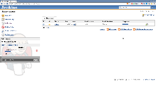

[[ProgressBarColumnPlugin-ProgressBarColumnPlugin]]
== Progress Bar Column Plugin

 +

Provide progress bar available for views.

 +

[cols="",options="header",]
|===
|List View
|[.confluence-embedded-file-wrapper]##
|===

 +

'''''

 +

[[ProgressBarColumnPlugin-Changelog]]
=== Changelog

[[ProgressBarColumnPlugin-1.1(planned)]]
==== 1.1 (planned)

* make the progress bar automatically update itself

[[ProgressBarColumnPlugin-1.0(released2011-08-08)]]
==== 1.0 (released 2011-08-08)

* initial implementation
