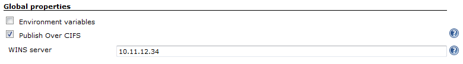
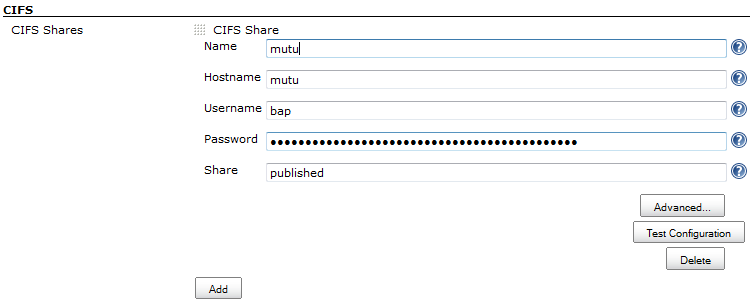
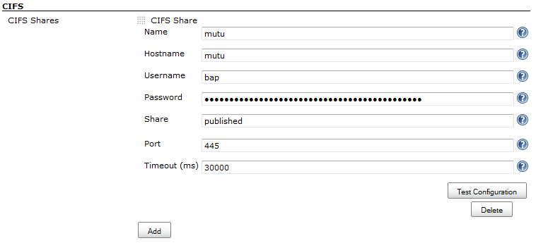
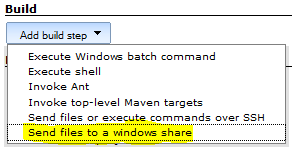
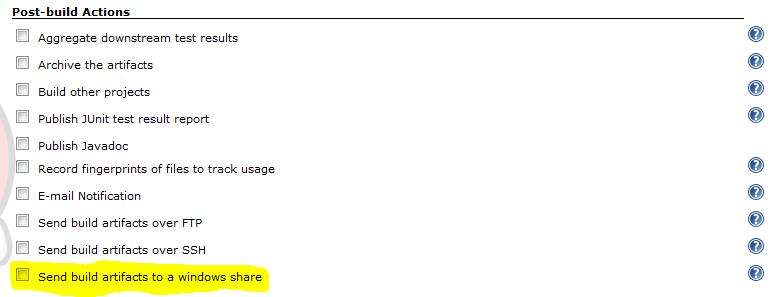
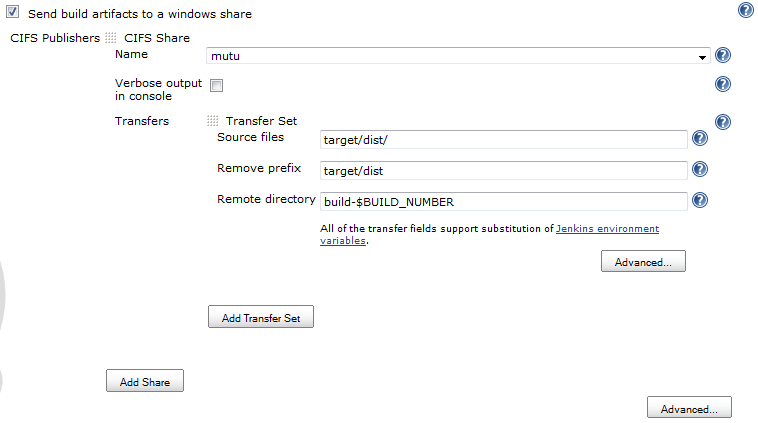
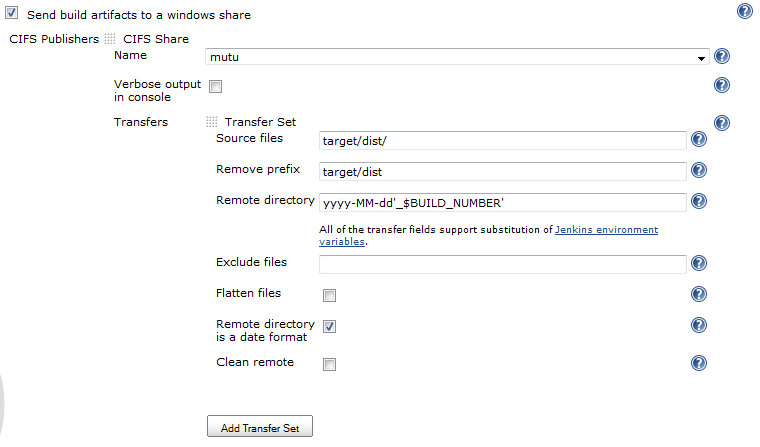
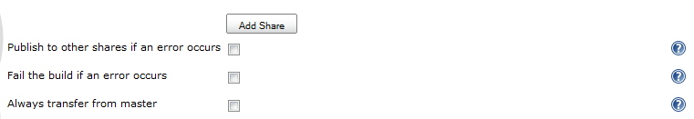
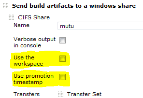

Send build artifacts to a windows share
(CIFS/SMB/samba)[.conf-macro .output-inline]##

[cols="",options="header",]
|===
|Plugin Information
|View Publish Over CIFS https://plugins.jenkins.io/publish-over-cifs[on
the plugin site] for more information.
|===

[.aui-icon .aui-icon-small .aui-iconfont-info .confluence-information-macro-icon]##

Older versions of this plugin may not be safe to use. Please review the
following warnings before using an older version:

* https://jenkins.io/security/advisory/2018-07-30/#SECURITY-975[CSRF
vulnerability and missing permission checks]

[.aui-icon .aui-icon-small .aui-iconfont-warning .confluence-information-macro-icon]##

*This plugin is up for adoption.* Want to help improve this plugin?
https://wiki.jenkins-ci.org/display/JENKINS/Adopt+a+Plugin[Click here to
learn more]!

[[PublishOverCIFSPlugin-PublishOver...]]
== Publish Over ...

Read Publish Over ... wiki page first

[.aui-icon .aui-icon-small .aui-iconfont-approve .confluence-information-macro-icon]#
#

Please read
https://wiki.jenkins-ci.org/display/JENKINS/Publish+Over[Publish Over]
first. +
Common configuration options that are documented in the Publish Over ...
wiki page will not be repeated here.

https://wiki.jenkins-ci.org/display/JENKINS/Publish+Over+CIFS+Plugin#PublishOverCIFSPlugin-features[Features] +
https://wiki.jenkins-ci.org/display/JENKINS/Publish+Over+CIFS+Plugin#PublishOverCIFSPlugin-configuration[Configure] +
https://wiki.jenkins-ci.org/display/JENKINS/Publish+Over+CIFS+Plugin#PublishOverCIFSPlugin-changelog[Change
log]

[#PublishOverCIFSPlugin-features .confluence-anchor-link .conf-macro .output-inline]#
#

[[PublishOverCIFSPlugin-Features]]
== Features

* Send files to windows shares
* The plugin is "promotion aware" see
https://wiki.jenkins-ci.org/display/JENKINS/Publish+Over#PublishOver-promotions[Promotions]
* Publish to multiple shares in the "Post-build Actions"
* Passwords are encrypted in the configuration files and in the UI
* Copy files to a windows share during a build

[#PublishOverCIFSPlugin-configuration .confluence-anchor-link .conf-macro .output-inline]#
#

[[PublishOverCIFSPlugin-Configure]]
== Configure

[[PublishOverCIFSPlugin-ConfigureaWINSserver]]
=== Configure a WINS server

From the Jenkins home page, click "Manage Jenkins" and the click on
"Configure System"

In the main Jenkins configuration page, there will be a "Publish Over
CIFS" checkbox in the "Global properties" section.

[.confluence-embedded-file-wrapper]##

[[PublishOverCIFSPlugin-WINSserver]]
==== WINS server

Set this option to the IP address of a WINS server that will be used by
the Jenkins master, and will be the default for all other nodes (slaves)

The WINS server can be set or overridden for individual nodes (slaves) +
A "Publish Over CIFS" checkbox will appear under "Node Properties" in
the configuration for a node. +
Set the WINS server to an IP address that this node will use for name
resolution. +
If a default WINS server has been specified in the "Global properties",
a node can be configured to not use WINS by checking the "Publish Over
CIFS" property and leaving the WINS server empty.

[[PublishOverCIFSPlugin-CreatehostconfigurationsinthemainJenkinsconfiguration]]
=== Create host configurations in the main Jenkins configuration

From the Jenkins home page, click "Manage Jenkins" and the click on
"Configure System"

Find the CIFS section (as below) and click on the "Add" button next to
"CIFS Servers"

[.confluence-embedded-file-wrapper]##

You should now have the configuration options as below

[.confluence-embedded-file-wrapper]##

Fill in Name, Hostname, Username, Password and Share.
https://wiki.jenkins-ci.org/display/JENKINS/Publish+Over#PublishOver-host[see
Publish Over ... for common options for Host Configurations]

[[PublishOverCIFSPlugin-Hostname]]
==== Hostname

Hostname is the hostname, IP address or windows servername of the host
that contains the share

[[PublishOverCIFSPlugin-Username]]
==== Username

To specify a user in a specific windows domain, use a back slash to
separate eg MYDOMAIN\myuser

[[PublishOverCIFSPlugin-Share]]
==== Share

The share is equivalent to the standard Remote directory option, except
that the Share is required and there is no concept of the directories
being relative. +
The share must be, or begin with, a windows share name on the server
named in Hostname.

[[PublishOverCIFSPlugin-Advanced]]
==== Advanced

If you click the "Advanced..." button for a configuration, then you will
make more configuration options available (see below)

[.confluence-embedded-file-wrapper]##

https://wiki.jenkins-ci.org/display/JENKINS/Publish+Over#PublishOver-host[see
Publish Over ... for common options for Host Configurations]

[[PublishOverCIFSPlugin-Click"TestConfiguration".]]
==== Click "Test Configuration".

[[PublishOverCIFSPlugin-Addmoreserverconfigurations(ifrequired)]]
==== Add more server configurations (if required)

[[PublishOverCIFSPlugin-Save]]
==== Save

[[PublishOverCIFSPlugin-Sendfilestoawindowsshareduringabuild]]
=== Send files to a windows share during a build

This plugin adds a build step to enable you to send files to a windows
share during a build.

Select "Send files to a windows share" from the "Add build step" drop
down (pic below) and then configure just like
https://wiki.jenkins-ci.org/display/JENKINS/Publish+Over+CIFS+Plugin#PublishOverCIFSPlugin-configjob[Configure
a job to send files to a windows share] below

[.confluence-embedded-file-wrapper]##

[#PublishOverCIFSPlugin-configjob .confluence-anchor-link .conf-macro .output-inline]#
#

[[PublishOverCIFSPlugin-Configureajobtosendfilestoawindowsshare]]
=== Configure a job to send files to a windows share

Open a jobs main page and then click "Configure" from the left hand
menu.

Find the "Send build artifacts to a windows share" checkbox in the
"Post-build Actions" section and click in the box.

[.confluence-embedded-file-wrapper]##

You should now have the configuration options as below

[.confluence-embedded-file-wrapper]##

https://wiki.jenkins-ci.org/display/JENKINS/Publish+Over#PublishOver-server[see
Publish Over ... for common options for Server]

https://wiki.jenkins-ci.org/display/JENKINS/Publish+Over#PublishOver-transfer[see
Publish Over ... for common options for Transfer Sets]

Source files

[.aui-icon .aui-icon-small .aui-iconfont-warning .confluence-information-macro-icon]#
#

The build will fail if you do not select any Source files to transfer

[[PublishOverCIFSPlugin-Advanced(TransferSets)]]
==== Advanced (Transfer Sets)

If you click the "Advanced..." button for a Transfer Set, then you will
make more configuration options available (see below) +
[.confluence-embedded-file-wrapper]##

https://wiki.jenkins-ci.org/display/JENKINS/Publish+Over#PublishOver-transfer[see
Publish Over ... for common options for Transfer Sets]

[[PublishOverCIFSPlugin-Cleanremote]]
===== Clean remote

Delete all files and directories from the remote directory before
uploading the new files.

[[PublishOverCIFSPlugin-Advanced(Publisher)]]
==== Advanced (Publisher)

If you click the "Advanced..." button that is immediately below the "Add
Server" button, then you will make more configuration options available
(see below) +
[.confluence-embedded-file-wrapper]##

https://wiki.jenkins-ci.org/display/JENKINS/Publish+Over#PublishOver-publisher[see
Publish Over ... for common options for Publisher]

[[PublishOverCIFSPlugin-OptionstooverridethedefaultPromotionbehaviour]]
=== Options to override the default Promotion behaviour

If you are configuring an action in a promotion, new options will become
available. +
[.confluence-embedded-file-wrapper]##

https://wiki.jenkins-ci.org/display/JENKINS/Publish+Over#PublishOver-promotions[see
Publish Over ... for common options for Promotions]

[#PublishOverCIFSPlugin-changelog .confluence-anchor-link .conf-macro .output-inline]#
#

[[PublishOverCIFSPlugin-Changelog]]
== Change log

[[PublishOverCIFSPlugin-0.11(2018-07-30)]]
=== 0.11 (2018-07-30)

* https://jenkins.io/security/advisory/2018-07-30/#SECURITY-975[Fix
security issue]

[[PublishOverCIFSPlugin-0.9]]
=== 0.9

* Fixed issue with parameter verification using incorrect check urls
* Fixed issue with bufferSize not being set correctly on ugprade
(https://issues.jenkins-ci.org/browse/JENKINS-49010[issue 49010]) +
 +

Questions, Comments, Bugs and Feature Requests

[.aui-icon .aui-icon-small .aui-iconfont-info .confluence-information-macro-icon]#
#

Please post questions or comments about this plugin to the
http://jenkins-ci.org/content/mailing-lists[Jenkins User mailing
list]. +
To report a bug or request an enhancement to this plugin please
https://issues.jenkins-ci.org/browse/JENKINS/component/15850[create a
ticket in JIRA].
