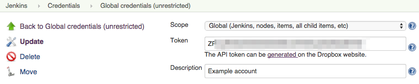
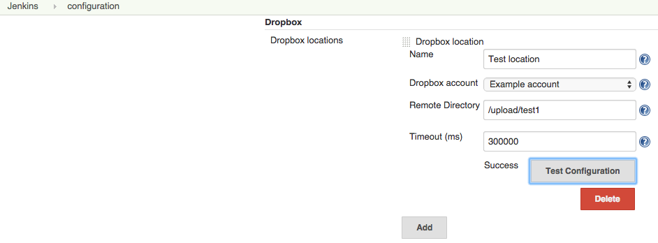
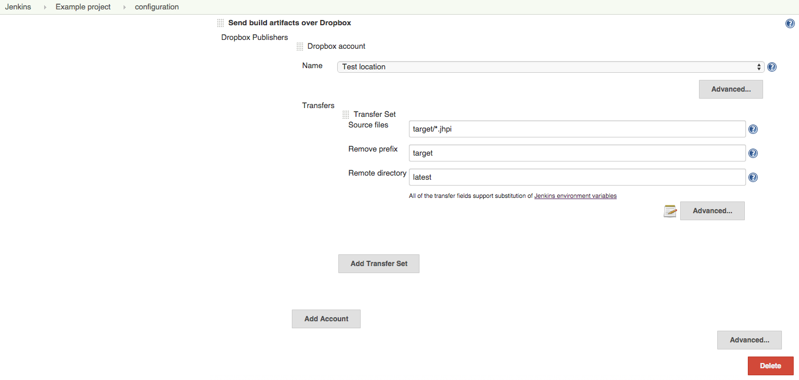
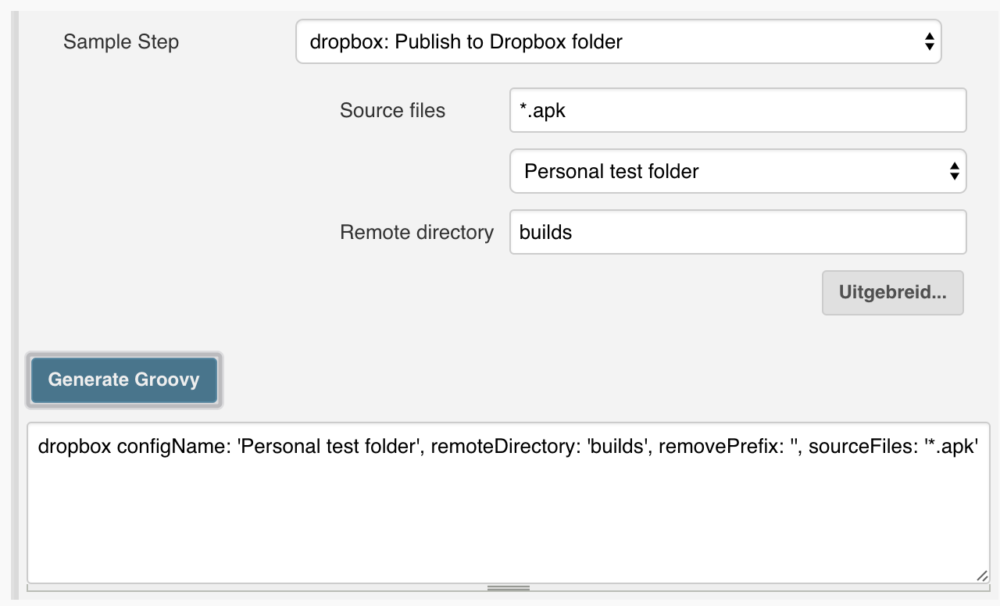
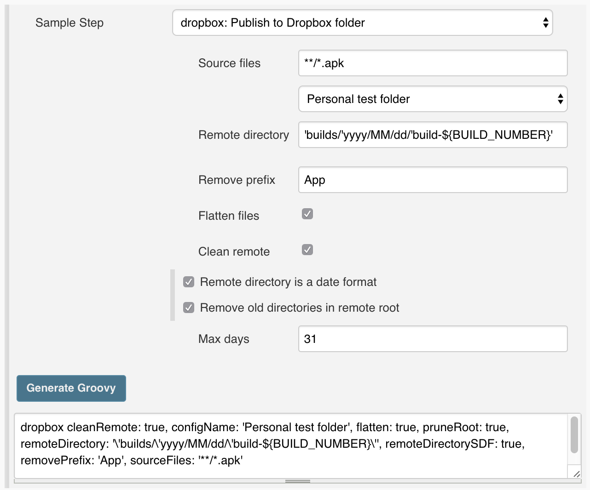

[.conf-macro .output-inline]##

[cols="",options="header",]
|===
|Plugin Information
|View Publish Over Dropbox
https://plugins.jenkins.io/publish-over-dropbox[on the plugin site] for
more information.
|===

[.aui-icon .aui-icon-small .aui-iconfont-info .confluence-information-macro-icon]##

Older versions of this plugin may not be safe to use. Please review the
following warnings before using an older version:

* https://jenkins.io/security/advisory/2018-09-25/#SECURITY-845[Credentials
stored in plain text]

[.conf-macro .output-inline]#Allows users to directly publishes
artifacts to their https://www.dropbox.com/[Dropbox] folders without the
need to run a sync client on their build servers.#

[[PublishoverDropboxPlugin-News]]
== News

[[PublishoverDropboxPlugin-Pipelinesupport]]
=== Pipeline support

Version 1.2.0 of the Dropbox plugin is out. It is now possible to use
the new Jenkins pipeline DSL to configure the Publish over Dropbox
plugin.

More info on: https://jenkins.io/doc/book/pipeline/[Build pipelines]

[[PublishoverDropboxPlugin-EOLversion1.0.0-1.0.5]]
=== EOL version 1.0.0 - 1.0.5

The versions of the plugin before 1.1 use the Dropbox V1 API. These are
https://blogs.dropbox.com/developers/2016/06/api-v1-deprecated/[deprecated
by Dropbox] will stop working from June 28, 2017. 

* Update your plugin to at least 1.1.2

 

[[PublishoverDropboxPlugin-Deprecated1.0.0-1.0.5OAuthAPItoken]]
==== Deprecated 1.0.0 - 1.0.5 OAuth API token

The versions before 1.1 use a API token coupled to a business account.
That account might not exist in the future, which can block all derived
Tokens. Uploads will fail after that.

. Update your plugin to at least 1.1.2 
. Generate a new Token. You can by retaking the first configuration
step: Link an account. (as described below)

[[PublishoverDropboxPlugin-Configuration]]
== Configuration

[[PublishoverDropboxPlugin-Linkanaccount]]
=== Link an account

The highest level is connecting a Dropbox account to Jenkins. Dropbox
account connections can be created in the **Jenkins > Credentials**.

[.confluence-embedded-file-wrapper]##

[[PublishoverDropboxPlugin-Createalocation]]
=== Create a location

The second level is to create a location for a previously linked
account. Locations can be created in **Jenkins > Manage Jenkins >
Configure System**.

[.confluence-embedded-file-wrapper]##

[[PublishoverDropboxPlugin-Publishfiles-classicstyle]]
=== Publish files - classic style

The last level is to actual publish files to a Dropbox location.
Publishing can be done as **Post-build Actions** in your build job
configuration.

[.confluence-embedded-file-wrapper .confluence-embedded-manual-size]##

[[PublishoverDropboxPlugin-Publishfiles-pipelinestyle]]
=== Publish files - pipeline style

The last level is to actual publish files to a Dropbox location. Since
version 1.2.0 publishing can be configured with *Pipeline DSL* in your
build job configuration.

Using the Snippet Generator you can create code for the DSL publishing.
A simple step only provides the required parameters: `+configName+`,
`+sourceFiles+` and `+remoteDirectory+`, 

[.confluence-embedded-file-wrapper .confluence-embedded-manual-size]##

All the options available in the classic mode are also available in the
DSL syntax.

[.confluence-embedded-file-wrapper .confluence-embedded-manual-size]##

A description of all the parameters are:

[[PublishoverDropboxPlugin-sourceFiles(required)]]
==== sourceFiles (required)

Files to upload to the Dropbox location.

The string is a comma separated list of includes for an Ant fileset eg.
'**/*.zip' (see
http://ant.apache.org/manual/dirtasks.html#patterns[patterns] in the Ant
manual). The base directory for this fileset is the workspace.

[[PublishoverDropboxPlugin-configName(required)]]
==== configName (required)

Select an Dropbox location from the list configured in the global
configuration of this Jenkins. The configuration defines the account
properties and base directory of the Dropbox location.

[[PublishoverDropboxPlugin-remoteDirectory(required)]]
==== remoteDirectory (required)

Destination folder.

This folder will be below the one in the global configuration. The
folder will be created if does not exist.

[[PublishoverDropboxPlugin-flatten(optional)]]
==== flatten (optional)

Only create files on the server, do not create directories (except for
the remote directory).

All files that have been selected to transfer must have unique
filenames. Publishing will stop and fail as soon as a duplicate filename
is found when using the flatten option.

[[PublishoverDropboxPlugin-remoteDirectorySDF(optional)]]
==== remoteDirectorySDF (optional)

Select this to include the timestamp in the remote directory.

The timestamp is the date of build. This setting turns the remote
directory option into a java SimpleDateFormat. The SimpleDateFormat(SDF)
uses letters to represent components of the date, like the month, year,
or day of the week.
The http://download.oracle.com/javase/6/docs/api/java/text/SimpleDateFormat.html[SimpleDateFormat]
page has more information about the date patterns. As the SDF reserves
all of the letters [A-Z][a-z], any that you want to appear literally in
the directory that is created will need to be quoted.

[[PublishoverDropboxPlugin-cleanRemote(optional)]]
==== cleanRemote (optional)

Select to delete all files and directories within the remote directory
before transferring files.

[[PublishoverDropboxPlugin-pruneRoot(optional)]]
==== pruneRoot (optional)

Directories older then the max days will be deleted.

A date format directory format can lead to a long list of directories.
Removing old directories in the remote root will allow you to prune that
list.

[[PublishoverDropboxPlugin-pruneDays(requiredonlywithpruneRootenabled)]]
==== pruneDays (required only with pruneRoot enabled)

Directory created more then this number of days ago are considered old
for pruning of root.

[[PublishoverDropboxPlugin-removePrefix(optional)]]
==== removePrefix (optional)

First part of the file path that should not be created on the remote
server.

Directory structures are created relative to the base directory, which
is usually the workspace.You normally do not want the full path to these
files to be created on the server. For example if Source files were
`+target/deployment/images/**/+` then you may want Remove prefix to be
`+target/deployment+` This would create the images folder under the
remote directory, and not target/deployment

If you use remove prefix, then ALL source file paths MUST start with the
prefix.

[[PublishoverDropboxPlugin-Needhelp]]
== Need help

Your help is appreciated! The most valued are your suggestions and
contributions through JIRA tickets and Github pull requests.

[[PublishoverDropboxPlugin-OpenTickets(bugsandfeaturerequests)]]
== Open Tickets (bugs and feature requests)

[[refresh-module--1043296771]]
[[refresh--1043296771]][[jira-issues--1043296771]]
T

Key

Summary

Assignee

Reporter

P

Status

Resolution

Created

Updated

Due

[.refresh-action-group]# #

[[refresh-issues-loading--1043296771]]
[.aui-icon .aui-icon-wait]#Loading...#

[#refresh-issues-button--1043296771]##
[#refresh-issues-link--1043296771]#Refresh#
[#error-message--1043296771 .error-message .hidden]# #

[[PublishoverDropboxPlugin-Changelog]]
== Changelog

[[PublishoverDropboxPlugin-1.2.4(June2018)]]
=== 1.2.4 (June 2018)

* Fix proxy config related crash on remote instances +
Fixes https://issues.jenkins-ci.org/browse/JENKINS-52039[JENKINS-52039]
* Upgraded minimal required Jenkins version to 2.98

[[PublishoverDropboxPlugin-1.2.3(June2018)]]
=== 1.2.3 (June 2018)

* Supports using the Jenkins proxy configuration +
Fixes https://issues.jenkins-ci.org/browse/JENKINS-51478[JENKINS-51478]

[[PublishoverDropboxPlugin-1.2.2(Januari2018)]]
=== 1.2.2 (Januari 2018)

* The underlying "Publish Over" library has been updated in 0.21 +
Fixes https://issues.jenkins-ci.org/browse/JENKINS-48926[JENKINS-48926]

[[PublishoverDropboxPlugin-1.2.1(September2017)]]
=== 1.2.1 (September 2017)

* Fix not overwritting large files +
Fixes https://issues.jenkins-ci.org/browse/JENKINS-46533?src=confmacro[JENKINS-46533]
* Add field description to the step Snippet Generator

[[PublishoverDropboxPlugin-1.2.0(July2017)]]
=== 1.2.0 (July 2017)

* Add build pipeline DSL support +
Fixes JENKINS-43230
* Fixed an encoding issue with directory creation +
Fixes JENKINS-45309
* Autorename attribute typo fixed +
Fixes https://github.com/jenkinsci/publish-over-dropbox-plugin/commit/1cffda729f60f82cd52e1e60443b1b1f00580f73[JENKINS-40196]
* Improved some error messages

[[PublishoverDropboxPlugin-1.1.2(Dec2016)]]
=== 1.1.2 (Dec 2016)

* Fix malformed chunk upload request +
Fixes https://issues.jenkins-ci.org/browse/JENKINS-40196[JENKINS-40196]

[[PublishoverDropboxPlugin-1.1.1(Nov2016)]]
=== 1.1.1 (Nov 2016)

* Large uploads are chunked in uploads of 4 MB each +
Fixes https://issues.jenkins-ci.org/browse/JENKINS-39093[JENKINS-39093]
* The plugin uses Dropbox V2 API +
Fixes https://issues.jenkins-ci.org/browse/JENKINS-36407[JENKINS-36407]
* Switch to a more future-proof Dropbox Client ID
* Update parent plugin to version 2.6 +
Addresses https://issues.jenkins-ci.org/browse/INFRA-588[INFRA-588]

[[PublishoverDropboxPlugin-1.0.5(Nov82015)]]
=== 1.0.5 (Nov 8 2015)

* Fixes https://issues.jenkins-ci.org/browse/JENKINS-31112[JENKINS-31112]

[[PublishoverDropboxPlugin-1.0.3(Sep212015)]]
=== 1.0.3 (Sep 21 2015)

First function release

[[PublishoverDropboxPlugin-1.0.2(Sep212015)]]
=== 1.0.2 (Sep 21 2015)

Failed non-functioning release

[[PublishoverDropboxPlugin-1.0.1(Sep202015)]]
=== 1.0.1 (Sep 20 2015)

Failed non-functioning release

[[PublishoverDropboxPlugin-1.0.0(Sep192015)]]
=== 1.0.0 (Sep 19 2015)

Failed non-functioning release

[[PublishoverDropboxPlugin-Credits]]
== Credits

This project builds upon the
https://github.com/jenkinsci/publish-over-plugin[publish-over-plugin] by
Anthony Robinson

Also this project builds upon the
https://github.com/jenkinsci/credentials-plugin[credentials-plugin] by
CloudBees, Inc., Stephen Connolly

And much inspiration was found in the
https://github.com/jenkinsci/publish-over-ftp-plugin[publish-over-ftp-plugin]
by Anthony Robinson

[[PublishoverDropboxPlugin-Licence]]
== Licence

The MIT License (MIT)

Copyright (c) 2015 René de Groot and other contributors.

Permission is hereby granted, free of charge, to any person obtaining a
copy of this software and associated documentation files (the
"Software"), to deal in the Software without restriction, including
without limitation the rights to use, copy, modify, merge, publish,
distribute, sublicense, and/or sell copies of the Software, and to
permit persons to whom the Software is furnished to do so, subject to
the following conditions:

The above copyright notice and this permission notice shall be included
in all copies or substantial portions of the Software.

THE SOFTWARE IS PROVIDED "AS IS", WITHOUT WARRANTY OF ANY KIND, EXPRESS
OR IMPLIED, INCLUDING BUT NOT LIMITED TO THE WARRANTIES OF
MERCHANTABILITY, FITNESS FOR A PARTICULAR PURPOSE AND NONINFRINGEMENT.
IN NO EVENT SHALL THE AUTHORS OR COPYRIGHT HOLDERS BE LIABLE FOR ANY
CLAIM, DAMAGES OR OTHER LIABILITY, WHETHER IN AN ACTION OF CONTRACT,
TORT OR OTHERWISE, ARISING FROM, OUT OF OR IN CONNECTION WITH THE
SOFTWARE OR THE USE OR OTHER DEALINGS IN THE SOFTWARE.
