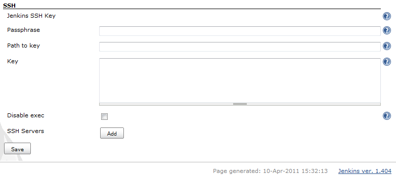
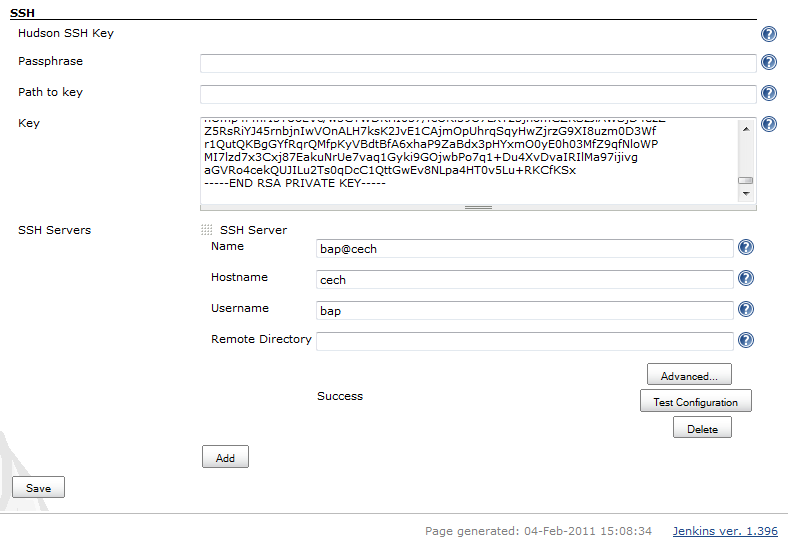
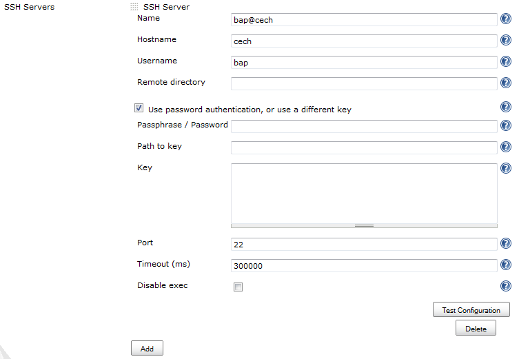
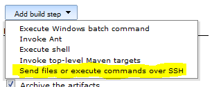
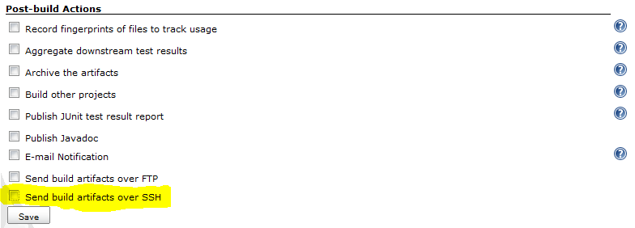
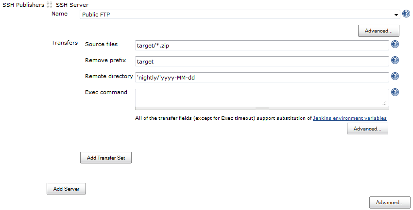
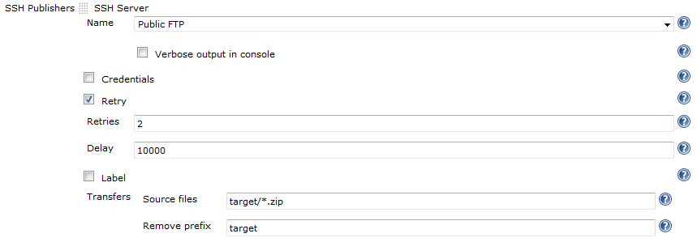
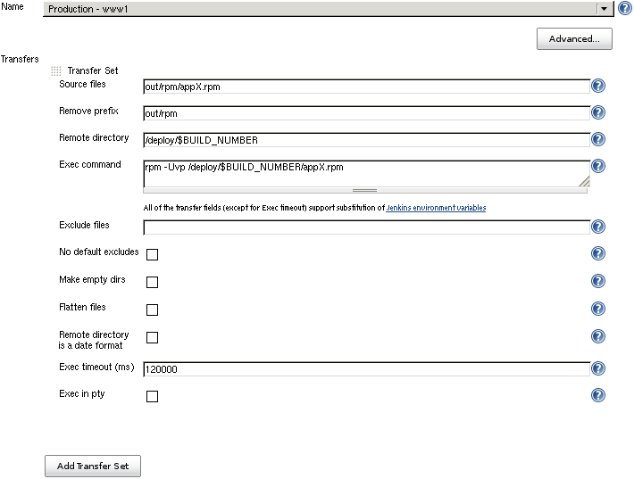
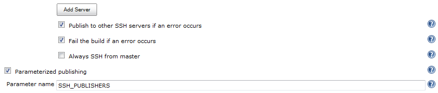
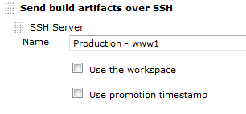

[.conf-macro .output-inline]##

[cols="",options="header",]
|===
|Plugin Information
|View Publish Over SSH https://plugins.jenkins.io/publish-over-ssh[on
the plugin site] for more information.
|===

[.aui-icon .aui-icon-small .aui-iconfont-warning .confluence-information-macro-icon]##

*This plugin is up for adoption.* Want to help improve this plugin?
https://wiki.jenkins-ci.org/display/JENKINS/Adopt+a+Plugin[Click here to
learn more]!

[[PublishOverSSHPlugin-PublishOver...]]
== Publish Over ...

Read Publish Over wiki page first

[.aui-icon .aui-icon-small .aui-iconfont-approve .confluence-information-macro-icon]#
#

Please read
https://wiki.jenkins-ci.org/display/JENKINS/Publish+Over[Publish Over]
first. +
Common configuration options that are documented in the Publish Over
wiki page will not be repeated here.

[#PublishOverSSHPlugin-features .confluence-anchor-link .conf-macro .output-inline]#
#

[[PublishOverSSHPlugin-Features]]
== Features

* SCP - Send files over SSH (SFTP)
* Execute commands on a remote server (can be disabled for a server
configuration, or for the whole plugin)
* Use username and password (keyboard-interactive) or public key
authentication
* Passwords/passphrases are encrypted in the configuration files and in
the UI
* SSH SFTP/ SSH Exec can be used as a build step during the build
process (Freestyle and Matrix projects)
* SSH before a (maven) project build, or to run after a build whether
the build was successful or not (see
https://wiki.jenkins-ci.org/display/JENKINS/Publish+Over+SSH+Plugin#PublishOverSSHPlugin-wrappers[Build
wrappers] below)
* The plugin is "promotion aware" (send files directly from the
artifacts directory of the build that is being promoted) see
https://wiki.jenkins-ci.org/display/JENKINS/Publish+Over#PublishOver-promotions[Promotions]
* Optionally override the authentication credentials for each server in
the job configuration (or provide them if they have not been provided
for that server in the global configuration)
* Optionally retry if the transfer of files fails (useful for flakey
connections)
* Enable the command/ script to be executed in a pseudo TTY

[#PublishOverSSHPlugin-wrappers .confluence-anchor-link .conf-macro .output-inline]#
#

[[PublishOverSSHPlugin-Buildwrappers]]
=== Build wrappers

There will be two new options in the *Build Environment* section of the
job configuration

. Send files or execute commands over SSH before the build starts +
This allows SSH to be used before a build begins, but after the
workspace has been configured and source checked out +
Most useful for maven project types
. Send files or execute commands over SSH after the build runs +
As long as the build was attempted, this will run after the build
finishes, and will run whether the build is successful or not +
This allows cleanup or shutdown of services started before or during the
build +
Use the publisher (Send build artifacts over SSH in Post-build Actions)
to publish build artifacts from succesful builds

[#PublishOverSSHPlugin-configuration .confluence-anchor-link .conf-macro .output-inline]#
#

[[PublishOverSSHPlugin-Configure]]
== Configure

[[PublishOverSSHPlugin-CreatehostconfigurationsinthemainJenkinsconfiguration]]
=== Create host configurations in the main Jenkins configuration

From the Jenkins home page, click "Manage Jenkins" and then click on
"Configure System"

Find the SSH section (as below) +
[.confluence-embedded-file-wrapper]##

[#PublishOverSSHPlugin-defaultkeyconfig .confluence-anchor-link .conf-macro .output-inline]##
##This configures the default key that will be used by all of the SSH
configurations. +
The simplest way to configure the key is to paste an unencrypted key
into the Key box. +
To configure, set *either* the path to a file containing the key *or*
paste the key into the Key field. +
If you enter data into both Path to key and Key, the pasted Key will
take precedence and the Path to file will be ignored.

Unencrypted keys

[.aui-icon .aui-icon-small .aui-iconfont-warning .confluence-information-macro-icon]#
#

If you plan to give read access to the Jenkins configuration page to non
administrators, then you should ensure that you only use private keys
encrypted with strong passphrases. +
The passphrase itself will be encrypted when the configuration is saved,
and will also be encrypted in the UI so that the value cannot be read.

[[PublishOverSSHPlugin-Passphrase]]
==== Passphrase

If the key is encrypted with a passphrase then set it here.

[[PublishOverSSHPlugin-Pathtofile]]
==== Path to file

The location, on the Jenkins master, of the private SSH key to use. +
The path can be an absolute path to the key, or relative to the
JENKINS_HOME directory.

[[PublishOverSSHPlugin-Key]]
==== Key

Paste the private key into this box. +
The key should include both the header and footer lines (----) and
everything in between.

[[PublishOverSSHPlugin-Disableexec]]
==== Disable exec

This option will remove the ability to execute commands from this
plugin. +
If this option is checked, then the Disable exec option in the Advanced
section of an SSH Server will be ignored.

[[PublishOverSSHPlugin-AddanSSHServer]]
==== Add an SSH Server

Click on the "Add" button next to "SSH Servers" +
[.confluence-embedded-file-wrapper]##

Fill in Name, Hostname, Username and Remote Directory.
https://wiki.jenkins-ci.org/display/JENKINS/Publish+Over#PublishOver-host[see
Publish Over ... for common options for Host Configurations]

[[PublishOverSSHPlugin-Username]]
===== Username

The user that will be used to connect to the host. +
This user will need the public key in their authorized_keys file on the
remote host (if using public key authentication).

[[PublishOverSSHPlugin-Advancedoptions]]
==== Advanced options

[.confluence-embedded-file-wrapper]##

https://wiki.jenkins-ci.org/display/JENKINS/Publish+Over#PublishOver-host[see
Publish Over ... for common options for Host Configurations]

[[PublishOverSSHPlugin-Usepasswordauthentication,oruseadifferentkey]]
===== Use password authentication, or use a different key

Selecting this option will produce 3 more configuration boxes that
mirror the options available for the Jenkins SSH Key.

[[PublishOverSSHPlugin-Passphrase/Password]]
===== Passphrase / Password

If either Path to key or Key are configured then this is the passphrase
to use with the encrypted key. +
If no key is configured then this is the password that will be used for
password authentication.

[[PublishOverSSHPlugin-Pathtokey]]
===== Path to key

https://wiki.jenkins-ci.org/display/JENKINS/Publish+Over+SSH+Plugin#PublishOverSSHPlugin-defaultkeyconfig[See
description above.]

[[PublishOverSSHPlugin-Key.1]]
===== Key

https://wiki.jenkins-ci.org/display/JENKINS/Publish+Over+SSH+Plugin#PublishOverSSHPlugin-defaultkeyconfig[See
description above.]

[[PublishOverSSHPlugin-Disableexec.1]]
===== Disable exec

This option will remove the ability to execute commands using this
configuration.

[[PublishOverSSHPlugin-Addthepublickeytotheremoteserver]]
==== Add the public key to the remote server

Ensure that the public key (counterpart to the private key configured
above) is in the authorized keys file for the user that you connect as
on the server you want to connect to.

[[PublishOverSSHPlugin-Click"TestConfiguration".]]
==== Click "Test Configuration".

[[PublishOverSSHPlugin-Addmoreserverconfigurations(ifrequired)]]
==== Add more server configurations (if required)

[[PublishOverSSHPlugin-Save]]
==== Save

[[PublishOverSSHPlugin-UseSSHduringabuild]]
=== Use SSH during a build

This plugin includes a builder which enables the use of the publisher
during the build process.

This means that you can send newly created packages to a remote server
and install them, start and stop services that the build may depend on
and many other use cases. +
[.confluence-embedded-file-wrapper]##

[#PublishOverSSHPlugin-configjob .confluence-anchor-link .conf-macro .output-inline]#
#

[[PublishOverSSHPlugin-ConfigureajobtoPublishOverSSH]]
=== Configure a job to Publish Over SSH

[.confluence-embedded-file-wrapper]##

[.confluence-embedded-file-wrapper]##

https://wiki.jenkins-ci.org/display/JENKINS/Publish+Over#PublishOver-server[see
Publish Over ... for common options for Server]

https://wiki.jenkins-ci.org/display/JENKINS/Publish+Over#PublishOver-transfer[see
Publish Over ... for common options for Transfer Sets]

[[PublishOverSSHPlugin-Execcommand]]
==== Exec command

If there is anything in this configuration box then it will be executed
on the remote server. +
If Source files are configured, then the files will be transfered before
the Exec command is executed. +
If the exit status of the command is not zero, then the publish will
fail. +
STDOUT and STDERR from the command execution are recorded in the Jenkins
console.

Source files, Exec command

[.aui-icon .aui-icon-small .aui-iconfont-warning .confluence-information-macro-icon]#
#

You must configure Source files, Exec command or both. +
If neither Source files nor Exec command are configured, the publish
will fail. +
If the Source files box is empty then no files will be transferred.

Environment variables

[.aui-icon .aui-icon-small .aui-iconfont-approve .confluence-information-macro-icon]#
#

Source files, Remove prefix, Remote directory and Exec command can all
use the Jenkins environment variables and build parameters.

[[PublishOverSSHPlugin-Advanced(Server)]]
==== Advanced (Server)

[.confluence-embedded-file-wrapper]##

[[PublishOverSSHPlugin-Advanced(TransferSets)]]
==== Advanced (Transfer Sets)

[.confluence-embedded-file-wrapper]##

https://wiki.jenkins-ci.org/display/JENKINS/Publish+Over#PublishOver-transfer[see
Publish Over ... for details of common options]

[[PublishOverSSHPlugin-Exectimeout(ms)]]
===== Exec timeout (ms)

Configure a timeout for the Exec command to use. +
If the command has not returned within this time then the publish will
fail.

[[PublishOverSSHPlugin-Execinpty]]
===== Exec in pty

Run the Exec command in a pseudo TTY.

[[PublishOverSSHPlugin-Advanced(Publisher)]]
==== Advanced (Publisher)

If you click the "Advanced..." button that is immediately below the "Add
Server" button, you will make more configuration options available.

[.confluence-embedded-file-wrapper]##

https://wiki.jenkins-ci.org/display/JENKINS/Publish+Over#PublishOver-publisher[see
Publish Over ... for common options for Publisher]

[[PublishOverSSHPlugin-OptionstooverridethedefaultPromotionbehaviour]]
=== Options to override the default Promotion behaviour

If you are configuring an action in a promotion, new options will become
available.

[.confluence-embedded-file-wrapper]##

https://wiki.jenkins-ci.org/display/JENKINS/Publish+Over#PublishOver-promotions[see
Publish Over ... for common options for Promotions]

[#PublishOverSSHPlugin-changelog .confluence-anchor-link .conf-macro .output-inline]#
#

[[PublishOverSSHPlugin-Changelog]]
== Change log

[[PublishOverSSHPlugin-1.14(24/03/2016)]]
=== 1.14 (24/03/2016)

* https://issues.jenkins-ci.org/browse/JENKINS-29360[JENKINS-29360] Bumped
the version of jsch to overcome algorithm issue
* Add support for proxies
(https://github.com/jenkinsci/publish-over-ssh-plugin/pull/10[PR #10])

[[PublishOverSSHPlugin-1.13(19/05/2015)]]
=== 1.13 (19/05/2015)

* Implement methods for adding and removing host configurations
(https://github.com/jenkinsci/publish-over-ssh-plugin/pull/5[PR #5])

[[PublishOverSSHPlugin-1.12(16/10/2014)]]
=== 1.12 (16/10/2014)

* Don't blow up errors when interacting with Item.EXTENDED_READ
(https://github.com/jenkinsci/publish-over-ssh-plugin/pull/8[PR #8])

[[PublishOverSSHPlugin-1.11(30/12/2013)]]
=== 1.11 (30/12/2013)

* https://issues.jenkins-ci.org/browse/JENKINS-17058[JENKINS-17058]
Publish over SSH plugin XML configuration cannot be read on Jenkins
start up.

[[PublishOverSSHPlugin-1.10(03/03/2013)]]
=== 1.10 (03/03/2013)

* https://issues.jenkins-ci.org/browse/JENKINS-16681[JENKINS-16681]
Allow source file names and paths to contain whitespace
** Add Advanced Transfer Set option "Pattern separator"

[[PublishOverSSHPlugin-1.9(22/10/2012)]]
=== 1.9 (22/10/2012)

* https://issues.jenkins-ci.org/browse/JENKINS-13831[JENKINS-13831]
Option to create empty directories
* No default excludes option now available for all versions of Jenkins
* Exclude files pattern now available for all versions of Jenkins

[[PublishOverSSHPlugin-1.8(10/09/2012)]]
=== 1.8 (10/09/2012)

* https://issues.jenkins-ci.org/browse/JENKINS-13693[JENKINS-13693] Add
option to disable default excludes
* Prefix Publish over to the global config section title
* Move the defaults configuration in the global config to an Advanced
section

[[PublishOverSSHPlugin-1.7(08/05/2012)]]
=== 1.7 (08/05/2012)

* Fixed
https://issues.jenkins-ci.org/browse/JENKINS-13714[JENKINS-13714] Drag
and drop handle missing from transfer sets

[[PublishOverSSHPlugin-1.6(06/02/2012)]]
=== 1.6 (06/02/2012)

* Upgrade JSch from 0.1.44 to 0.1.45
* Remove gssapi-with-mic as a preferred auth method

[[PublishOverSSHPlugin-1.5(10/11/2011)]]
=== 1.5 (10/11/2011)

* Enable the server credentials to be specified/overriden when
configuring the publisher in a job

[[PublishOverSSHPlugin-1.4(11/09/2011)]]
=== 1.4 (11/09/2011)

* https://issues.jenkins-ci.org/browse/JENKINS-10965[JENKINS-10965]
Enable exec command to be run in a pseudo TTY

[[PublishOverSSHPlugin-1.3(05/08/2011)]]
=== 1.3 (05/08/2011)

* https://issues.jenkins-ci.org/browse/JENKINS-10599[JENKINS-10599] When
using the Flatten files option, do not create the Remote directory if
there are no files to transfer

[[PublishOverSSHPlugin-1.2(21/07/2011)]]
=== 1.2 (21/07/2011)

* https://issues.jenkins-ci.org/browse/JENKINS-10315[JENKINS-10315] Only
open an SFTP connection if any of the transfer sets have source files
configured
** Saves time and resources on client and server
** Enables the plugin to run commands on servers that do not support
SFTP
* https://issues.jenkins-ci.org/browse/JENKINS-10363[JENKINS-10363]
Allow the publisher default values to be changed in Manage Jenkins (on
Jenkins and Hudson 1.391 - 1.395)

[[PublishOverSSHPlugin-1.1(09/07/2011)]]
=== 1.1 (09/07/2011)

* Fixed
https://issues.jenkins-ci.org/browse/JENKINS-10268[JENKINS-10268]

[[PublishOverSSHPlugin-1.0(08/07/2011)]]
=== 1.0 (08/07/2011)

* Add
https://wiki.jenkins-ci.org/display/JENKINS/Publish+Over#PublishOver-parampub[Parameterized
publishing]
https://issues.jenkins-ci.org/browse/JENKINS-10006[JENKINS-10006]
* Add ability to
https://wiki.jenkins-ci.org/display/JENKINS/Publish+Over#PublishOver-retry[retry]
the publish
https://issues.jenkins-ci.org/browse/JENKINS-10094[JENKINS-10094]
* Moved the "Verbose output in console" option to the new Advanced
section containing the other new Server options

[[PublishOverSSHPlugin-0.14(06/06/2011)]]
=== 0.14 (06/06/2011)

* Fixed https://issues.jenkins-ci.org/browse/JENKINS-9878[JENKINS-9878]
where the password/passphrase for an individual configuration was
ignored when saving the global config (Manage Jenkins)

[[PublishOverSSHPlugin-0.13(20/05/2011)]]
=== 0.13 (20/05/2011)

* Remove "Give the master a NODE_NAME" option when running on Jenkins
1.414 or later
* Default the "Give the master a NODE_NAME" option to 'master' when run
on a Jenkins older than 1.414

[[PublishOverSSHPlugin-0.12(09/05/2001)]]
=== 0.12 (09/05/2001)

* Advanced Transfer Set option to Exclude files +
(option only available with Jenkins 1.407 and later)
* https://issues.jenkins-ci.org/browse/JENKINS-9480[JENKINS-9480] Exec
command is now an expandable textarea

[[PublishOverSSHPlugin-0.11(15/04/2011)]]
=== 0.11 (15/04/2011)

* Fixed form validation issue
(https://issues.jenkins-ci.org/browse/JENKINS-9376[JENKINS-9376]) when
selected configuration name contains non ASCII characters

[[PublishOverSSHPlugin-0.10(14/04/2011)]]
=== 0.10 (14/04/2011)

* Fix potential NPE when performing ajax form validation

[[PublishOverSSHPlugin-0.9(10/04/2011)]]
=== 0.9 (10/04/2011)

* Reduce horizontal space taken up by labels in the configuration views

[[PublishOverSSHPlugin-0.8(10/04/2011)]]
=== 0.8 (10/04/2011)

* Add options to disable exec for individual configurations, or for the
whole plugin

[[PublishOverSSHPlugin-0.7(01/04/2011)]]
=== 0.7 (01/04/2011)

* Enable form validation for SSH key file location for Jenkins 1.399 and
later

[[PublishOverSSHPlugin-0.6(07/03/2011)]]
=== 0.6 (07/03/2011)

* Fixed https://issues.jenkins-ci.org/browse/JENKINS-8982[JENKINS-8982]
where configuration for the builder was not populated when re
configuring a job

[[PublishOverSSHPlugin-0.5(18/02/2011)]]
=== 0.5 (18/02/2011)

* Passwords/passphrases encrypted in config files and in UI (now
requires Hudson > 1.384 or any Jenkins)
* Environment variables for substitution now include build variables
(including matrix build axis)
* Added build wrapper to enable SSH before a (maven) project build, or
to run after a build whether the build was successful or not

[[PublishOverSSHPlugin-0.4(16/02/2011)]]
=== 0.4 (16/02/2011)

* Added form validation
* Removed debug logs for new configurations

[[PublishOverSSHPlugin-0.3(11/02/2011)]]
=== 0.3 (11/02/2011)

* 2 new configuration options when in promotion
** Use the workspace when selecting "Source files"
** Use the time of the promotion when using "Remote directory is a date
format"

[[PublishOverSSHPlugin-0.2(10/02/2011)]]
=== 0.2 (10/02/2011)

* Stop the builder from showing up in promotion actions as publisher
already included

[[PublishOverSSHPlugin-0.1(08/02/2011)]]
=== 0.1 (08/02/2011)

* Initial release

Questions, Comments, Bugs and Feature Requests

[.aui-icon .aui-icon-small .aui-iconfont-info .confluence-information-macro-icon]#
#

Please post questions or comments about this plugin to the
http://jenkins-ci.org/content/mailing-lists[Jenkins User mailing
list]. +
To report a bug or request an enhancement to this plugin please
http://issues.jenkins-ci.org/browse/JENKINS/component/15792[create a
ticket in JIRA].
